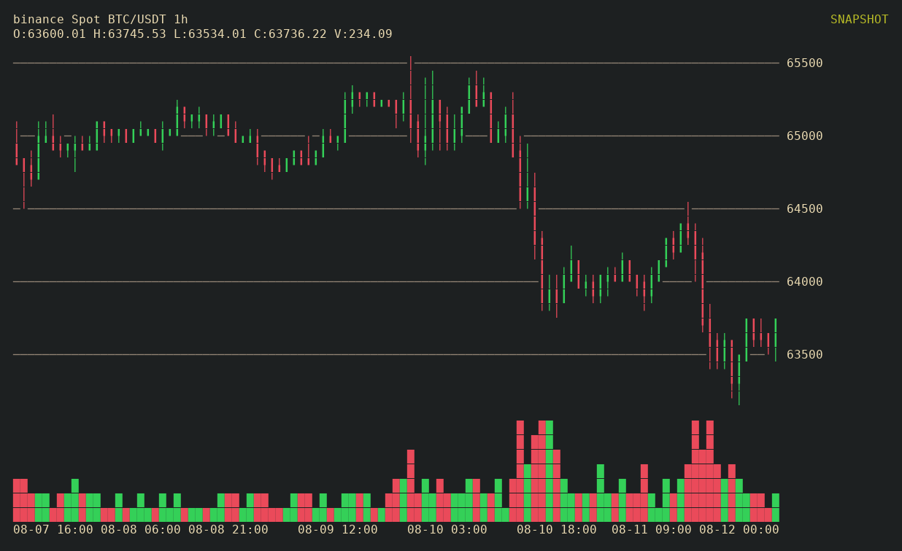

# fccli

Terminal candlestick charts for Binance and Hyperliquid Spot and Perpetual markets.

_Example: `fccli btc 1h`_



## Install

Requires Rust 1.96 or newer.

```sh
cargo install --git https://github.com/AdamIsNotAlex/fccli
```

## Usage

```text
fccli [OPTIONS] [INSTRUMENT] [TIMEFRAME]
```

By default, `fccli` renders one chart snapshot. With no positionals, it uses `binance:btc`
at `1h`. With one positional, that value is always the instrument and the timeframe remains
`1h`. Add `-i` or `--interactive` to open the interactive terminal UI.

```sh
fccli
fccli eth
fccli btc h
fccli btc.p
fccli binance:btc/usdc 1h
fccli BTCUSDT.p M --interactive
fccli hyperliquid:btc.p 1h
fccli hyperliquid:hype
fccli hyperliquid:xyz:XYZ100.p 15m
```

An instrument may be an asset (`btc`, quoted in the selected provider's default), pair (`btc/usdc` or `btc-usdt`), concatenated symbol (`BTCUSDT`), or provider-prefixed pair (`binance:btc/usdc`). Append `.p` (or `.P`) to select perpetual instead of Spot: `btc.p`, `btc/usdt.p`, and `BTCUSDT.p` all resolve to perpetual. On Hyperliquid, `hyperliquid:btc` is remapped UBTC/USDC spot and `hyperliquid:btc.p` is the BTC perpetual; HIP-3 builder DEX perps use `hyperliquid:<dex>:<coin>.p`. Bare assets default to `USDT` on Binance, OKX, and Bybit; `USD` on Coinbase and Kraken; and `USDC` on Hyperliquid. The startup provider remains Binance. Hyperliquid rejects `1s` and `6h`. For example, `fccli h` selects the instrument `h` at the default `1h`; a single positional is never interpreted as a timeframe.

Supported canonical timeframes: `1s`, `1m`, `3m`, `5m`, `15m`, `30m`, `1h`, `2h`, `4h`, `6h`, `8h`, `12h`, `1d`, `3d`, `1w`, `1M`. The unit-only aliases `s`, `m`, `h`, `d`, `w`, and `M` mean one unit. Timeframes are case-sensitive: `m` is one minute and `M` is one month.

### Interactive controls

- `:`: open the market/timeframe command line
- `A` / `D` or `←` / `→`: pan through time
- `W` / `S` or `↑` / `↓`: pan the price range
- `h` / `H`: zoom time in / out
- `v` / `V`: zoom price in / out
- `End`: return to live data
- `r`: reset the view
- `q`, `Esc`, `Ctrl-C`, or `Ctrl-D`: quit

While the command line is open, enter a target using the same zero-, one-, or two-field grammar as
the startup command, then press `Enter`. Empty input selects `binance:btc 1h`; one field is always
the instrument and uses timeframe `1h`:

```text
:
:eth
:btc m
:btc.p
:binance:btc/usdc 1h
:BTCUSDT M
```

The current chart remains live while the new market loads. A successful switch resets the chart
view to the new market; if loading fails, the current chart remains active and the error is shown
in the footer. Submitting the currently displayed market and timeframe is a no-op.

Command-line editing supports `Backspace`, `Delete`, `←`, `→`, `Home`, and `End`. `Esc` cancels
command entry without quitting; `Ctrl-C` and `Ctrl-D` always quit.

Run `fccli --help` for command-line help.
