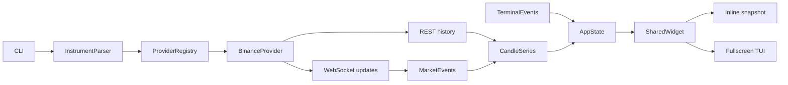

# Implementation Plan

## Goal

从空仓库实现一个 Rust CLI 应用 `fccli`，提供两种共享渲染核心的 K 线模式：

```bash
# 快照：打印后立即退出
fccli btc 1h
fccli binance:btc 1d

# 交互 TUI
fccli btc 1h -i
fccli binance:btc 1d --interactive
```

交付后的行为：

- 快照模式从 Binance Spot 获取最新 K 线，按终端尺寸打印完整图表并退出。
- 交互模式实时更新当前 K 线，支持历史回溯、键盘/鼠标缩放和平移、鼠标十字线。
- 首版仅实现 Binance Spot，但 provider 边界允许后续接入 Hyperliquid、OKX、Coinbase、Bybit 和美股数据源。
- Linux、macOS、Windows 使用相同的数据、状态与渲染路径。

## Confirmed decisions

### CLI 与市场

- 默认模式是快照；`-i`/`--interactive` 进入交互模式。
- 无 provider 前缀时默认 `binance`。
- 首版只支持 Binance Spot，不支持 Binance Futures。
- 裸资产默认使用 USDT：
  - `btc` → `BTCUSDT`
  - `binance:btc` → `BTCUSDT`
  - `btc/usdc` → `BTCUSDC`
  - `btc-usdt` → `BTCUSDT`
  - `BTCUSDT` → `BTCUSDT`
- 支持 Binance 全部官方周期，严格区分 `1m` 和 `1M`：

```text
1s 1m 3m 5m 15m 30m
1h 2h 4h 6h 8h 12h
1d 3d 1w 1M
```

### 图表

- 完整行情布局：
  - source、market、symbol、timeframe、连接状态
  - OHLCV 详情
  - 主 K 线区
  - 右侧价格轴
  - 成交量区
  - 底部 UTC 时间轴
  - 交互快捷键状态栏
- 经典绿涨红跌，填充式 Unicode 蜡烛。
- 价格和时间标签自适应终端宽度及价格数量级。
- 鼠标悬停绘图区时显示十字线和对应单根 K 线的 UTC 时间、OHLCV；离开后恢复显示最新 K 线。
- 首版不包含 MA/EMA、RSI、Bollinger、画线工具、交易、图片导出、持久配置和多图布局。

### 交互

| 输入 | 行为 |
|---|---|
| `A` / `←` | 向历史方向移动 |
| `D` / `→` | 向最新方向移动 |
| `W` / `↑` | 价格视窗上移 |
| `S` / `↓` | 价格视窗下移 |
| `h` | 横向 zoom in，显示更少、更宽的 K 线 |
| `H` | 横向 zoom out，显示更多、更窄的 K 线 |
| `v` | 纵向 zoom in，缩小价格跨度 |
| `V` | 纵向 zoom out，扩大价格跨度 |
| `End` | 回到最新 K 线并恢复实时跟随 |
| `r` | 恢复默认横向缩放、Y 自动适配、最新位置和实时跟随 |
| `q` / `Esc` / `Ctrl-C` | 安全退出并恢复终端 |

鼠标规则：

- 右侧价格轴上下拖动：Y 轴缩放。
- 底部时间轴左右拖动：X 轴缩放。
- 绘图区拖动：同时平移时间和价格，图表内容跟随鼠标。
- 价格轴向上拖动、时间轴向右拖动均表示 zoom in。
- drag 期间隐藏十字线，释放后按新位置恢复。

实时跟随规则：

- 启动时跟随最新 K 线。
- 用户向左移动后暂停跟随；实时数据继续更新，但不会把视窗拉回右侧。
- `End` 或移动到最新边界时恢复跟随。

### 数据加载与验证

- 交互模式初始加载最近 500 根。
- 接近左侧边界时，通过 `endTime` 单线程按需加载最多 1000 根更早数据。
- Binance 使用 REST 历史数据和 WebSocket 实时更新。
- provider 对 UI 暴露统一行情事件流；未来 REST-only provider 可以在自身实现中使用 polling，不改变 UI。
- 快照尺寸使用当前终端宽高并为 shell 留一行；非 TTY 使用 120×36。
- 默认自动测试完全使用本地 REST/WS mock；交付前执行真实 Binance 快照和交互 smoke test。
- Rust Edition 2024，`rust-version = "1.96"`；当前环境为 `rustc 1.96.0`、`cargo 1.96.0`。
- 支持 Linux、macOS、Windows；键盘是硬保证，鼠标功能要求终端能够上报 Crossterm mouse events。

## Relevant codebase context

- 当前 `/root/gitfiles/AdamIsNotAlex/fccli` 是空目录，需要创建新的 Cargo application。
- 参考文件 `/root/gitfiles/Julien-R44/cli-candlestick-chart/examples/fetch-from-binance.rs`：
  - 使用 Binance Kline 数组响应。
  - 将 OHLCV 和 open time 转为 `Candle`。
  - 自动按终端尺寸渲染，并包含成交量。
- 参考库 `cli-candlestick-chart 0.4.1` 直接拼接 ANSI 字符串后 `println!`：
  - 没有事件循环或鼠标输入。
  - 可见数据固定为终端每列一根。
  - Y 轴只能对可见数据自动适配。
  - 不支持视窗状态、手动缩放、十字线或实时更新。
  - 因此只作为视觉和 Binance 解析参考，不作为生产依赖，也不 fork。

推荐依赖基线：

| Dependency | Version | Purpose |
|---|---:|---|
| `ratatui` | 0.30.2 | 布局、Buffer、终端后端、测试后端 |
| `crossterm` | 0.29.0 | 键盘、鼠标、resize、raw/alternate screen |
| `clap` | 4.6.6 | CLI derive 和参数校验 |
| `tokio` | 1.53.1 | 异步任务、channel、timer、网络事件循环 |
| `reqwest` | 0.13.4 | Binance REST |
| `tokio-tungstenite` | 0.30.0 | Binance WebSocket |
| `futures-util` | 0.3.33 | stream/sink、provider boxed stream |
| `serde` / `serde_json` | 1.0.229 / 1.0.151 | REST/WS payload |
| `time` | 0.3.55 | UTC 时间格式化 |
| `thiserror` / `anyhow` | 2.0.20 / 1.0.104 | 类型化错误和顶层上下文 |
| `wiremock` | 0.6.5, dev | REST mock |
| `assert_cmd` | 2.2.2, dev | CLI 契约测试 |

使用最小必要 feature：

- Ratatui：Crossterm 0.29 backend。
- Crossterm：`event-stream`。
- Reqwest：`json`、`query`，沿用 0.13 默认 Rustls。
- Tokio：`macros`、`rt-multi-thread`、`sync`、`time`、`net`。
- Tokio Tungstenite：`connect`、`rustls-tls-native-roots`。
- Time：`formatting`、`macros`。

依据：

- [Ratatui 0.30.2](https://docs.rs/crate/ratatui/0.30.2)
- [Crossterm 0.29 mouse events](https://docs.rs/crossterm/0.29.0/crossterm/event/enum.MouseEventKind.html)
- [Binance Spot REST Klines](https://github.com/binance/binance-spot-api-docs/blob/master/rest-api.md#klinecandlestick-data)
- [Binance Kline WebSocket](https://github.com/binance/binance-spot-api-docs/blob/master/web-socket-streams.md#klinecandlestick-streams-for-utc)
- [Tokio Tungstenite 0.30.0](https://docs.rs/crate/tokio-tungstenite/0.30.0)
- [Ratatui Sci-Fi Candlestick widget](https://docs.rs/ratatui-sci-fi/latest/ratatui_sci_fi/widgets/struct.CandlestickChart.html)

## Recommended approach

### Rendering choice

| Approach | Fit | Cost | Decision |
|---|---|---|---|
| Directly use `cli-candlestick-chart` | Static output only | Interactive mode would require fork and a second rendering architecture | Reject |
| Use a third-party Ratatui candlestick widget | Basic candles available | Existing inspected widget normalizes price to `0..1`，没有成交量、价格轴、视窗和所需交互 | Reject |
| Custom Ratatui `StatefulWidget` writing to `Buffer` | Exact control over glyphs、axes、hit regions、crosshair、tests | Requires implementing chart projection and glyph selection | Use |

Use direct Buffer rendering rather than Ratatui `Canvas`:

- Buffer cells correspond exactly to mouse row/column coordinates.
- Variable candle width, axis drag hit-testing and crosshair overlays remain deterministic.
- Unicode half-body/wick glyphs can reuse the visual principles of the reference project.
- `Buffer`/`TestBackend` tests can assert exact symbols, colors and labels.
- Canvas/Braille gives more sub-cell resolution, but complicates adjacent bull/bear colors and precise single-candle hover selection.

Horizontal zoom-out stops at one source candle per terminal column. It will not merge several real candles into a synthetic display candle, avoiding misleading OHLC and ambiguous crosshair details. Interactive mode initially uses about two columns per candle, leaving useful zoom range in both directions.

### Runtime architecture



Core boundaries:

- `MarketDataProvider` owns provider-specific symbol mapping, REST pagination and live-feed implementation.
- `CandleSeries` owns sorted, deduplicated candles.
- `ChartViewState` owns visible bar count, X position, Y range, follow mode, crosshair and drag state.
- `ChartWidget` is pure rendering: input state + layout area → Ratatui Buffer.
- Snapshot and TUI differ only in terminal lifecycle and event loop; both use the same models and widget.

Suggested source layout：

```text
Cargo.toml
Cargo.lock
src/
  main.rs
  lib.rs
  cli.rs
  error.rs
  model.rs
  provider/
    mod.rs
    binance.rs
  chart/
    mod.rs
    layout.rs
    state.rs
    interaction.rs
    widget.rs
    format.rs
  app.rs
  snapshot.rs
tests/
  cli.rs
  binance_rest.rs
  binance_live.rs
  chart_state.rs
  chart_render.rs
  fixtures/
    binance_klines.json
    binance_kline_open.json
    binance_kline_closed.json
.github/
  workflows/
    ci.yml
```

## Implementation steps

1. **Create the Cargo application**
   - Declare binary name `fccli`, Edition 2024 and `rust-version = "1.96"`.
   - Add the pinned dependency families above with minimal features.
   - Commit `Cargo.lock`; this is an application, so exact dependency resolution must be reproducible.
   - Keep `main.rs` limited to CLI parsing, runtime startup, error reporting and exit codes.
   - Put testable application logic in `lib.rs` modules.

2. **Implement the CLI contract**
   - Define positional `instrument` and `timeframe`, plus `-i/--interactive`.
   - Split `provider:symbol` at the first colon; default provider is `binance`.
   - Normalize Binance symbols:
     - `/` or `-` means explicit base/quote.
     - separator-free symbol ending in `USDT` is treated as a full pair.
     - every other separator-free symbol receives the `USDT` suffix.
     - reject empty components and non-ASCII alphanumeric symbols.
   - Parse timeframe into a closed enum containing all supported official values.
   - Keep timeframe matching case-sensitive so `1m` and `1M` remain distinct.
   - Produce concise errors with valid examples for unknown provider, invalid symbol syntax and unsupported timeframe.

3. **Define provider-neutral domain types**
   - `Instrument`: provider, market, base, quote, provider symbol and display name.
   - `Timeframe`: canonical CLI value and provider mapping.
   - `Candle`: open/close timestamps, OHLC, base volume and closed/open status.
   - `HistoryRequest`: optional start/end time and limit.
   - `MarketEvent`: candle upsert, connected, reconnecting, rate-limited and disconnected statuses.
   - Validate every candle:
     - all floating-point values finite
     - `low <= min(open, close)`
     - `high >= max(open, close)`
     - nonnegative volume
     - `open_time < close_time`
   - Use `f64`; this is a visualization client, not an order/accounting engine.

4. **Create the provider interface**
   - Use an object-safe `MarketDataProvider: Send + Sync`.
   - Return boxed futures for symbol resolution/history and a boxed stream for live events.
   - UI and chart modules must not import Binance response types.
   - Do not implement an unused generic polling system yet. Future REST-only providers implement the same live-event stream contract using polling when first added.

5. **Implement Binance REST history**
   - Production REST base URL: `https://data-api.binance.vision`.
   - Inject the base URL through `BinanceProvider::new` so tests use Wiremock without environment variables or hidden CLI flags.
   - Use `/api/v3/klines`:
     - initial: `limit=500`
     - older history: `limit=1000`, `endTime=oldest_open_time - 1`
   - Deserialize the array response with a typed tuple/newtype, not untyped `Value` indexing.
   - Parse string prices with field-specific error context.
   - Derive REST candle closed state from `close_time` relative to current UTC time.
   - Set a 10-second HTTP timeout.
   - Handle Binance error JSON, 4xx, 5xx and malformed payloads separately.
   - Snapshot errors terminate with exit code 1 and a readable message.
   - Interactive backfill errors keep existing data visible and report failure in the status bar.

6. **Implement Binance live updates**
   - Production WS URL:
     `wss://data-stream.binance.vision/ws/<lowercase-symbol>@kline_<timeframe>`.
   - Decode open and closed Kline events into the same `Candle` type.
   - Upsert the current candle by `open_time`; append only when a new interval begins.
   - Explicitly answer ping frames with pong frames.
   - Treat close frames, transport errors, 24-hour connection expiry and Binance `serverShutdown` as reconnect signals.
   - Reconnect with bounded exponential backoff: 1, 2, 4, 8, 16, then 30 seconds.
   - On reconnect:
     1. establish WS reception,
     2. request REST candles starting from the last known open time,
     3. merge the REST gap fill,
     4. replay buffered WS events,
     5. continue normal streaming.
   - Emit connection status events for the header/footer.

7. **Implement the candle store and history coordinator**
   - Use `VecDeque<Candle>` because the dominant operations are prepend older history, update the newest candle and append a new candle.
   - Keep candles strictly ordered and unique by `open_time`.
   - Filter overlapping backfill pages before prepending.
   - Allow only one backfill request at a time.
   - Trigger backfill when the visible left edge reaches the first 10% of loaded data.
   - When prepending, shift the view index by the number of added candles so the chart does not jump.
   - Stop requesting after Binance returns an empty page.
   - Respect `Retry-After` for HTTP 429 and display the deferred retry state.
   - Keep history in memory only for the process lifetime; no disk cache.

8. **Implement chart view state and transforms**
   - Track:
     - rightmost logical candle index
     - visible candle count
     - effective/manual price center and span
     - Y auto-scale flag
     - live-follow flag
     - hovered candle/price
     - active drag region and initial coordinates
   - Snapshot initial X range: latest one candle per available plot column.
   - Interactive initial X range: approximately one candle per two columns.
   - Clamp X range to 10 candles minimum and one source candle per plot column maximum.
   - Auto Y range uses visible low/high plus 5% padding.
   - Flat-price data gets a nonzero fallback span based on price magnitude.
   - Keyboard transforms:
     - X pan: 5% of visible bars, minimum one bar.
     - Y pan: 10% of current price span.
     - zoom in: multiply visible range/span by `0.8`.
     - zoom out: multiply by `1.25`.
   - Any manual Y pan/zoom disables Y auto-scale.
   - Horizontal movement away from the latest edge disables live-follow.
   - `End` changes only X position/follow state.
   - `r` restores default X scale, auto Y scale, latest position and follow state.
   - Re-clamp state after terminal resize or history mutation.

9. **Implement layout and direct Buffer rendering**
   - Define layout regions once per frame and retain their rectangles for mouse hit-testing:
     - two-row header
     - main chart
     - right price axis
     - volume pane
     - UTC time axis
     - interactive footer
   - Reserve roughly 20% of graph height for volume, with a practical minimum of three rows.
   - Render candles with Unicode wick/body edge glyphs such as `│`, `┃`, `╷`, `╵`, `╻`, `╹`, `╽`, `╿`.
   - When a candle receives multiple columns, repeat the body across its slot and keep the wick centered.
   - Draw volume bars in the same X slots and bull/bear color.
   - Compute adaptive price precision from the visible price range and tick spacing; tiny-value assets must not collapse to `0.00`.
   - Choose 4–8 non-overlapping UTC time labels based on plot width and timeframe.
   - Render crosshair after candles and grid so it remains visible:
     - vertical line at nearest candle center
     - horizontal line at hovered price
     - time label on X axis
     - price label on Y axis
   - Use standard Ratatui green/red rather than truecolor to improve terminal compatibility.
   - Honor `NO_COLOR`; monochrome mode uses distinct bull/bear glyph intensity so direction remains visible without color.
   - Below 60×18:
     - interactive mode renders a resize instruction and still accepts resize/quit events；
     - snapshot mode exits with a clear minimum-size error.

10. **Implement snapshot mode**
    - Fetch history before changing terminal state.
    - For a TTY:
      - obtain current dimensions,
      - reserve one row for the shell,
      - render once through Ratatui `Viewport::Inline`,
      - leave the chart in scrollback and place the cursor below it.
    - Never enable raw mode, alternate screen or mouse capture.
    - For non-TTY output:
      - render the same widget using `TestBackend` at 120×36,
      - serialize plain Unicode rows without ANSI escape sequences.
    - Exit immediately after a successful draw.

11. **Implement the interactive event loop**
    - Require stdin/stdout to be TTYs; otherwise return a clear error recommending snapshot mode.
    - Load the initial 500 candles before entering alternate screen so startup failures do not leave a partial TUI.
    - Add an RAII `TerminalSession`:
      - enable raw mode
      - enter alternate screen
      - enable mouse capture
      - hide cursor
      - always reverse those actions on normal return, error and panic unwinding
    - Use `crossterm::event::EventStream` and `tokio::select!` over:
      - keyboard/mouse/resize events
      - provider live events
      - backfill results
      - reconnect timers/status
    - Redraw only when data, viewport, crosshair, connection state or terminal size changes.
    - Ignore key-release events to prevent duplicate actions on Windows.
    - Spawn the live supervisor as a Tokio task and abort/join it during shutdown.
    - Keep the last valid chart visible during WS reconnects.

12. **Implement mouse interaction**
    - `Moved` in plot area updates crosshair.
    - Left-button `Down` records drag region, initial view and anchor price/time.
    - Plot drag maps cell deltas directly into bar and price offsets.
    - Right-axis drag uses a multiplicative factor of `1.05^|row_delta|`, anchored at the price under the initial mouse row.
    - Bottom-axis drag uses the same factor over column delta, anchored at the candle under the initial mouse column.
    - `Up` commits the final view and restores hover calculation.
    - Ignore drag events outside known chart rectangles.
    - Mouse support remains additive; every action has a keyboard path.

13. **Add cross-platform CI**
    - Add a GitHub Actions matrix for `ubuntu-latest`, `macos-latest` and `windows-latest`.
    - Run `cargo test` and `cargo clippy --all-targets -- -D warnings` on each platform.
    - Run `cargo fmt --check` once on Linux.
    - Tests must not access Binance or any public network endpoint.

## Validation plan

### Automated tests

1. **CLI contract**
   - Snapshot and interactive invocations parse correctly.
   - Provider prefix defaults and explicit `binance:` parsing.
   - Symbol normalization for `btc`, `BTCUSDT`, `btc/usdt`, `btc-usdt`.
   - Every official timeframe accepted.
   - `1m` and `1M` remain distinct.
   - Unknown providers and malformed symbols return nonzero status and actionable errors.

2. **REST provider**
   - Wiremock asserts path and query parameters for initial and backfill calls.
   - Deserialize valid Binance tuple responses.
   - Reject missing elements, invalid numbers, NaN/infinity and broken OHLC invariants.
   - Validate 400 invalid-symbol, 429 with `Retry-After`, 500 and timeout behavior.
   - Backfill uses `oldest_open_time - 1` and never overlaps indefinitely.

3. **WebSocket provider**
   - Local Tokio TCP/WebSocket server sends open and closed Kline fixtures.
   - Verify current candle update and closed candle append.
   - Verify ping/pong.
   - Force disconnect and confirm reconnect status/backoff.
   - Send REST gap-fill data plus overlapping WS events and verify sorted, duplicate-free output.

4. **Series and viewport**
   - Prepending history preserves the same visible candles.
   - Live append follows only while follow mode is active.
   - Left pan pauses follow；`End` restores it.
   - `r` restores all defaults.
   - `h/v` reduce visible ranges；`H/V` increase them.
   - Pan and zoom clamps hold at every boundary.
   - Flat-price, one-candle and empty states never divide by zero.

5. **Mouse transforms**
   - Region hit-testing distinguishes plot, price axis and time axis.
   - Plot drag moves both dimensions with correct sign.
   - Axis zoom keeps the initial cursor anchor stable.
   - Drag suppresses and release restores crosshair.

6. **Rendering**
   - Ratatui `Buffer` assertions at fixed 80×24 and 120×36 sizes.
   - Bull/bear glyphs and colors.
   - Wick/body alignment.
   - Volume alignment.
   - Adaptive tiny-price labels.
   - UTC time labels do not overlap.
   - Hover header and crosshair axis labels.
   - `NO_COLOR` retains directional distinction.
   - Terminal-too-small state.
   - Non-TTY serializer emits exactly 36 rows and no ANSI escapes.

7. **Quality gates**
   - `cargo fmt --check`
   - `cargo clippy --all-targets -- -D warnings`
   - `cargo test`
   - Linux/macOS/Windows CI matrix green.

### Real Binance smoke tests

Run outside the automated suite:

```bash
cargo run -- btc 1h
cargo run -- binance:btc 1m --interactive
```

Verify:

- Snapshot fetches, prints one chart, exits zero and leaves the chart in scrollback.
- Interactive header reaches `LIVE`.
- Current `1m` candle changes within Binance’s update interval.
- Hover shows the correct candle UTC time and OHLCV.
- All WASD/arrow, `h/H`, `v/V`, `End` and `r` actions change the intended state.
- Plot, price-axis and time-axis drag behaviors match the confirmed directions.
- Moving left triggers an older REST page without changing the currently viewed candles.
- Resize recomputes layout without panic or corrupted output.
- `q`, `Esc` and `Ctrl-C` restore cursor, mouse capture, raw mode and the original screen.

## Risks and mitigations

| Risk | Mitigation |
|---|---|
| Terminal mouse reporting differs across terminal emulators and tmux | Use Crossterm capture, test event kinds directly, keep every operation available from the keyboard, and display no false claim when mouse events are unavailable |
| Unicode glyphs render differently with poor fonts | Restrict rendering to common box-drawing characters；use fixed Buffer tests and a monochrome glyph fallback |
| Horizontal terminal resolution is limited | Start interactive mode at two columns per candle and cap zoom-out at one real candle per column；never synthesize misleading aggregate candles |
| Tiny or flat prices break naïve axis math | Adaptive decimal precision, explicit finite-value validation, 5% padding and a nonzero magnitude-based fallback span |
| Binance public endpoints may be blocked geographically or return WAF/rate-limit responses | Use the official market-data-only endpoints, set timeouts, serialize backfill, respect `Retry-After`, and return clear provider-specific errors |
| WebSocket connections expire after 24 hours and require ping/pong | Explicit pong handling, bounded reconnect backoff and REST gap resynchronization |
| Real-time updates can disrupt historical inspection | Separate live data mutation from viewport movement；pause follow after left pan and require `End` to resume |
| Prepending data can make the chart jump | Shift logical view indices by exactly the number of prepended candles and test viewport preservation |
| History can grow during extreme manual backfill | Store compact candles in a `VecDeque`, fetch only near the boundary, allow one request at a time, and keep data process-local |
| Raw mode or mouse capture could survive an error | Central RAII terminal guard, panic-safe teardown and explicit manual smoke testing of all exit paths |
| Cross-platform key events may include press/repeat/release differences | Process only press/repeat events, test synthetic Crossterm events, and run CI on all three target OS families |
| Dependency/API churn | Pin the stated compatible versions through `Cargo.lock`, use Rust 1.96/Edition 2024, and avoid unstable Ratatui APIs or immature candlestick crates |
