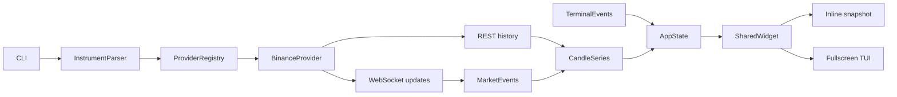

# Implementation Plan

## Goal

从空仓库实现一个 Rust CLI 应用 `fccli`，提供两种共享渲染核心的 K 线模式：

```bash
# 快照：打印后立即退出
fccli btc 1h
fccli binance:btc 1d

# 交互 TUI
fccli btc 1h -i
fccli binance:btc 1d --interactive
```

交付后的行为：

- 快照模式从 Binance Spot 获取最新 K 线，按终端尺寸打印完整图表并退出。
- 交互模式实时更新当前 K 线，支持历史回溯、键盘/鼠标缩放和平移、鼠标十字线。
- 首版仅实现 Binance Spot，但 provider 边界允许后续接入 Hyperliquid、OKX、Coinbase、Bybit 和美股数据源。
- Linux、macOS、Windows 使用相同的数据、状态与渲染路径。

## Confirmed decisions

### CLI 与市场

- 默认模式是快照；`-i`/`--interactive` 进入交互模式。
- 无 provider 前缀时默认 `binance`。
- 首版只支持 Binance Spot，不支持 Binance Futures。
- 裸资产默认使用 USDT：
  - `btc` → `BTCUSDT`
  - `binance:btc` → `BTCUSDT`
  - `btc/usdc` → `BTCUSDC`
  - `btc-usdt` → `BTCUSDT`
  - `BTCUSDT` → `BTCUSDT`
- 支持 Binance 全部官方周期，严格区分 `1m` 和 `1M`：

```text
1s 1m 3m 5m 15m 30m
1h 2h 4h 6h 8h 12h
1d 3d 1w 1M
```

### 图表

- 完整行情布局：
  - source、market、symbol、timeframe、连接状态
  - OHLCV 详情
  - 主 K 线区
  - 右侧价格轴
  - 成交量区
  - 底部 UTC 时间轴
  - 交互快捷键状态栏
- 经典绿涨红跌，填充式 Unicode 蜡烛。
- 价格和时间标签自适应终端宽度及价格数量级。
- 鼠标悬停绘图区时显示十字线和对应单根 K 线的 UTC 时间、OHLCV；指针移动到绘图区外时立即清除 hover，header 恢复显示最新 K 线。
- 首版不包含 MA/EMA、RSI、Bollinger、画线工具、交易、图片导出、持久配置和多图布局。

### 交互

| 输入 | 行为 |
|---|---|
| `A` / `←` | 向历史方向移动 |
| `D` / `→` | 向最新方向移动 |
| `W` / `↑` | 价格视窗上移 |
| `S` / `↓` | 价格视窗下移 |
| `h` | 横向 zoom in，显示更少、更宽的 K 线 |
| `H` | 横向 zoom out，显示更多、更窄的 K 线 |
| `v` | 纵向 zoom in，缩小价格跨度 |
| `V` | 纵向 zoom out，扩大价格跨度 |
| `End` | 回到最新 K 线并恢复实时跟随 |
| `r` | 恢复默认横向缩放、Y 自动适配、最新位置和实时跟随 |
| `q` / `Esc` / `Ctrl-C` | 安全退出并恢复终端 |

鼠标规则：

- 右侧价格轴上下拖动：Y 轴缩放。
- 底部时间轴左右拖动：X 轴缩放。
- 绘图区拖动：同时平移时间和价格，图表内容跟随鼠标。
- 价格轴向上拖动、时间轴向右拖动均表示 zoom in。
- drag 期间隐藏十字线，释放后按新位置恢复。

实时跟随规则：

- 启动时跟随最新 K 线。
- 用户向左移动后暂停跟随；实时数据继续更新，但不会把视窗拉回右侧。
- `End` 或移动到最新边界时恢复跟随。

### 数据加载与验证

- 交互模式初始加载最近 500 根。
- 接近左侧边界时，通过 `endTime` 单线程按需加载最多 1000 根更早数据。
- Binance 使用 REST 历史数据和 WebSocket 实时更新。
- provider 对 UI 暴露统一行情事件流；未来 REST-only provider 可以在自身实现中使用 polling，不改变 UI。
- 快照尺寸使用当前终端宽高并为 shell 留一行；非 TTY 使用 120×36。
- 默认自动测试完全使用本地 REST/WS mock；交付前执行真实 Binance 快照和交互 smoke test。
- Rust Edition 2024，`rust-version = "1.96"`；当前环境为 `rustc 1.96.0`、`cargo 1.96.0`。
- 支持 Linux、macOS、Windows；键盘是硬保证，鼠标功能要求终端能够上报 Crossterm mouse events。

## Relevant codebase context

- 当前 `/root/gitfiles/AdamIsNotAlex/fccli` 是空目录，需要创建新的 Cargo application。
- 参考文件 `/root/gitfiles/Julien-R44/cli-candlestick-chart/examples/fetch-from-binance.rs`：
  - 使用 Binance Kline 数组响应。
  - 将 OHLCV 和 open time 转为 `Candle`。
  - 自动按终端尺寸渲染，并包含成交量。
- 参考库 `cli-candlestick-chart 0.4.1` 直接拼接 ANSI 字符串后 `println!`：
  - 没有事件循环或鼠标输入。
  - 可见数据固定为终端每列一根。
  - Y 轴只能对可见数据自动适配。
  - 不支持视窗状态、手动缩放、十字线或实时更新。
  - 因此只作为视觉和 Binance 解析参考，不作为生产依赖，也不 fork。

推荐依赖基线（所有直接依赖在 `Cargo.toml` 使用 `=版本` 精确约束，并提交生成的 `Cargo.lock`）：

| Dependency | Exact version | Required features / purpose |
|---|---:|---|
| `ratatui` | `=0.30.2` | `default-features = false`, `crossterm_0_29`；布局、Buffer、后端、TestBackend |
| `crossterm` | `=0.29.0` | 默认跨平台能力 + `event-stream`；键盘、鼠标、resize、终端模式 |
| `clap` | `=4.6.6` | derive CLI 和参数校验 |
| `tokio` | `=1.53.1` | `macros`, `rt-multi-thread`, `sync`, `time`, `net` |
| `reqwest` | `=0.13.4` | `default-features = false`, `json`, `query`, `rustls`；确定性的 Rustls REST 客户端 |
| `tokio-tungstenite` | `=0.30.0` | `connect`, `rustls-tls-native-roots`；生产 WS 与本地 WS harness |
| `futures-util` | `=0.3.33` | `default-features = false`, `std`, `sink`；`StreamExt`/`SinkExt`、boxed future/stream |
| `tokio-util` | `=0.7.16` | `rt`；canonical `tokio_util::sync::CancellationToken` across provider/task boundaries |
| `serde` / `serde_json` | `=1.0.229` / `=1.0.151` | Serde 启用 `derive`；typed REST/WS DTO |
| `time` | `=0.3.55` | `formatting`, `macros`；UTC 格式化 |
| `thiserror` / `anyhow` | `=2.0.20` / `=1.0.104` | 类型化边界错误和顶层上下文 |
| `wiremock` | `=0.6.5`, dev | 仅用于 REST mock |
| `assert_cmd` | `=2.2.2`, dev | 无网络 CLI/进程契约测试 |
| `nix` | `=0.30.1`, Linux-only dev | `default-features = false`, `term`, `process`, `fs`；mandatory `openpty`/spawn kernel PTY validation |

工具链固定为 Rust `1.96.0`、Edition 2024：仓库加入 `rust-toolchain.toml`，CI 同样显式安装 `1.96.0`。本地 WebSocket 测试使用 Tokio `TcpListener` + `tokio_tungstenite::accept_async`，不把 Wiremock 当作 WS server。Linux TTY 生命周期验证必须同时使用两种不可互相替代的机制：target-specific `nix = "=0.30.1"` (`term`,`process`,`fs`) `openpty`/spawn 证明真实 kernel termios/echo/进程退出恢复；注入式 terminal-command driver 证明每个 setup/teardown 的确定性 fault path。不得选择其一、省略其一，且非 Linux target 不编译 Nix harness。

Feature 约束与理由：

- Ratatui 的版本匹配 backend selector 是 `crossterm_0_29`；禁用其无关默认 feature，避免并存第二套 Crossterm 类型。
- Serde 默认不含 derive；`serde = { version = "=1.0.229", features = ["derive"] }`。
- Futures-util 禁用默认 feature 后必须保留 `std` 和 `sink`，否则 `SinkExt`/`send` 等 WS 用法不可用。
- Reqwest 明确启用 `rustls` 且关闭默认 feature，避免 TLS 被意外移除，也避免 system-proxy 等默认行为污染本地 mock 测试。
- Tokio 保留 `macros`、多线程 runtime、channel、timer、socket 所需 feature；Tokio Tungstenite 保留 `connect` 与 native-root Rustls。除非另行加入并记录 `url` feature，`connect_async` 只传 `String`/`&str`/`http::Uri`。
- 当前锁定图预计只启用一个 Rustls crypto provider；若实施时 feature 统一产生歧义，必须在启动早期显式安装唯一 provider，并添加启动测试，不得靠平台偶然选择。

依据：

- [Ratatui 0.30.2](https://docs.rs/crate/ratatui/0.30.2)
- [Crossterm 0.29 mouse events](https://docs.rs/crossterm/0.29.0/crossterm/event/enum.MouseEventKind.html)
- [Binance Spot REST Klines](https://github.com/binance/binance-spot-api-docs/blob/master/rest-api.md#klinecandlestick-data)
- [Binance Kline WebSocket](https://github.com/binance/binance-spot-api-docs/blob/master/web-socket-streams.md#klinecandlestick-streams-for-utc)
- [Tokio Tungstenite 0.30.0](https://docs.rs/crate/tokio-tungstenite/0.30.0)
- [Ratatui Sci-Fi Candlestick widget](https://docs.rs/ratatui-sci-fi/latest/ratatui_sci_fi/widgets/struct.CandlestickChart.html)

## Recommended approach

### Rendering choice

| Approach | Fit | Cost | Decision |
|---|---|---|---|
| Directly use `cli-candlestick-chart` | Static output only | Interactive mode would require fork and a second rendering architecture | Reject |
| Use a third-party Ratatui candlestick widget | Basic candles available | Existing inspected widget normalizes price to `0..1`，没有成交量、价格轴、视窗和所需交互 | Reject |
| Custom Ratatui `StatefulWidget` writing to `Buffer` | Exact control over glyphs、axes、hit regions、crosshair、tests | Requires implementing chart projection and glyph selection | Use |

Use direct Buffer rendering rather than Ratatui `Canvas`:

- Buffer cells correspond exactly to mouse row/column coordinates.
- Variable candle width, axis drag hit-testing and crosshair overlays remain deterministic.
- Unicode half-body/wick glyphs can reuse the visual principles of the reference project.
- `Buffer`/`TestBackend` tests can assert exact symbols, colors and labels.
- Canvas/Braille gives more sub-cell resolution, but complicates adjacent bull/bear colors and precise single-candle hover selection.

Horizontal zoom-out stops at one source candle per terminal column. It will not merge several real candles into a synthetic display candle, avoiding misleading OHLC and ambiguous crosshair details. Interactive mode initially uses about two columns per candle, leaving useful zoom range in both directions.

### Runtime architecture



- `MarketDataProvider` owns provider-specific local symbol mapping, REST pagination and live-feed construction；`LiveFeed` owns explicit cancellation and an awaited supervisor task。Chunk 7 只冻结 provider-neutral trait/ownership，并用 injected fake provider 验证；concrete Binance trait implementation、single shared instance 与 registry mapping 只能在 REST+WS supervisor 全部完成后的 chunk 10 末尾加入，禁止 stub/no-op/提前 registry。
- `CandleSeries` is the sole owner of sorted/deduplicated candles and returns `MutationSummary`；the App is its only mutable owner。
- `ChartViewState` owns integer `visible_count`, X boundary/follow state, finite Y range, crosshair and drag state；the App is its only mutable owner。
- Provider/live/history tasks own network work only and emit immutable results/events；they never mutate series or view state。
- `ChartWidget` is pure rendering: input state + retained `ChartLayout` + explicit `RenderPolicy` → Ratatui Buffer。`RenderPolicy` is the only public rendering-policy type; no parallel `ColorPolicy` alias/API is introduced。
- Snapshot and TUI differ only in terminal lifecycle and event loop；both use the same models, layout, formatting and widget。
- Valid modes use only canonical `run_with_dependencies`; chunk 6 and chunk 14 are library-only. Chunk 17 introduces sole dispatch and Assert Cmd only for help/version/argument errors that terminate before dependencies; valid snapshot/interactive tests call `run_with_dependencies` directly with local dependencies. No hidden child-process seam, flag, environment injection, stub, or no-op exists.

Suggested source layout：

```text
Cargo.toml
Cargo.lock
rust-toolchain.toml
src/
  main.rs
  lib.rs
  cli.rs
  error.rs
  model.rs
  series.rs
  clock.rs
  provider/
    mod.rs
    binance.rs
  chart/
    mod.rs
    layout.rs
    state.rs
    interaction.rs
    widget.rs
    format.rs
  terminal.rs
  history.rs
  app.rs
  snapshot.rs
tests/
  cli.rs
  binance_rest.rs
  binance_ws_codec.rs
  binance_live.rs
  chart_state.rs
  chart_render.rs
  terminal_lifecycle.rs
  feature_selection.rs      # introduced in chunk 2
  api_boundaries.rs
  app_live_contract.rs      # introduced only in chunk 17
  support/
    mod.rs
    manual_clock.rs
    local_ws.rs
  fixtures/
    binance_klines.json
    binance_kline_open.json
    binance_kline_closed.json
.github/
  workflows/
    ci.yml
```

This tree is the final delivered inventory, not a chunk-2 precreation list. Chunk 2 creates only the files needed for its skeleton and feature-selection checks, including `tests/feature_selection.rs`; it MUST NOT create `tests/app_live_contract.rs`, which first appears with the real App reducer/consumer contract in chunk 17.

## Resolved implementation contracts

以下决策冻结实现语义；后续 chunk、TODO、测试和错误文案使用相同术语，不得以临时 scaffold 改写。它们细化既有产品范围，不新增 provider、交易或分析功能。

### Canonical shared contract（normative）

以下 Rust-like block 是跨 module API 的唯一权威定义；chunk 与 sibling todo 只能引用这些 exact symbols，不得引入 alias、`or equivalent`、平行字段 taxonomy 或第二种 renderer/reducer state。

```rust
pub type ProviderFuture<'a, T> =
    Pin<Box<dyn Future<Output = Result<T, ProviderError>> + Send + 'a>>;
pub type MarketEventStream =
    Pin<Box<dyn Stream<Item = Result<MarketEvent, ProviderError>> + Send + 'static>>;

#[derive(Clone, Copy, Debug, Eq, Ord, PartialEq, PartialOrd)]
pub struct GapGeneration(pub u64);
#[derive(Clone, Copy, Debug, Eq, Ord, PartialEq, PartialOrd)]
pub struct ReplayRevision(pub u64);

pub trait MarketDataProvider: Send + Sync {
    fn id(&self) -> ProviderId;
    fn canonicalize(&self, spec: &InstrumentSpec) -> Result<Instrument, ProviderError>;
    fn history<'a>(
        &'a self,
        instrument: &'a Instrument,
        timeframe: Timeframe,
        request: HistoryRequest,
        cancellation: CancellationToken,
    ) -> ProviderFuture<'a, Vec<Candle>>;
    fn open_live<'a>(&'a self, request: LiveRequest) -> ProviderFuture<'a, LiveFeed>;
    fn rate_gate(&self) -> RateGateSnapshot;
}

pub struct LiveRequest {
    pub instrument: Instrument,
    pub timeframe: Timeframe,
    pub startup_watermark: Option<i64>,
    pub accepted_watermark_rx: AcceptedWatermarkReceiver,
    pub reconcile_ack_rx: ReconcileAckReceiver,
    pub cancellation: CancellationToken,
}

pub type AcceptedWatermark = Option<i64>;
pub type CancellationToken = tokio_util::sync::CancellationToken;

#[derive(Clone)]
pub struct AcceptedWatermarkSender { /* synchronous nonblocking monotonic latest-value sender */ }
#[derive(Clone)]
pub struct AcceptedWatermarkReceiver { /* awaitable latest-value receiver with per-clone cursor */ }
pub fn accepted_watermark_channel(initial: AcceptedWatermark) -> (AcceptedWatermarkSender, AcceptedWatermarkReceiver);
impl AcceptedWatermarkSender {
    pub fn publish(&self, value: AcceptedWatermark) -> Result<WatermarkUpdate, AcceptedWatermarkUpdateError>;
}
impl AcceptedWatermarkReceiver {
    pub fn current(&self) -> Result<AcceptedWatermark, AcceptedWatermarkClosed>;
    pub async fn changed(&mut self) -> Result<AcceptedWatermark, AcceptedWatermarkClosed>;
}
#[derive(Clone, Copy, Debug, Eq, PartialEq)]
pub enum WatermarkUpdate { Advanced, Unchanged }
#[derive(Clone, Copy, Debug, Eq, PartialEq)]
pub enum AcceptedWatermarkUpdateError { Closed, Regression }

#[derive(Clone, Copy, Debug, Eq, PartialEq)]
pub struct AcceptedWatermarkClosed;
#[derive(Clone, Copy, Debug, Eq, PartialEq)]
pub struct ReconcileAck { pub generation: GapGeneration, pub revision: ReplayRevision, pub through: i64 }
#[derive(Clone, Copy, Debug, Eq, PartialEq)]
pub struct ReconcileExpectation { pub generation: GapGeneration, pub revision: ReplayRevision, pub target_open_time: i64 }
#[derive(Clone)]
pub struct ReconcileAckSender { /* App publication endpoint */ }
pub struct ReconcileAckReceiver { /* supervisor expectation/observation endpoint */ }
pub fn reconcile_ack_channel() -> (ReconcileAckSender, ReconcileAckReceiver);
impl ReconcileAckSender {
    pub fn publish(&self, value: ReconcileAck) -> Result<ReconcileAckUpdate, ReconcileAckPublishError>;
}
impl ReconcileAckReceiver {
    pub fn register_expectation(&mut self, expected: ReconcileExpectation) -> Result<ExpectationUpdate, ReconcileExpectationError>;
    pub fn current_expectation(&self) -> Result<Option<ReconcileExpectation>, ReconcileAckClosed>;
    pub fn current(&self) -> Result<Option<ReconcileAck>, ReconcileAckClosed>;
    pub async fn changed(&mut self) -> Result<ReconcileAck, ReconcileAckClosed>;
}
#[derive(Clone, Copy, Debug, Eq, PartialEq)]
pub enum ExpectationUpdate { Registered, Unchanged }
#[derive(Clone, Copy, Debug, Eq, PartialEq)]
pub enum ReconcileAckUpdate { Published, Unchanged }
#[derive(Clone, Copy, Debug, Eq, PartialEq)]
pub enum ReconcileAckPublishError { Closed, NoExpectation, Stale, UnexpectedKey, ConflictingThrough, ThroughBeforeTarget }
#[derive(Clone, Copy, Debug, Eq, PartialEq)]
pub struct ReconcileAckClosed;
#[derive(Clone, Copy, Debug, Eq, PartialEq)]
pub enum ReconcileExpectationError { Closed, Regression, Conflict }

#[derive(Clone, Debug, Eq, PartialEq)]
pub enum ProducerCompletion { Running, Finished(Result<(), ProviderError>) }
#[derive(Clone)]
pub struct ProducerCompletionReceiver { /* non-consuming awaitable completion watch */ }
impl ProducerCompletionReceiver {
    pub fn current(&self) -> Result<ProducerCompletion, ProducerCompletionClosed>;
    pub async fn changed(&mut self) -> Result<ProducerCompletion, ProducerCompletionClosed>;
}
#[derive(Clone, Copy, Debug, Eq, PartialEq)]
pub struct ProducerCompletionClosed;

pub struct LiveFeed {
    pub events: MarketEventStream,
    pub producer_completion: ProducerCompletionReceiver,
    cancellation: CancellationToken,
    supervisor: tokio::task::JoinHandle<Result<(), ProviderError>>,
}
impl LiveFeed {
    pub fn request_shutdown(&self);
    pub async fn join(self, deadline: MonoInstant) -> Result<(), LiveFeedJoinError>;
}

#[derive(Clone, Copy, Debug, Eq, PartialEq)]
pub enum RateGateState {
    Open,
    TimedUntil(MonoInstant),
    ProcessBlocked(ProcessBlocker),
}
#[derive(Clone, Copy, Debug, Eq, PartialEq)]
pub enum ProcessBlocker { InvalidBanExpiry }

#[derive(Clone)]
pub struct RateGateSnapshot { /* read-only cloneable watch receiver of RateGateState */ }
impl RateGateSnapshot {
    pub fn current(&self) -> Result<RateGateState, RateGateClosed>;
    pub async fn changed(&mut self) -> Result<RateGateState, RateGateClosed>;
}

#[derive(Clone, Copy, Debug, Eq, PartialEq)]
pub enum MutationKind { Inserted, Replaced, Unchanged }
#[derive(Clone, Copy, Debug, Eq, PartialEq)]
pub struct ResolvedMutation {
    pub open_time: i64,
    pub final_index: usize,
    pub kind: MutationKind,
}
#[derive(Clone, Debug, Eq, PartialEq)]
pub enum IndexMapping {
    Identity { len: usize },
    ShiftSuffix { len: usize, from: usize, delta: isize },
    Explicit(Vec<usize>),
}
impl IndexMapping {
    pub fn len(&self) -> usize;
    pub fn map(&self, old_index: usize) -> Option<usize>;
}
#[derive(Clone, Debug, Eq, PartialEq)]
pub struct MutationSummary {
    pub inserted: usize,
    pub replaced: usize,
    pub unchanged: usize,
    pub old_to_new: IndexMapping,
    pub resolved: Vec<ResolvedMutation>,
    pub empty_input: bool,
    pub duplicate_only: bool,
    pub no_progress: bool,
}

#[derive(Clone, Debug, PartialEq)]
pub enum InteractiveChartState { LayoutPending, Ready(ChartViewState) }
#[derive(Clone, Copy, Debug, Eq, PartialEq)]
pub struct ChartLayout {
    pub frame: Rect,
    pub header: Rect,
    pub main_plot: Rect,
    pub volume: Rect,
    pub gutter: Rect,
    pub price_axis: Rect,
    pub utc_axis: Rect,
    pub footer: Option<Rect>,
}
#[derive(Clone, Debug, PartialEq)]
pub enum ChartLayoutResult {
    LayoutPending { required: Size, actual: Size },
    Ready { layout: ChartLayout },
}
#[derive(Clone, Debug, PartialEq)]
pub struct RendererSnapshot {
    pub mode: RenderMode,
    pub display_status: DisplayStatus,
    pub status_detail: Option<ProviderError>,
    pub rate_gate: RateGateState,
    pub instrument: Instrument,
    pub timeframe: Timeframe,
    pub candles: Arc<[Candle]>,
    pub chart_state: InteractiveChartState,
}
#[derive(Clone, Copy, Debug, Eq, PartialEq)]
pub enum DisplayStatus {
    Snapshot, Connected, Connecting, Backoff, GapSync, Stopped, Backfilling,
    TerminalError, Disconnected,
}

pub struct RunDependencies {
    pub providers: ProviderRegistry,
    pub clock: Arc<dyn Clock>,
    pub terminal: Arc<dyn TerminalDriver>,
    pub stdin: Box<dyn std::io::Read + Send>,
    pub stdout: Box<dyn std::io::Write + Send>,
    pub stderr: Box<dyn std::io::Write + Send>,
    pub stdin_is_tty: bool,
    pub stdout_is_tty: bool,
}
pub async fn run_with_dependencies<I, T>(
    args: I,
    dependencies: RunDependencies,
) -> Result<std::process::ExitCode, AppError>
where
    I: IntoIterator<Item = T>,
    T: Into<std::ffi::OsString> + Clone;
```

Channel directions are closed. App creates `accepted_watermark_channel(startup_watermark)`, retains `AcceptedWatermarkSender`, and passes its receiver in `LiveRequest`. App also creates `reconcile_ack_channel()`, whose initial state is exactly no expectation and no acknowledgement; App retains `ReconcileAckSender`, and `LiveRequest` carries the sole `ReconcileAckReceiver`. Watermark publication is synchronous/nonblocking and monotonic under `None < Some(t)`; equal returns `Unchanged`, regression/closure returns the typed error without mutation. Receiver `current` is nonblocking; per-clone-cursor `changed` is awaitable and cancellation-safe for `select!`, returning the latest value or typed closure, never busy polling.

Before emitting an acknowledgeable batch, supervisor calls `register_expectation(ReconcileExpectation { generation, revision, target_open_time })`; keys increase lexicographically, identical registration is `Unchanged`, and regression/conflict is a typed invariant error. Registration atomically clears an older ack. `publish` succeeds only for the registered exact key with `through >= target_open_time`; identical publication is `Unchanged`; no expectation, stale/wrong key, conflicting through, insufficient through, and closure return the exact `ReconcileAckPublishError` without mutation. `current` returns the optional matching ack and awaitable `changed` wakes only for a new matching ack or closure. This registration is the sole meaning of “currently awaited.”

`LiveFeed::producer_completion` starts `Running` and changes once to `Finished(result)` when the supervisor returns, independently of stream closure. App observes it non-consumingly as the active-epoch producer-join source. After terminal restoration, consuming `join` still awaits/owns the handle and returns the same result; an already-reduced completion is not recorded twice, while timeout/abort or distinct join mechanics failure is cleanup detail. `request_shutdown` cancels without awaiting; dropping `events` does not stop the supervisor. Rate-gate and `MutationSummary` semantics remain exactly as defined below.

The canonical invalid/missing-418 error and producer sequence are exactly `MarketEvent::RecoverableError { generation: None, error: ProviderError::InvalidBanExpiry, rate_gate_deadline: None }`, immediately followed by `MarketEvent::Status { generation: None, status: ConnectionStatus::Stopped }`; there is no other blocker/error spelling, deadline, retry, or later generation.

### CLI、instrument 与模式

- `cli.rs` 只把输入解析为 provider-neutral `InstrumentSpec`：provider 前缀、原始 pair components 与 `Timeframe`。provider 名区分大小写，首版仅接受小写 `binance`。
- 最多一个 `:`；pair 最多一个 `/` 或一个 `-`，不得混用。拒绝额外分隔符、空 component、空白和非 ASCII 字母数字。component 先大写，再由 Binance provider 本地、纯函数 canonicalize 为 `Instrument`。
- 无分隔符且以 `USDT` 结尾的 token 仅在移除 suffix 后 base 非空时视为完整 pair；因此 `USDT` 与 `binance:USDT` 在 runtime/TTY/network 前报 canonicalization error。其余无分隔符 token 按锁定规则追加 `USDT`，所以 `BTCUSDC`→`BTCUSDCUSDT`；v1 不猜 quote、不请求 `exchangeInfo`。显式 `btc/usdc` 才表示 `BTCUSDC`。最短合法 suffixed pair 是一个 ASCII alphanumeric base + `USDT`（如 `AUSDT`）。
- `Instrument` 明确保存 Spot market、非空 base/quote、展示 pair 和 opaque provider symbol；展示 pair 的唯一表示是 `BASE/QUOTE`（例如 `BTC/USDT`），与 Binance opaque symbol `BTCUSDT` 明确分离；Binance DTO 与 canonicalization 不越过 provider 边界。
- CLI/Clap 错误优先于 TTY、runtime 和网络工作。Chunk 6 仅提供 parser/canonicalization/command-rendering library API，且不运行任何 `assert_cmd` binary test；chunk 14 只暴露可被最终 dispatcher 调用的真实 snapshot runner，不建立 global dispatcher/binary seam；chunk 17 在 snapshot 与 interactive 两条真实路径都存在后才引入 `RunDependencies`、sole `run_with_dependencies`、`main.rs` dispatch 与首批 binary coverage，chunk 19 完成全部矩阵，禁止临时 no-op/stub dispatch seam。
- `--interactive` 要求 stdin 与 stdout 都是 TTY；任一不是 TTY 即非零退出并建议快照，不自动 fallback。交互 footer 仅在 interactive 出现；snapshot 不显示快捷键 footer。

### Domain、storage、chart state 与历史

- provider-neutral timestamp 一律为 Unix milliseconds，并限定在 `time::OffsetDateTime` 可无损构造和格式化的闭区间；同一 formatter-safe bound 用于 `Candle`、`HistoryRequest`、calendar successor、pagination cursor 与 renderer，越界返回 typed validation error，禁止 panic 或占位标签。`Candle` stores OHLC/base volume/open-close timestamps and exactly one stored finality/provenance field, `FinalityAuthority`, with variants `RestProvisionalOpen | RestProvisionalClosed | WsAuthoritativeOpen | WsAuthoritativeClosed`; open/closed is derived from that authority and no parallel boolean/enum is stored. In addition to finite/OHLC/nonnegative-volume/time-order checks, every price must satisfy `abs(price) <= CHART_PRICE_MAX`, where `CHART_PRICE_MAX = f64::MAX / 4.0`; this makes every accepted raw range, exact 5% padded endpoint, center, and span representable.
- Binance REST decoding emits validated immutable `RestProvisionalOpen` candles only and never inspects merged data. Structural REST closure is exclusively a series-level adjacency hint, not response-local authority: after every `CandleSeries` merge, a REST predecessor becomes `RestProvisionalClosed` whenever its provider-valid interval successor exists anywhere in the merged series, including existing older-history data or a later page; losing that adjacency returns it to `RestProvisionalOpen`. Page partitioning cannot change the final result.
- Equal-`open_time` merge is a complete table: `WsAuthoritativeClosed` never regresses; otherwise any WS authority beats either REST provisional state; between WS open/closed, closed wins; between REST provisional open/closed, closed wins when adjacency proves it and otherwise open is retained; within the same resulting state later accepted payload wins. A later `WsAuthoritativeOpen` may replace any REST payload, and later `WsAuthoritativeClosed` closes it. Initial REST, live, replay and backfill use only this table.
- `HistoryRequest` provides validated `latest`/`older`/`gap`; `older` uses checked `oldest_open_time - 1`, and pagination uses inclusive checked `last_returned_open_time + 1 ms`, never fixed duration for `1M`. Calendar-aware provider successor determines continuity; overflow, repeated cursor and duplicate-only input are no-progress.
- `CandleSeries` alone owns sorted/deduplicated candle storage. It accepts and stable-sorts arbitrary batches, preserves acceptance order among equal keys, recomputes provisional REST adjacency after every mutation, answers calendar-aware continuity and `open_time` lookup, and returns `MutationSummary` with exact inserted/replaced/unchanged counts, canonical `IndexMapping`, resolved open times, and explicit empty-input/duplicate-only/no-progress signals. `IndexMapping::len()` is the number of prior indices and `map(old_index) -> Option<usize>` returns the final index for every valid prior index (and `None` only outside that prior domain); every produced mapping therefore resolves every valid prior index. Same-key newest upsert and newest append return `Identity { len }` without allocating; a single middle/prepend shift uses `ShiftSuffix { len, from, delta }`; only a general batch requiring nonuniform remapping uses `Explicit(Vec<usize>)`. The append hot path checks the previous back element first when determining predecessor adjacency, avoiding a full mapping allocation or unnecessary search while preserving the complete authority/adjacency semantics. It owns no viewport anchor, drag, hover, follow, or end-of-history latch: chunk 5 applies `IndexMapping`/open-time lookup to `ChartViewState`, and chunk 16 is the sole owner of the end/no-progress latch.
- `ChartViewState` has a distinct empty-data state; interactive App startup separately uses `InteractiveChartState::LayoutPending`, never a dummy empty/zero-width view. Snapshot shows latest `min(series_len, plot_width)`. For every nonempty interactive series, the exact X-zoom floor is `min_visible_count = min(series_len, plot_width, 10)`; apply it after every keyboard or mouse X-zoom mutation, then re-clamp the resulting viewport/anchor to the current series and plot width. A zoom-in already at `min_visible_count` is a no-op. Chunk 11 only computes the canonical layout result (while retaining its locked formatting and shared slot-geometry ownership): `ChartLayoutResult::LayoutPending { required: Size, actual: Size }` for an undersized effective frame with no chart rectangles, or `ChartLayoutResult::Ready { layout: ChartLayout }` for an adequate frame; every consumer derives plot width from `layout.main_plot.width`; it owns no renderer state, rendering, App mutation, or first-adequate transition. Chunk 12 introduces `RendererSnapshot` and renders from `RendererSnapshot.chart_state` plus a separately supplied `ChartLayoutResult`; the two inputs remain separate and `RendererSnapshot` has no `layout_result` field.
- Auto-Y uses endpoint-normalized checked arithmetic. Let `raw = high-low` and `epsilon = max(max(abs(low),abs(high),1.0) * 2^-40, f64::MIN_POSITIVE)`. If `raw > epsilon`, endpoints are exactly `low - 0.05*raw` and `high + 0.05*raw`; otherwise centered fallback span is exactly `epsilon`. Manual span clamps to `[epsilon, 1.10 * (2 * CHART_PRICE_MAX)]`. Pan/zoom computes in normalized endpoints and clamps before conversion; drag exponentiation short-circuits at the first exponent that would cross a bound rather than calling overflowing `pow`. Boundary tests include `±CHART_PRICE_MAX`, rejected larger/f64::MAX/opposite extremes, subnormals, and maximum coordinate deltas.
- X uses integer `visible_count`; nearest rounding ties away from zero; pan=`max(1,ceil(visible_count*0.05))`. Follow/`End`/`r`, keyboard center/latest anchors, resize center, mouse initial-candle and initial-row price anchors remain as locked. Plot drag is content-following: dragging downward raises the viewed price center (and dragging upward lowers it), so the grabbed candle remains under the pointer. Chunk 5 receives an explicit already-computed `plot_width`, owns only logical open-time/index anchor preservation after canonical `MutationSummary`, re-clamps `visible_count`, cancels active drag, and sets coordinate-derived hover to `None`; it contains no layout, hit testing, axis sizing, formatting, or coordinate reprojection. Chunk 11 owns permanent `ChartLayout` and hit rectangles. Chunk 13 exclusively owns pointer-coordinate projection: normal move and drag release compute candle/price hover from retained coordinates, and after mutation the next reducer pass may call that same helper only when the pointer remains in the new plot.
- The history coordinator retries only typed `ProviderError` variants classified as recoverable for history. A typed non-retryable client 4xx/client-status error permanently enters the coordinator's no-further-history-request state: it preserves every candle and current view already accepted, clears/disarms any deferred retry, issues no later older-history request for the process, and remains distinct from the ordinary end/no-progress latch. Tests must prove recoverable typed failures retry under the shared gate and that representative non-special client 4xx responses preserve data while suppressing every later history request.

### Provider ownership、closed events、reconciliation、rate gate 与 live protocol

- The exact closed provider-neutral API is `MarketEvent::Status { generation: Option<GapGeneration>, status: ConnectionStatus } | ReconcileBatch { generation: GapGeneration, revision: ReplayRevision, target_open_time: i64, candles: Vec<Candle> } | Candle { generation: GapGeneration, candle: Candle } | RecoverableError { generation: Option<GapGeneration>, error: ProviderError, rate_gate_deadline: Option<MonoInstant> } | TerminalError(ProviderError)`. `Some(generation)` tags gap/reconnect controls, `None` is reserved for controls outside a gap generation, every live `Candle` is generation-tagged, and only the chunk-17 App reducer discards `Status`, `RecoverableError`, `ReconcileBatch`, and `Candle` from an invalidated or older generation. `ConnectionStatus` is exactly `Connecting | GapSync | Connected | Backoff | Stopped`. Stream `Err` is reserved only for terminal supervisor/join/channel failure after no `TerminalError` can be delivered. Producers and the App consumer use exhaustive matches without wildcard; this spelling and these field names/types are frozen in chunks 3, 7, 10, and 17. Chunk 9 does not construct `MarketEvent`; its private codec returns only a closed internal decoded-frame outcome (candle, ping, close, provider error), and chunk 10 alone assigns generations and constructs all statuses, retry/error events, reconciliation batches, and terminal delivery. Chunk 12 receives only an already-reduced renderer snapshot and never matches `MarketEvent`.
- Reducer ordering and display precedence are separate total orders. After stale-generation rejection, one epoch reduces in this complete order: 1 cancellation, then `q`, `Esc`, `Ctrl-C` in admitted terminal-input FIFO; if any occurs, stop the epoch immediately and perform no lower bucket. 2 terminal failures in the exact order terminal lifecycle, stream, channel, producer join, history join; preserve FIFO within each subtype, and after the first such failure record it as primary, retain already-admitted later failures only as ordered secondary cleanup detail, stop normal state mutation for the epoch, and process no buckets 3–7. 3 generation-valid live controls in the exact order `TerminalError`, `RecoverableError`, `Status`, preserving FIFO within each subtype; the first `TerminalError` stops buckets 4–7 after its display/error state is recorded, while recoverable/status events do not short-circuit. 4 history results in source FIFO. 5 generation-valid `ReconcileBatch` in `(generation, revision)` order with arrival FIFO for equal keys, then generation-valid `Candle` in arrival FIFO. 6 `Resize` in terminal-input FIFO, then non-quit keyboard input in FIFO, then pointer/hover events in FIFO; every pointer projection therefore uses the retained layout produced by the latest preceding resize in that epoch. 7 timers in deadline order with admission FIFO ties, then one coalesced redraw. History consequently merges before simultaneous reconciliation/live payload at equal `open_time`. Renderer display precedence is exactly stream/channel/join failure (`DISCONNECTED`) > in-band `TerminalError` > active blocker/rate-limit/recoverable detail > `STOPPED` > `SYNCING` > `RECONNECTING` > `BACKFILLING` > `CONNECTING` > `LIVE`.
- `LiveRequest.startup_watermark` and `accepted_watermark_rx` use monotonic `Option<i64>` under `None < Some(t)`; App retains sender. `LiveRequest` also carries cancellation and the sole `ReconcileAckReceiver`, while App retains `ReconcileAckSender`; it carries no gate snapshot. Presence of an accepted exact-key ack means App proved continuity, with no parallel boolean/correction state.
- Every reconciliation has increasing `GapGeneration` and `ReplayRevision`. Every generation, including `Some(confirmed)`, waits up to `FIRST_KLINE_HANDSHAKE_TIMEOUT` for at least one decoded WS kline before REST reconciliation can complete; a kline ready exactly at deadline wins. For `Some`, inclusive start remains confirmed and the first kline establishes current target (at least confirmed, even if equal); for `None`, it supplies both start and target without predecessor. During reconciliation, every decoded WS candle mutation atomically advances `ReplayRevision` and sets `target_open_time = max(current_target_open_time, candle.open_time)`, including same-key replacements, open→closed updates, and candles arriving between or during REST pages; no WS mutation may leave the revision unchanged or lower/freeze the target. Production is exactly 10 s, validated `1 ms..=60 s`; silence emits typed recoverable handshake failure, invalidates/purges/closes, then Backoff.
- Before each ordered `ReconcileBatch`, supervisor registers its exact latest `ReconcileExpectation`. App merges and proves calendar-aware CandleSeries continuity through that expectation's latest `target_open_time` before publishing the matching ack; missing middle or continuity only through an earlier target publishes none. If WS advances revision/target while REST pagination or an ack is in flight, the older expectation/ack cannot unlock `Connected`: supervisor must reconcile and obtain App proof through the newest target, including multi-page gaps and calendar-aware `1M` successor boundaries. Supervisor waits `RECONCILE_ACK_TIMEOUT = 10 s`, validated in chunk 10 over `1 ms..=60 s`; matching latest ack ready exactly at deadline wins. Expiry emits generation-tagged `ProviderError::ReconcileAckTimeout { generation, revision, target_open_time }`, then Backoff, invalidates/purges/closes, and retries only through ordinary backoff/rate-gate policy. Wrong/stale/conflicting acks never unlock Connected.
- The socket owner selects continuously over cancellation, WS read/automatic-Pong flush, finite REST work, sender readiness and ack changes. Candles drain in ascending `open_time`; same-key coalescing uses the authority table. Normal controls are FIFO after deterministic duplicate-status coalescing. Production capacities are exactly `KEYED_CANDLE_CAPACITY = 1024`, `CONTROL_CAPACITY = 64`, and App-facing `MARKET_EVENT_CHANNEL_CAPACITY = 256`; test configuration accepts each non-emergency capacity only in `1..=65536`. `EMERGENCY_CONTROL_CAPACITY = 2` is non-configurable and permanently preallocated/reserved for exactly the overflow issue plus `Backoff`; normal traffic can never consume either slot. On saturation the generation is atomically invalidated, every queued control and unacknowledged candle from it—including a queued `Connected`—is purged, the socket is closed, and exactly `RecoverableError { generation: None, .. }` then `Status { generation: None, status: Backoff }` is delivered from those two reserved slots. The next generation MUST NOT start until both emergency controls have been delivered; socket read/flush/Pong progress never waits for App capacity, and saturation handling performs no allocation.
- Explicit byte budgets are validated before library construction: REST cap 2 MiB; WS read 128 KiB, message 1 MiB, frame 256 KiB, write 64 KiB, max-write 1 MiB, each `1..=16 MiB`, `frame <= message`, and strictly `write_buffer_size < max_write_buffer_size`. Equality returns the typed configuration error before Tungstenite, so invalid limits cannot panic there.
- One shared cancellation-aware `RestRateGate` belongs to the single `BinanceProvider` and is consulted by initial/history/gap before every request and observed through canonical `RateGateSnapshot`. Valid checked delta-seconds on 429 or 418 extends `TimedUntil` with `max(existing,new)`. Missing/malformed/negative/overflowing 429 uses exactly 30 seconds in production. Missing/malformed/negative/overflowing 418 atomically invalidates/purges the current generation, persists `RateGateState::ProcessBlocked(ProcessBlocker::InvalidBanExpiry)`, then emits the exact canonical `ProviderError::InvalidBanExpiry` event and `Stopped` event from the shared contract; no timed wake, retry, alternate spelling, or later generation exists.
- Reconnect backoff is exactly `1, 2, 4, 8, 16, 30, 30, …` seconds. It resets only after the App-proved reconciliation acknowledgement through the latest ratcheted target has allowed the supervisor to emit acknowledged `Connected`; opening a socket, receiving a kline, delivering replay, proving continuity only through an older target, or an unacknowledged/queued/purged `Connected` does not reset it. Every reconnect wakes at the later of the checked backoff deadline and the current shared timed rate-gate deadline; a later gate extension lengthens an already scheduled wait, while `ProcessBlocked` prevents every later generation. Status transitions, reconnect, reconciliation/backfill, recoverable errors, and timed/process rate-limit transitions never clear already accepted `CandleSeries` data and never reset an inspected viewport, its logical open-time anchor, manual Y range, or paused-follow state; only explicit user reset/follow commands and ordinary mutation-anchor mapping may change that view state.
- Recoverable close/transport/serverShutdown/max-age/malformed-policy/sync/rate/overflow paths emit the exact `RecoverableError` with applicable generation/deadline then the fixed transition; unrecoverable config/invariant emits `TerminalError(ProviderError)` then terminates. Tungstenite alone queues Pong; application sends none.

### Fixed production constants and no-progress transitions

- Numeric/layout constants, fields, and formulas are exact. `CHART_PRICE_MAX: f64 = f64::MAX / 4.0`, `PRICE_LABEL_BUDGET: u16 = 14`, and `PRICE_AXIS_GUTTER: u16 = 1`. Canonical `ChartLayout` has exactly `frame`, `header`, `main_plot`, `volume`, `gutter`, `price_axis`, `utc_axis`, and `footer: Option<Rect>`. Given a nonzero-origin input `frame = Rect { x: x0, y: y0, width: W, height: T }`, the pure layout function first returns `ChartLayoutResult::LayoutPending { required: Size { width: 60, height: 18 }, actual: Size { width: W, height: T } }` whenever effective `W < 60 || T < 18`; this guard runs before any layout equation. Otherwise use checked/saturating `u16` arithmetic and reserve `header_height=2`, `utc_height=1`, and `footer_height = 1` only for interactive mode (`0` for snapshot). For width, `gutter_width = if W >= 2 { 1 } else { 0 }`, `price_label_width = min(PRICE_LABEL_BUDGET, W.saturating_sub(gutter_width + 1))`, and `plot_width = W - gutter_width - price_label_width`; thus one plot column remains whenever `W > 0`. Let `H = T - header_height - utc_height - footer_height`; adequate layout requires `H >= 4`, then `volume_height = clamp((H + 2) / 5, 3, H - 1)` and `main_plot_height = H - volume_height`. The exact retained half-open rectangles are `header = Rect(x0, y0, W, 2)`, `main_plot = Rect(x0, y0+2, plot_width, main_plot_height)`, `volume = Rect(x0, y0+2+main_plot_height, plot_width, volume_height)`, `gutter = Rect(x0+plot_width, y0+2, gutter_width, H)`, `price_axis = Rect(x0+plot_width+gutter_width, y0+2, price_label_width, H)`, `utc_axis = Rect(x0, y0+2+H, plot_width, 1)`, and `footer = Some(Rect(x0, y0+2+H+1, W, 1))` only in interactive mode, otherwise `None`; `frame` remains the exact input rectangle. Rectangle containment is universally half-open: `x <= px < x+width && y <= py < y+height`. Pointer ownership is exact and disjoint: `main_plot` is the only candle hover/plot-pan region, `price_axis` is the only Y-axis drag region, `utc_axis` is the only X-axis drag region, and `header`, `volume`, `gutter`, and `footer` are non-interactive; every boundary cell belongs only to the rectangle whose half-open range contains it, and coordinates outside `frame` hit nothing.
- Chunk 8 exclusively owns REST cap, `REST_REQUEST_TIMEOUT = 10 s`, and 429 fallback `30 s`. Chunk 9 exclusively owns all five WS byte constants, strict write<max-write validation, and `WS_STALLED_WRITE_TIMEOUT = 5 s` validated `1 ms..=60 s`.
- Chunk 17 exclusively owns `MAX_EVENTS_PER_SOURCE_PER_EPOCH = 32`, `PRODUCER_JOIN_TIMEOUT = 5 s`, and `HISTORY_JOIN_TIMEOUT = 5 s` with their stated ranges.
- Chunk 10 exclusively owns `KEYED_CANDLE_CAPACITY = 1024`, `CONTROL_CAPACITY = 64`, non-configurable permanently reserved `EMERGENCY_CONTROL_CAPACITY = 2`, and `MARKET_EVENT_CHANNEL_CAPACITY = 256`; every configurable capacity validates over `1..=65536`, and boundary tests prove normal traffic cannot consume the emergency slots. It also owns `FIRST_KLINE_HANDSHAKE_TIMEOUT = 10 s`, `RECONCILE_ACK_TIMEOUT = 10 s`, 24 h max age, and reconnect backoff `1,2,4,8,16,30,30,… s`, reset only after acknowledged `Connected`; each reconnect deadline is `max(checked_backoff_deadline, current_rate_gate_deadline)`. Both timeouts validate `1 ms..=60 s` with event-at-deadline wins. Chunk 10 consumes chunk 9's already validated stalled-write value and owns only its recovery transition/integration.
- Gap pagination requests up to 1000 candles from the inclusive cursor. A page that reaches/covers target emits the ordered batch and awaits its matching ack. A nonempty full page that advances the checked cursor but remains below target requests the next page. Otherwise—empty page, duplicate-only/no-progress page, repeated/non-advancing cursor, or short page (`len < requested_limit`) whose last open time remains below target—emit `RecoverableError { generation: Some(g), error: ProviderError::GapSyncNoProgress { target_open_time, last_open_time: Option<i64> }, rate_gate_deadline: None }`, then `Status { generation: Some(g), status: ConnectionStatus::Backoff }`; invalidate/purge `g`, close the socket, and retry only when the ordinary checked backoff/rate-gate deadline expires. It never remains in `GapSync` or spins another REST request in that generation. A gap-sync REST response with any non-special 4xx status (including 403 and a non-invalid-symbol 400, excluding the separately locked 418/429 handling) instead emits exactly `MarketEvent::TerminalError(the sanitized typed non-retryable client-status/HTTP ProviderError)` and terminates the producer immediately: no `RecoverableError`, `Backoff`, retry, or later generation is emitted.
### Deterministic intake、interaction、layout、terminal 与 isolation

- App uses a two-phase finite-epoch reducer, not direct branch reduction. Each cycle first samples cancellation and terminal input through dedicated cancellation-safe sources; `q`/Esc/Ctrl-C is preclassified as priority 1. It then admits at most configured `MAX_EVENTS_PER_SOURCE_PER_EPOCH` from each ready source and applies the complete canonical order and short-circuits frozen above, including lifecycle→stream→channel→producer-join→history-join terminal ordering, live `TerminalError`→`RecoverableError`→`Status`, history before reconciliation/candles, and resize before keyboard then pointer/hover projection. Priority overrides cross-variant live FIFO while preserving FIFO within each exact subtype; generation rejection prevents an old event from overwriting a newer generation. Tests enumerate every order-sensitive adjacent subtype pair, every terminal short-circuit boundary, and simultaneous resize+pointer projection, in addition to quota/fairness cases.
- Chunk 3 defines `MonoInstant` and every absolute-deadline value required by domain/events. Chunk 7 defines only `Clock`, manual scheduler, checked duration-to-deadline conversion, cancellation, and task timeout seams. All interaction/render/output behaviors remain locked.
- Undersized interactive startup is `InteractiveChartState::LayoutPending`. The sole canonical layout-result enum is exactly `ChartLayoutResult::LayoutPending { required: Size, actual: Size } | ChartLayoutResult::Ready { layout: ChartLayout }`; it contains no duplicate `plot_width`, and every consumer derives that value from `layout.main_plot.width`. Chunk 11 only computes and returns `ChartLayoutResult` and owns no renderer state, rendering, App mutation, or first-adequate transition. Chunk 12 introduces and consumes a complete `RendererSnapshot` together with a separately supplied `ChartLayoutResult`; the two inputs remain separate and `RendererSnapshot` has no `layout_result` field. It renders `ChartLayoutResult::LayoutPending` as the resize-only frame with no chart rectangles and renders adequate snapshots without mutating App. Chunk 17 exclusively consumes the first `ChartLayoutResult::Ready` to perform the one-time first-adequate App transition and owns all later resize preservation/reclamp.
- Chunk 11 owns one shared `CandleSlotGeometry` used unchanged by both renderer and interaction/hit testing. For plot origin `x0`, width `W`, and `N=visible_count` with `0 < N <= W`, let `q=W/N`, `r=W%N`; slot `i` is the half-open interval `[x0 + i*q + min(i,r), x0 + (i+1)*q + min(i+1,r))`. Thus the first `r` slots receive one remainder column (remainder-left), every plot column belongs to exactly one slot, and the slot center/wick/nearest-candle coordinate is `floor((start + end - 1)/2)`. `N=0` or `W=0` yields no slots; coordinates before `x0` or at/after `x0+W` map to none. Renderer candle bodies/wicks/volume and interaction hover/drag/zoom anchors MUST consume this helper rather than reimplementing partition math; chunk 11 tests non-divisible widths, nonzero origins, half-open edges, remainder-left widths, and center-floor ties.
- `TerminalSession` marks every step `NotAttempted | AttemptedOrActive | Restored`, setting `AttemptedOrActive` before mutation. Rollback/cleanup attempts the idempotent inverse for every attempted/uncertain step in cursor→mouse→alternate→raw order, continues after errors, and `Drop` retries unrestored state without panic. Driver tests include side-effect-then-error for every setup command.
- Shutdown stops actions, closes terminal input/event receivers, signals producer cancellation, and explicitly restores/drops `TerminalSession` before awaiting network/history joins; only outside the session does an injected bounded monotonic join deadline permit abort+join. A never-cooperating producer test proves terminal restoration precedes its abort completion.
- Automated integration uses explicit injected library entry functions, not valid child processes or hidden flags/env. Test builds use mutually exclusive transport features: CI runs tests with production constructors/hosts compiled out (`--no-default-features --features test-transport`), while a separate compile-only `production-transport` build proves the real binary path. Test transport APIs accept literal loopback and disable redirects. Chunk 2 validates only feature mutual exclusion/default selection and successful test-/production-feature compilation. Non-vacuous compile-fail/API-boundary fixtures are added only with the real APIs they protect: REST production-client construction in chunk 8, WS construction in chunk 9, and concrete provider/registry construction in chunk 10; chunks 18–19 retain the combined boundary. Negative runtime tests reject public/DNS/redirect endpoints. No automated test has a public-capable transport object.

### Assumptions and rationale

- 假设 Binance Spot kline contract 与已引用官方文档一致，且 v1 不做 exchange metadata discovery；这样 provider resolution 无额外启动网络竞态。
- 假设固定 direct pins + `Cargo.lock` + `rust-toolchain.toml` 是 application reproducibility 的三层要求；只做其中之一不足以锁定实施环境。
- 选择 app-only mutable ownership，理由是 store merge、view shift 与 redraw 顺序必须可确定测试，避免 network task 并发写 UI state。
- 选择 bounded keyed WS buffer + paginated REST，理由是 1000 根上限不足以覆盖长期断线，按 open-time 去重又能限制 replay 歧义。
- 选择 Tungstenite automatic Pong，理由是库已保证 queue response，manual Pong 会重复并消耗 Binance control-frame 限额。
- 选择 integer X state 与明确 rounding，理由是重复 zoom 不产生 floating drift，固定 Buffer tests 可精确复现。
- 选择 effective-frame minimum，理由是 inline snapshot 的 shell-row reservation 是 renderer 外层约束；60×18 physical 无法同时满足 60×18 chart。
- PTY automation 只证明 Linux command/lifecycle contract；tmux、Terminal.app/iTerm2、Windows Terminal 仍需 manual smoke。鼠标 availability 依赖 terminal event reporting，键盘和 cleanup 是硬保证。

## Dependency-ordered implementation chunks

每个 chunk 只在其前置 contracts/tests 完成后开始；fixtures/seams 随消费 feature 同步加入，不留到末尾 omnibus task。实施过程中不得用临时 duplicate model 或兼容 shim 绕过顺序。

1. **Contract freeze（本计划与 sibling checklist）**
   - Freeze every name/formula/state above and reconcile every original validation; no alternative policy remains.

2. **Reproducible skeleton**
   - Exact manifest/toolchain/lock/module tree; mandatory Linux-only Nix PTY plus injected driver; mutually exclusive `test-transport`/`production-transport`. The displayed tree is the final inventory, not a precreation mandate: create `tests/feature_selection.rs` here for default/independent/mutually-exclusive feature checks, and do not create `tests/app_live_contract.rs` until chunk 17. Verify Rust 1.96, three-target dependency graph, feature mutual exclusion/default selection, and successful compilation under each feature independently; define no behavior constants/config validation, constructor compile-fail fixture, or behavior scaffold yet.

3. **Provider-neutral domain/events only**
   - Define the locked domain/events plus `MonoInstant` and all absolute-deadline values appearing in them. Do not define provider aliases/channels/tasks or the `Clock` abstraction here.

4. **Pure candle storage**
   - Stable accept/sort, complete authority merge, sole ownership of series-level REST adjacency closure/regression, strict uniqueness, calendar-aware continuity, open-time lookup, and `MutationSummary` counts/`IndexMapping`/empty-input/duplicate-only signals. `IndexMapping` is exactly `Identity { len } | ShiftSuffix { len, from, delta: isize } | Explicit(Vec<usize>)`, exposes `len()` and `map(old_index) -> Option<usize>`, and resolves every valid prior index. Verify same-key newest upsert and newest append use allocation-free `Identity`, single middle/prepend shifts use `ShiftSuffix` where applicable, general nonuniform batches may use `Explicit`, and append predecessor detection checks the previous back element first; preserve all observable mutation, authority, adjacency, count, and resolved-mutation semantics. Also verify page-boundary closure, missing-middle detection, arbitrary mutation, and no-progress reporting; REST inputs are immutable provisional candles only. This store chunk owns no viewport anchors, drag/hover behavior, follow state, or end-of-history latch.

5. **Pure chart state**
   - Exact initializers and integer transforms parameterized only by explicit caller-supplied `plot_width`; enforce `visible_count <= min(series_len, plot_width)` after every zoom/resize/mutation and preserve logical X/right-edge/center anchors via canonical `MutationSummary.old_to_new.map(old_index)` or `open_time`. On mutation cancel active drag and set coordinate-derived hover to `None`; tests assert equivalent anchor behavior for `Identity`, `ShiftSuffix`, and `Explicit`, plus invalidation and before/inside/after anchor preservation, never coordinate reprojection. This chunk contains no retained layout, hit testing, axis/formatting, history latch, or integrated layout-to-view work.

6. **CLI/parser and local Binance canonicalization**
   - Parse only `ProviderId`/`InstrumentSpec`; pure Binance canonicalization; test valid forms, command rendering, help/version, and invalid inputs only through `Cli::try_parse_from`. No Assert Cmd binary test, registry, dispatch, child-process injection seam, stub, or no-op in this chunk; Assert Cmd waits for the sole real dispatch in chunk 17 and completion in chunk 19.

7. **Provider-neutral APIs and ownership only**
   - Introduce the exact canonical provider APIs and endpoint/error symbols. Fake-provider tests cover awaitable watermark changes, expectation registration, every `ReconcileExpectationError`/`ReconcileAckPublishError`, idempotence, closure, `ProducerCompletionReceiver`, cancellation, rate-gate observation, and bounded consuming join. No alternate ack/provider API exists.

8. **Deterministic Binance REST**
   - Exact production base URL is `https://data-api.binance.vision`, path `/api/v3/klines`. The single production Reqwest client sends the identifying User-Agent value `concat!("fccli/", env!("CARGO_PKG_VERSION"))` on every request; an independent Wiremock assertion verifies the exact resulting header. Own REST timeout/cap/rate policy. The self-contained local-mock error matrix is: invalid-symbol HTTP 400 with sanitized Binance code/message; every other non-418/non-429 HTTP 4xx (including 403 and a 400 whose Binance code is not invalid-symbol) maps to the existing sanitized typed non-retryable client-status/HTTP error without exposing raw payloads; 429 valid Retry-After or exact 30 s invalid/missing fallback; 418 valid deadline or absorbing `InvalidBanExpiry`; generic 5xx recoverable status; typed request timeout and transport failure; malformed JSON/non-array/wrong-arity/invalid-field/over-budget typed payload failure. Each row has an independent local-mock test.

9. **WS codec and bounded local harness**
   - Exact endpoint `wss://data-stream.binance.vision/ws/<lowercase-symbol>@kline_<timeframe>`; chunk 9 owns all byte bounds, strict write<max-write including equality rejection before Tungstenite, and `WS_STALLED_WRITE_TIMEOUT`. Chunk 10 only consumes it for recovery integration.

10. **Full WS supervisor, reconciliation, then concrete registry（producer only）**
    - Own the exact capacities/ranges and permanent two-slot emergency reservation frozen above, first-kline and ack timeouts, max age, and reconnect sequence `1,2,4,8,16,30,30,… s`. Every generation crosses the first-WS current-target barrier. Every reconciliation WS candle mutation advances `ReplayRevision` and ratchets `target_open_time=max(current,candle.open_time)`; exact latest expectation registration/proof-only ack gates `Connected`, including WS arrivals during multi-page REST pagination or an outstanding ack and calendar-aware `1M` races. Only acknowledged `Connected` proven through the latest target resets backoff, and retry waits until the later of checked backoff and the current rate-gate deadline. Ack timeout causes typed invalidation/Backoff. Expose the one-way producer-completion watch and consume chunk 9's validated stalled-write timeout without redefining it.
    - **Current unchecked implementation accounting（pending main gates；no ledger credit）:** source now invalidates every non-cancelled failed generation before recovery, purges queued generation events, drops its socket before Backoff, uses the request-scoped REST target, advances inclusive pagination by checked `last_open_time + 1 ms`, filters first WS data older than the confirmed start, applies authority-aware same-key coalescing without closed→open regression, and observes watermark/ack/gate changes with typed closure during connect、first-kline、REST、ack、Connected、and Backoff. It wires separate regular/control permits plus the keyed Connected queue/emergency pair, dynamically extends `max(backoff, gate)`, converts ProcessBlocked to the reserved invalid-ban/Stopped sequence, resets backoff only after the consumer dequeues `Connected`, and keeps connect/shutdown cancellation nonblocking. New source tests cover first WS before/equal/after a confirmed watermark, a real 1000-row page plus `+1 ms` continuation and authoritative WS overlap, empty/short confirmed no-progress, exact non-special 400 terminal behavior, the complete pre-Connected capped backoff sequence, shared registry trait dispatch/completion, and paired registry constructor boundaries. These additions are not PASS evidence until the main gates run. Chunk 10 remains incomplete for the still-unimplemented/unproved exhaustive decoded-outcome/error matrix, cancellation in every remaining state, deadline-equality cases, `1M` page race and remaining repeated-cursor cases, all live expectation/channel errors, independent queue/control/emergency-bound matrices and ordered coalesced-drain evidence, timed-gate/ProcessBlocked+saturation integration evidence, positive/pre-Connected max-age boundaries, stalled-write supervisor recovery, and reset-after-multiple-post-Connected-failures coverage.


11. **Pure layout, formatting, and shared candle-slot geometry**
    - Own and validate `PRICE_LABEL_BUDGET=14`, conditional `PRICE_AXIS_GUTTER=1`, canonical `ChartLayout { frame, header, main_plot, volume, gutter, price_axis, utc_axis, footer }`, and the exact nonzero-origin equations and half-open hit ownership frozen above. Before evaluating any equation, return `ChartLayoutResult::LayoutPending { required: Size { width: 60, height: 18 }, actual: Size { width: W, height: T } }` whenever effective `W < 60 || T < 18`; pure boundary tests require `59x18` pending, `60x17` pending, and `60x18` ready. From the height `H` remaining after the two-row header, one-row UTC axis, and exactly one interactive-only footer row (no snapshot footer), require `H >= 4` and apply `volume_height = clamp((H + 2) / 5, 3, H - 1)` and `main_plot_height = H - volume_height`. Implement retained rectangles, 1/2/5 ticks, adaptive precision, bounded base-volume formatting, exact UTC formats, whole-label omission, and empty text. Introduce the sole shared `CandleSlotGeometry` with canonical half-open equal partition, remainder-left allocation, center-floor selection, and outside/empty behavior. Its only runtime output is the canonical pure layout computation `ChartLayoutResult::LayoutPending { required, actual }` or `ChartLayoutResult::Ready { layout }`; it owns no renderer state, rendering, App mutation, or first-adequate transition, and every consumer derives plot width from `layout.main_plot.width`.

12. **Pure shared Buffer renderer snapshots**
    - Introduce canonical `RendererSnapshot` and consume it with the single `RenderPolicy`; renderer input is a complete `RendererSnapshot` together with a separately supplied `ChartLayoutResult`, and `RendererSnapshot` has no `layout_result` field. Chunk 12 exclusively renders `ChartLayoutResult::LayoutPending` as the resize-only branch with no chart rectangles, and renders adequate states without performing the App's first-adequate transition. In every adequate main plot, draw each visible 1/2/5 price grid row first with glyph `─` across every `main_plot` cell; then use chunk-11 `CandleSlotGeometry` for candle wick/body and direction-matched volume cells. The crosshair is rendered last with vertical glyph `┆` in every `main_plot` row at the nearest candle center, horizontal glyph `┄` in every other `main_plot` cell on the hovered-price row, intersection glyph `┼` at their crossing, and `┄` across every `gutter` cell on that row. Its exact X UTC label is centered on the candle-center column then clamped as a whole label inside `utc_axis`, replacing underlying UTC tick cells; its exact Y price label is left-aligned and space-padded to `price_axis.width`, replacing the entire corresponding `price_axis` row. Crosshair cells replace grid/candle cells, and axis labels replace preexisting axis cells; no crosshair glyph is written into `volume`, `header`, or `footer`. Color policy uses the same glyphs with grid `DarkGray`, crosshair and both overlay labels `Yellow`, and preserves candle/volume bull-green, bear-red, and doji-neutral styles beneath non-overlaid cells. Style-free policy uses the identical symbols and overwrite order but `Style::default()` for every grid, crosshair, intersection, and overlay-label cell, emitting no ANSI. The complete candle/body glyph inventory remains `│`, `┃`, `╷`, `╵`, `╻`, `╹`, `╽`, `╿`, bull body `█`, bear body `▓`, and doji `━`. Fixed-`Buffer` tests assert every glyph and exact cell style for both policies, grid-under-candle and crosshair-last intersections, gutter continuation, whole-label clamping/padding on both axes, nonzero origins, and unchanged cells outside every retained rectangle. Snapshot status is exact `SNAPSHOT`; interactive display consumes only already-reduced `DisplayStatus`/detail/rate-gate inputs and never raw lifecycle/control events.

13. **Interaction mapping**
    - After permanent chunk-11 layout/hit rectangles and `CandleSlotGeometry` exist, exclusively map retained pointer coordinates through that shared helper to candle/price hover; no duplicate slot math. Normal movement and drag release reproject; outside-plot movement clears immediately. After series mutation chunk 5 has cleared hover, the next reducer pass may call the same helper if retained coordinates remain inside the new plot. Tests own coordinate-based recomputation plus locked transforms, content-following signs, suppression/release, half-open edges, center ties, non-divisible widths/nonzero origins, and inside→outside behavior.

14. **Snapshot runner（library-only; no global dispatcher）**
    - Direct library integration only through the real injected snapshot runner. Its deterministic request assertion is exactly `HistoryRequest::latest(..., limit=500)`, and its rendered result uses the latest `min(series_len, plot_width)` candles. No `RunDependencies`, dispatcher, main, Assert Cmd, or binary coverage exists in this chunk; all binary early-exit coverage waits for chunk 17.

15. **TerminalSession**
    - Three-state attempted/uncertain tracking, side-effect-then-error driver, non-short-circuit cleanup, mandatory real PTY. Verify prompt restore independent of never-cooperating producers.

16. **History coordinator**
    - Obtain the shared current gate only from `provider.rate_gate()`, implement deferred retry extension and the sole end/no-progress latch, and consume chunk-4 signals/chunk-5 mappings without owning view state. Retry only typed recoverable history failures. A typed non-retryable client 4xx/client-status failure preserves accepted data and view state, clears any deferred retry, and persistently disables every further older-history request for the process in a state distinct from end/no-progress. Verify boundary/end/no-progress behavior, recoverable typed retry, persistent non-retryable-4xx suppression with data preservation, concurrent valid 418/429 extension, invalid/missing 429 exact 30s fallback, and invalid/missing 418 or observation closure disabling automatic retry and recording blocker status.

17. **Interactive app/reducer and sole dispatch（sole MarketEvent consumer）**
    - Add explicit `LayoutPending` startup and exclusively perform the one-time App transition on the first adequate `ChartLayoutResult::Ready`; subsequent adequate results only preserve/reclamp existing state. Then introduce sole dispatch. Assert Cmd covers only help/version/argument errors that terminate before dependencies; valid snapshot/interactive modes call sole `run_with_dependencies` directly with local dependencies. Active epochs observe `ProducerCompletionReceiver`; consuming join after restoration never duplicates it. This chunk alone proves that status, reconnect, reconciliation/backfill, recoverable error, and rate-limit reductions preserve all accepted `CandleSeries` data and the inspected viewport/manual-Y/paused-follow state. It also adds `tests/app_live_contract.rs`, matching the `DET-RECONCILIATION-STATE` ledger command, with producer-to-App coverage proving that a gap-sync non-special 4xx is delivered as `MarketEvent::TerminalError`, terminates the producer, becomes the App's terminal failure, and permits no retry, `Backoff`, or later generation.

18. **Errors/compatibility/isolation**
    - Stable errors, single `RenderPolicy`, production/test transport feature boundary, cross-platform behavior and exclusions.

19. **CI/final verification**
    - Populate only these authoritative ledger record IDs: `DET-FMT`, `DET-TEST-LINUX`, `DET-TEST-MACOS`, `DET-TEST-WINDOWS`, `DET-CLIPPY-LINUX`, `DET-CLIPPY-MACOS`, `DET-CLIPPY-WINDOWS`, `DET-PRODUCTION-CHECK`, `DET-LINUX-PTY`, `DET-DEFAULT-FEATURE`, `DET-MUTUAL-EXCLUSION`, `DET-CONSTRUCTOR-BOUNDARY`, and `DET-RECONCILIATION-STATE`.
## Validation plan

### Automated contract tests（全部 local-only、deterministic）

1. **Manifest/toolchain/module/network boundary**
   - Exact pins/features/toolchain/lock；Linux-only Nix PTY does not enter other targets；main thin；chart/app have no Binance DTO。
   - The exact one-to-one gate inventory and commands/scenarios are the deterministic `DET-*` records below. `production-transport` is the default for ordinary Cargo selection; `test-transport` builds the Assert Cmd binary without production constructors; both together must fail at compile time. Chunk 2 checks default/mutual selection and independent feature compilation only; non-vacuous compile-fail boundaries arrive with REST in chunk 8, WS in chunk 9, provider/registry in chunk 10, and are combined in chunks 18–19. Literal-loopback/public-IP/DNS/redirect negatives are mandatory.

2. **CLI、canonicalization 与 injected entry**
   - Chunk 6 and chunk 14 are library-only. From chunk 17, Assert Cmd is restricted to help/version/argument-error early exits; every valid mode is tested by direct `run_with_dependencies` with local dependencies. No hidden child-process injection exists.

3. **Domain、series、view numeric invariants**
   - Formatter-safe Unix-ms bounds, validated requests/cursors/calendar successor; `FinalityAuthority` is the sole stored finality/provenance and open/closed is derived from its complete four-state merge table; REST emits provisional candles and only `CandleSeries` recomputes adjacency across older-page and exact-1000 gap boundaries; current row remains provisional; ±clock skew.
   - Stable sort/equal-key order, mappings/counts/unique, missing-middle continuity. Exact initializers and exact 5%/epsilon/min/max formulas. `visible_count` is clamped after every keyboard/mouse zoom, resize and series mutation; zoom-out reaches exactly `plot_width` and the next attempt is a no-op. Accept `±CHART_PRICE_MAX`, reject larger/f64::MAX/opposite unsafe extremes, and prove subnormal/flat/max-delta finite results.

4. **REST provider/rate gate/body bounds**
   - Exact base `https://data-api.binance.vision` plus `/api/v3/klines`; the production Reqwest client identifies itself with `concat!("fccli/", env!("CARGO_PKG_VERSION"))`, independently asserted as the exact resulting `User-Agent` header by Wiremock. Independent local mocks cover latest/older/gap queries, invalid-symbol 400 Binance body, generic non-special 4xx/client status (including 403 and non-invalid-symbol 400) as the sanitized typed non-retryable client-status/HTTP error, generic 5xx, timeout, transport failure, malformed JSON/non-array/wrong-arity/invalid fields, and declared/chunked >2 MiB.
   - Latest-query and injected snapshot-runner tests assert exact `limit=500`; 429/418 behavior follows the exact self-contained matrix above and one shared non-shortening gate.

5. **WS codec、configuration 与 automatic Pong**
   - Verify exact endpoint/constants, ranges, frame≤message, strict write<max-write and equality rejection before Tungstenite, and chunk-9-owned stalled-write timeout; chunk 10 tests only recovery integration.

6. **Live supervisor producer contract、reconciliation 与 registry**
   - Construct every exact event plus one-way `ProducerCompletionReceiver`; prove active-epoch observation and later consuming join return the same result without duplicate accounting.
   - Every generation waits for a first WS kline under exact 10 s barrier, event-at-deadline wins, then registers exact `ReconcileExpectation`. Every reconciliation WS candle mutation advances revision and ratchets `target_open_time=max(current,candle.open_time)`; App continuity/ack must reach the latest target before `Connected`. Missing-middle no-ack reaches exact 10 s ack timeout, ack-at-deadline wins, and timeout emits `ReconcileAckTimeout` then invalidation/Backoff. Deterministic tests cover same-key/open→closed mutations, WS arrivals between pages and while ack is pending, multi-page gaps, calendar-aware `1M` successor races, stale earlier acks, all channel errors, revision/target races, and the gap-sync non-special 4xx producer path that emits `MarketEvent::TerminalError` and terminates without retry or a later generation.
   - Retain all saturation, Ping/Pong, blocker, reconnect, gate, ordering, cancellation, and registry validations already locked. Manual-clock tests assert exact backoff `1,2,4,8,16,30,30,…`, no reset before acknowledged `Connected` through the latest target, reset immediately after that acknowledged `Connected`, and wake at the maximum of checked backoff and a concurrently extended shared rate-gate deadline.
   - Test data/control saturation while the app channel is full across multiple Ping intervals: continuously read/flush, yield exactly one automatic Pong per Ping, atomically invalidate the generation on queue saturation, purge queued controls including queued `Connected`, discard unacknowledged candles, use preallocated reserved capacity for exactly `RecoverableError { generation: None, .. }` then `Status { generation: None, status: Backoff }`, deliver both before starting the next generation, and prove deterministic producer delivery without allocation/blocking. All consumer acceptance, prior-`LIVE` clearing, stale control/candle rejection, old-candle/new-batch ordering, and accepted-series/viewport/manual-Y/paused-follow state-preservation proofs belong solely to chunk 17.
   - Also prove the exact invalid/missing-418 out-of-generation `InvalidBanExpiry` then `Stopped` producer sequence with `rate_gate_deadline: None`; prove that every gap-sync non-special 4xx (including 403 and non-invalid-symbol 400) produces exactly `MarketEvent::TerminalError` and immediate producer termination with no recoverable transition, retry, or later generation; and prove deterministic normal control order, ascending candle drain, socket recovery, rapid nonblocking optional-watermark/ack updates in every state, receiver closure, current update, authoritative close, >1000 outage, overlaps, rate gate, injected production 24-hour connection max-age transition, every cancellation state, no post-shutdown events, and empty-history first-WS handshake. Only after these pass, validate concrete Binance trait/registry/shared-instance dispatch.

7. **History coordinator**
   - Exact threshold/single-flight and sole end/no-progress latch; one deferred shared-gate retry only for a typed recoverable history failure if inside, outside disarm, repeated response or concurrent caller extends a valid deadline, cancellation. A typed non-retryable client 4xx/client-status failure preserves all accepted candles and view state, clears deferred retry, enters the persistent distinct no-further-history-request state, and causes every later history trigger to issue no request. Tests cover both typed recoverable retry and representative non-special client 4xx permanent suppression/data preservation. Invalid/missing 429 uses exact configured 30s; invalid/missing 418 or observer closure disables automatic retry and records blocker status; chunk-4 store signals and chunk-5 prepend/middle anchor mapping remain one-way inputs, never duplicated state.

8. **Layout、format 与 renderer**
   - Chunk 11 only computes the pure canonical `ChartLayoutResult::LayoutPending { required: Size, actual: Size } | ChartLayoutResult::Ready { layout: ChartLayout }`, with no duplicate `plot_width`; every consumer derives plot width from `layout.main_plot.width`. Before any equations it returns pending whenever effective `W < 60 || T < 18`, with pure boundary coverage for `59x18` pending, `60x17` pending, and `60x18` ready. It retains the locked formatting and shared geometry helpers: exact `ChartLayout` fields, nonzero-origin equations, half-open/disjoint hit regions, conditional gutter/axis/plot width, exact 1–9/≥10 initializer inputs, two-row header, one-row UTC axis, one-row interactive-only footer with no snapshot footer, and the canonical `volume_height = clamp((H + 2) / 5, 3, H - 1)` with `main_plot_height = H - volume_height`; it owns no renderer state or App transition. Chunk 12 exclusively consumes a complete `RendererSnapshot` together with a separately supplied `ChartLayoutResult`; `RendererSnapshot` has no `layout_result` field. It renders the resize-only pending frame with no dummy view/rectangles and covers adequate Buffer rendering under the exact glyph/style/overlay rules below. Chunk 17 alone performs the first adequate App initialization; later ready layouts only preserve/reclamp existing state.
   - `CandleSlotGeometry` tests prove the exact half-open formula, first-`r` remainder distribution, center `floor((start+end-1)/2)`, complete/no-overlap column ownership, no-slot/outside behavior, and identical renderer/interaction mapping for non-divisible widths and nonzero origins.
   - `1/2/5×10^n`, adaptive decimal/scientific precision and fit with tiny-price and very-large-price fixtures proving adjacent labels distinct/monotonic/in-bounds, compact `K/M/B/T` then scientific large-volume formatting proving bounded header text and unchanged stored base volume, exact UTC strings `%H:%M:%S`/`%H:%M`/`%m-%d %H:%M`/`%Y-%m-%d`/`%Y-%m`, 4–8 nonoverlap and whole-label omission.
   - The only widget policy API is `RenderPolicy`. Fixed-`Buffer` snapshots freeze grid `─`, crosshair vertical `┆`, horizontal `┄`, intersection `┼`, gutter-row continuation, centered-and-clamped UTC overlay, and left-aligned space-padded full-width price-axis overlay. They assert the exact `DarkGray` grid and `Yellow` crosshair/overlay-label cell styles under color policy, the same glyphs/overwrite order with `Style::default()` and no ANSI under style-free policy, direction-matched candle/volume styles on every non-overlaid cell, crosshair-last replacement of grid/candle cells, label replacement of preexisting axis cells, and untouched cells outside retained nonzero-origin rectangles. Snapshot asserts exact header status `SNAPSHOT`, outside `ConnectionStatus`. Interactive renderer input is already reduced; snapshots exhaust display precedence `DISCONNECTED` > in-band `TerminalError` > active blocker/rate-limit/recoverable detail > `STOPPED` > `SYNCING` > `RECONNECTING` > `BACKFILLING` > `CONNECTING` > `LIVE`, exclude lifecycle/cleanup controls, and do not test stale generations. `hover = None` renders latest-candle header details. Non-TTY and NO_COLOR absent/empty/set are directional, 36 rows/35 newlines/no ANSI.

9. **Keyboard/mouse transforms**
   - Press/repeat/release, all keys, half-open/tie-left/ownership/clamps/signs, fixed initial candle/price anchors, exponent bound short-circuit, and the content-following Y sign where downward plot drag raises viewed price center. For a nonempty series, keyboard and mouse X zoom both apply exact `min_visible_count = min(series_len, plot_width, 10)` after the zoom mutation and then re-clamp viewport/anchor; tests assert that exact minimum for `series_len`, `plot_width`, and `10` as each limiting term, and assert the next zoom-in at the floor is blocked. Drag suppresses crosshair and release recomputes it; a synthetic inside→outside mouse move immediately clears hover, and a fixed-Buffer assertion proves the header reverts to the latest candle.

10. **Snapshot/terminal lifecycle（real Linux PTY + injected driver）**
    - Snapshot inline/no mutation; physical terminal `60x18` fails because the reserved shell row leaves an effective height below 18, while physical `60x19` passes with effective `60x18`; all interactive stdin/stdout TTY combinations.
    - Every setup step is marked attempted before mutation; normal error and side-effect-then-error for each command attempt all idempotent reverse undos; teardown failures do not short-circuit; Drop never panics and retries unresolved state.
    - q/Esc/Ctrl-C/provider/render/panic restore raw/echo/cursor/mouse/alternate. A never-cooperating producer proves terminal input closes and restoration completes before abort/join outside the session. No active-session `process::exit`.

11. **Interactive reducer/integration**
   - Order tests use the real non-consuming producer-completion source for the producer-join bucket; final join is cleanup accounting only. Retain every other pairwise order and short-circuit case.
   - Integration covers the current-target first-kline barrier; revision/target ratcheting on every reconciliation WS mutation; multi-page and calendar-aware `1M` WS/REST races; latest-expectation registration, proof-only ack and ack timeout; `LayoutPending`→chunk-17-only one-time adequate initialization→ordinary resize; persistence of accepted CandleSeries plus inspected viewport/manual-Y/paused-follow state across status, reconnect, reconciliation/backfill, recoverable error, and rate-limit transitions; and all existing reconnect/render/shutdown cases.

12. **Error、privacy 与 scope audit**
    - Stable precedence/sanitization; no secrets/raw payload/API key. No forbidden renderer/Canvas/exchangeInfo/generic polling/cache/config/indicator/trading/export/multi-chart/Futures/extra provider/synthetic aggregation/telemetry/shim/retry layer.

13. **Quality/CI gates（实施完成后执行）**
    - Maintain exactly one record ID per gate. Attempts may repeat until PASS; each is append-only and `Supersedes` the immediately prior attempt. Deterministic rows are never BLOCKED.

### Environment-dependent result accounting and durable ledger

This section is the sole authoritative validation ledger. `init.todo.md` may reference record IDs and track checklist status only; it MUST NOT restate commands, record schemas, attempts, or completion rules. Deterministic records always have `Applicability=REQUIRED` and `ExecutionStatus=PENDING|PASS`; failures and unavailable prerequisites remain `PENDING`, never `BLOCKED`. Environment records separate `Applicability=REQUIRED|CONDITIONAL|NOT-APPLICABLE` from `ExecutionStatus=PENDING|PASS|BLOCKED`; `BLOCKED` is permitted only by the row's narrow external criterion. Conditional mouse records start `CONDITIONAL/PENDING`; a positive raw Crossterm move+button+drag probe changes them to `REQUIRED/PENDING`, while a truthful negative probe changes them to `NOT-APPLICABLE/PENDING`—execution is neither falsely passed nor blocked. `FINAL-SCOPE` becomes eligible for its own audit only after every other `REQUIRED` record is `PASS`; overall completion then requires `FINAL-SCOPE=PASS` and ignores `NOT-APPLICABLE` records. `REAL-INTERACTIVE` always excludes mouse; `FINAL-SCOPE` is never blocker-eligible.

Attempts are append-only. Every new attempt names the immediately previous attempt for that record in `Supersedes`; older attempts are never edited/deleted, and seed rows are inventory markers rather than attempts. Hosted-runner outage evidence uses a separate `OUTAGE-*` environment record and never changes a deterministic record.

| ID | Applicability | Execution status | Exact command / scenario and PASS semantics | Narrow blocker criterion |
|---|---|---|---|---|
| DET-FMT | REQUIRED | PASS | `cargo fmt --check`; exit 0 | never |
| DET-TEST-LINUX | REQUIRED | PENDING | Linux: `cargo test --locked --all-targets --no-default-features --features test-transport`; exit 0 | never |
| DET-TEST-MACOS | REQUIRED | PENDING | macOS: same exact locked OS-test command; exit 0 | never |
| DET-TEST-WINDOWS | REQUIRED | PENDING | Windows: same exact locked OS-test command; exit 0 | never |
| DET-CLIPPY-LINUX | REQUIRED | PENDING | Linux: `cargo clippy --locked --all-targets --no-default-features --features test-transport -- -D warnings`; exit 0 | never |
| DET-CLIPPY-MACOS | REQUIRED | PENDING | macOS: same exact locked Clippy command; exit 0 | never |
| DET-CLIPPY-WINDOWS | REQUIRED | PENDING | Windows: same exact locked Clippy command; exit 0 | never |
| DET-PRODUCTION-CHECK | REQUIRED | PENDING | `cargo check --locked --all-targets --no-default-features --features production-transport`; exit 0 | never |
| DET-LINUX-PTY | REQUIRED | PENDING | `cargo test --locked --test terminal_lifecycle --no-default-features --features test-transport linux_openpty_restores_kernel_state -- --exact`; exit 0 and named Nix test runs, not zero filtered | never |
| DET-DEFAULT-FEATURE | REQUIRED | PASS | `cargo test --locked --test feature_selection default_is_production_only -- --exact`; exit 0 and compile-time fixture proves production enabled/test disabled | never |
| DET-MUTUAL-EXCLUSION | REQUIRED | PASS | `cargo check --locked --all-targets --no-default-features --features production-transport,test-transport`; expected nonzero only from dedicated feature-conflict `compile_error!` | never |
| DET-CONSTRUCTOR-BOUNDARY | REQUIRED | PENDING | `cargo test --locked --test api_boundaries --no-default-features --features test-transport combined_production_constructors_are_unnameable -- --exact`; exit 0 and named combined REST/WS/provider boundary runs | never |
| DET-RECONCILIATION-STATE | REQUIRED | PENDING | `cargo test --locked --test app_live_contract --no-default-features --features test-transport reconciliation_target_and_state_persistence -- --exact`; `tests/app_live_contract.rs` exists, exit 0, and the named deterministic scenario proves every reconciliation WS mutation advances revision/ratchets target, `Connected` waits for App continuity through the latest target across multi-page and `1M` races, status/reconnect/backfill/rate-limit transitions preserve accepted CandleSeries plus inspected viewport/manual-Y/paused-follow state, and a gap-sync non-special 4xx is produced as `MarketEvent::TerminalError`, terminates the producer, is reduced as the App terminal failure, and permits no retry, `Backoff`, or later generation | never |
| REAL-SNAPSHOT | REQUIRED | PENDING | `cargo run --locked -- btc 1h`; use Binance Spot as the displayed source and the exact `1h` timeframe, fetch exactly one latest request with `limit=500`, exit zero, show exact `SNAPSHOT` and `BTC/USDT`, render UTC time labels, OHLCV details, the volume region, and the right-side price axis, and leave exactly one complete chart in scrollback after exit. Use current terminal width/height while reserving one shell row (or deterministic `120×36` when non-TTY), render the latest width-fitting candles, leave output inline in scrollback, do not enter raw mode/alternate screen/mouse capture, do not print the interactive shortcut footer, and return the prompt on the reserved shell row with terminal state unchanged. The injected-runner assertion for the exact latest limit must already PASS | public Binance unavailable after retry and deterministic prerequisites including the injected-runner assertion PASS |
| REAL-INTERACTIVE | REQUIRED | PENDING | `cargo run --locked -- binance:btc 1m --interactive`; require both stdin/stdout TTY, initially request exactly the latest 500 candles, enter the alternate screen and reach `LIVE`, and observe the current `1m` candle's displayed values changing from authoritative live updates within its documented one-minute interval, not merely a new candle appearing after interval rollover. Verify the full keyboard contract: `A`/Left and `D`/Right pan time, `W`/Up and `S`/Down pan price, `h`/`H` zoom X, `v`/`V` zoom Y, `End` resumes latest follow, and `r` restores default X zoom/auto-Y/latest/follow. Move left to pause follow while accepted live data continues without snapping the viewport, return to the latest edge to resume follow, trigger single-flight older history with `endTime` and pages of at most 1000, exercise undersized resize-only display and first adequate recovery, then enter a distinguishable non-following logical anchor/manual-Y/paused-follow state and observe status transition, reconnect, reconciliation/backfill, and any naturally reachable timed rate-limit state without clearing accepted candles or resetting that inspected state. Exit ordinarily and verify complete restoration. If timed rate limiting is not naturally observed, `DET-RECONCILIATION-STATE` supplies only that subcase; controlled provider/render/panic failures belong only to their permanent harness records | public Binance unavailable after retry and every deterministic prerequisite including `DET-RECONCILIATION-STATE` PASS |
| REAL-INTERACTIVE-MOUSE | CONDITIONAL | PENDING | A positive raw Crossterm move+button+drag probe makes REQUIRED. PASS then verifies hover crosshair and exact UTC/OHLC/base-volume details, immediate outside-plot clear with latest-candle header restoration, price-axis upward drag zoom-in, time-axis rightward drag zoom-in, plot drag moving time and price with content following the pointer, fixed initial candle/row-price anchors, hidden crosshair during every drag, and crosshair recomputation on release. A truthful negative probe makes NOT-APPLICABLE with evidence and no UI availability claim | after positive probe only, public Binance unavailable under the REAL-INTERACTIVE criterion |
| RESTORE-Q | REQUIRED | PENDING | real TTY production interactive exit via `q`; prompt returns with raw mode/echo/cursor/mouse capture/alternate screen completely restored | named terminal unavailable after retry and DET-LINUX-PTY PASS |
| RESTORE-ESC | REQUIRED | PENDING | real TTY production interactive exit via `Esc`; the same complete terminal restoration | same |
| RESTORE-CTRL-C | REQUIRED | PENDING | real TTY production interactive exit via Ctrl-C; the same complete terminal restoration | same |
| RESTORE-PROVIDER-ERROR | REQUIRED | PENDING | `cargo test --locked --test terminal_lifecycle --no-default-features --features test-transport manual_real_tty_provider_error_restores -- --exact --ignored --nocapture`; permanent injected provider fails during active session; prompt/raw/echo/cursor/mouse/alternate state is completely restored and canonical error precedence is observed | named terminal unavailable after retry and DET-LINUX-PTY PASS |
| RESTORE-RENDER-ERROR | REQUIRED | PENDING | `cargo test --locked --test terminal_lifecycle --no-default-features --features test-transport manual_real_tty_render_error_restores -- --exact --ignored --nocapture`; permanent injected renderer fails during active session; prompt/raw/echo/cursor/mouse/alternate state is completely restored and canonical error precedence is observed | same |
| RESTORE-PANIC | REQUIRED | PENDING | `cargo test --locked --test terminal_lifecycle --no-default-features --features test-transport manual_real_tty_panic_restores -- --exact --ignored --nocapture`; permanent injected active-session panic fallback; best-effort prompt/raw/echo/cursor/mouse/alternate restoration and nonzero failure semantics | same |
| TERM-LINUX | REQUIRED | PENDING | Linux terminal PASS observes snapshot current-size/non-TTY-fallback sizing, reserved shell row, inline scrollback and unchanged terminal; interactive alternate-screen entry, all keyboard controls, initial follow/pause/resume, live updates, older-history loading, undersized→adequate recovery, q/Esc/Ctrl-C/provider-error cleanup, prompt/raw/echo/cursor/mouse/alternate restoration, and an independent raw mouse capability probe. Truthful unsupported mouse is permitted only with evidence and no availability claim | named terminal unavailable after retry and deterministic prerequisites PASS |
| TERM-TMUX | REQUIRED | PENDING | tmux/outer-terminal PASS repeats every `TERM-LINUX` snapshot, keyboard, live/history, resize, follow, and restoration observation in tmux and performs its own independent raw mouse capability probe; no other terminal substitutes | environment unavailable after retry and prerequisites PASS |
| TERM-MACOS-TERMINAL | REQUIRED | PENDING | Terminal.app PASS repeats every platform-applicable snapshot, keyboard, live/history, resize, follow, and restoration observation and performs its own independent raw mouse capability probe; no other terminal substitutes | same |
| TERM-MACOS-ITERM2 | REQUIRED | PENDING | iTerm2 PASS repeats every platform-applicable snapshot, keyboard, live/history, resize, follow, and restoration observation and performs its own independent raw mouse capability probe; no other terminal substitutes | same |
| TERM-WINDOWS | REQUIRED | PENDING | Windows Terminal PASS repeats every platform-applicable snapshot, keyboard, live/history, resize, follow, and restoration observation and performs its own independent raw mouse capability probe; no other terminal substitutes | same |
| MOUSE-LINUX | CONDITIONAL | PENDING | Linux positive probe makes REQUIRED: PASS repeats the complete `REAL-INTERACTIVE-MOUSE` hover/details/outside-clear, three drag-zone direction/anchor, drag-hidden-crosshair, and release-reprojection observations; negative probe makes NOT-APPLICABLE with evidence and no false availability claim | activated only by positive probe |
| MOUSE-TMUX | CONDITIONAL | PENDING | tmux positive probe makes REQUIRED and uses the same complete mouse PASS semantics; negative probe makes NOT-APPLICABLE with evidence and no false claim | activated only by positive probe |
| MOUSE-MACOS-TERMINAL | CONDITIONAL | PENDING | Terminal.app positive probe makes REQUIRED and uses the same complete mouse PASS semantics; negative probe makes NOT-APPLICABLE with evidence and no false claim | activated only by positive probe |
| MOUSE-MACOS-ITERM2 | CONDITIONAL | PENDING | iTerm2 positive probe makes REQUIRED and uses the same complete mouse PASS semantics; negative probe makes NOT-APPLICABLE with evidence and no false claim | activated only by positive probe |
| MOUSE-WINDOWS | CONDITIONAL | PENDING | Windows Terminal positive probe makes REQUIRED and uses the same complete mouse PASS semantics; negative probe makes NOT-APPLICABLE with evidence and no false claim | activated only by positive probe |
| FINAL-SCOPE | REQUIRED | PENDING | final audit may be recorded PASS only after every other REQUIRED record is PASS, every activated mouse record is PASS, every negative-probe mouse record is NOT-APPLICABLE with evidence, all 19 chunks/Goal/Confirmed decisions/exclusions/Risks are delivered with evidence, and no stub/TODO/no-op/shim/duplicate/deprecated compatibility path remains | never |

Authoritative attempt schema:

| Record ID | Attempt ID/date | Applicability after attempt | Execution status after attempt | Named environment | Exact command/scenario | Expected exit/result | Observed result | Evidence | Retry/reason while pending | Supersedes |
|---|---|---|---|---|---|---|---|---|---|---|
| all records | seed | as inventoried above | `PENDING` | row environment | row command/scenario | row PASS semantics | not executed | — | implementation/evidence pending | — |
| DET-FMT | `attempt-2026-08-10-chunk2-1` / 2026-08-10 | REQUIRED | `PASS` | Linux workspace | `cargo fmt --check` | exit 0 | PASS | Chunk-2 command evidence reports PASS for the exact authoritative command. | — | seed |
| DET-DEFAULT-FEATURE | `attempt-2026-08-10-chunk2-1` / 2026-08-10 | REQUIRED | `PASS` | Linux workspace, default Cargo features | `cargo test --test feature_selection` | exit 0; the default-feature fixture runs with production enabled and test transport disabled | PASS | Chunk-2 command evidence reports PASS; `Cargo.toml` lines 8–11 select only `production-transport` by default, and `tests/feature_selection.rs` lines 1–12 assert production enabled/test disabled. | — | seed |
| DET-MUTUAL-EXCLUSION | `attempt-2026-08-10-chunk2-1` / 2026-08-10 | REQUIRED | `PASS` | Linux workspace, simultaneous production/test features | simultaneous `production-transport` + `test-transport` Cargo check (the chunk-2 evidence did not retain the full argv) | nonzero only from the dedicated feature-conflict `compile_error!` | expected nonzero; exact dedicated `compile_error!` observed | Chunk-2 command evidence reports the expected feature-conflict failure; `src/lib.rs` lines 3–4 contain that exact mutually-exclusive-feature `compile_error!`. | — | seed |
| DET-DEFAULT-FEATURE | `attempt-2026-08-10-chunk2-2` / 2026-08-10 | REQUIRED | `PENDING` | Linux workspace, default Cargo features | `cargo test --locked --test feature_selection default_is_production_only -- --exact` | exit 0; the named default-feature fixture runs with production enabled and test transport disabled | not executed | The prior PASS used `cargo test --test feature_selection`, omitting authoritative `--locked`, the named test filter, and `-- --exact`; its broader successful run does not prove execution of this ledger's exact command. | Execute the exact authoritative command before recording PASS. | `attempt-2026-08-10-chunk2-1` |
| DET-MUTUAL-EXCLUSION | `attempt-2026-08-10-chunk2-2` / 2026-08-10 | REQUIRED | `PENDING` | Linux workspace, simultaneous production/test features | `cargo check --locked --all-targets --no-default-features --features test-transport,production-transport` | nonzero only from the dedicated feature-conflict `compile_error!` | not executed | The prior PASS did not retain its full argv, so it cannot establish that the authoritative locked all-targets command was executed; observing the intended `compile_error!` under an incompletely recorded invocation is insufficient ledger evidence. | Execute the exact authoritative command and confirm the nonzero result is caused only by the dedicated feature-conflict `compile_error!`. | `attempt-2026-08-10-chunk2-1` |
| DET-DEFAULT-FEATURE | `attempt-2026-08-10-chunk2-3` / 2026-08-10 | REQUIRED | `PASS` | Linux workspace, default Cargo features | `cargo test --locked --test feature_selection default_is_production_only -- --exact` | exit 0; the named default-feature fixture runs with production enabled and test transport disabled | PASS; 1 passed, 0 failed, 0 ignored, 0 measured, 0 filtered out | `artifact://528` records the exact named test `default_is_production_only` passing. | — | `attempt-2026-08-10-chunk2-2` |
| DET-MUTUAL-EXCLUSION | `attempt-2026-08-10-chunk2-3` / 2026-08-10 | REQUIRED | `PASS` | Linux workspace, simultaneous production/test features | `cargo check --locked --all-targets --no-default-features --features production-transport,test-transport` | exit 101 solely from the dedicated feature-conflict `compile_error!` | exit 101 solely from the dedicated feature-conflict `compile_error!` | `artifact://532` records only the intended mutually-exclusive-feature error at `src/lib.rs:4`, followed by Cargo's lib/lib-test failure summaries. | — | `attempt-2026-08-10-chunk2-2` |
| DET-FMT | `attempt-2026-08-10-chunk2-2` / 2026-08-10 | REQUIRED | `PENDING` | Linux workspace before rustfmt provisioning | `cargo fmt --check` | exit 0 | command could not run: Cargo reported that the `cargo-fmt` executable was not installed for toolchain `1.96.0-x86_64-unknown-linux-gnu` | Retained chunk-2 command transcript records the exact invocation and missing-rustfmt diagnostic. | Provision the pinned toolchain's `rustfmt` component, then retry the exact command. | `attempt-2026-08-10-chunk2-1` |
| DET-FMT | `attempt-2026-08-10-chunk2-3` / 2026-08-10 | REQUIRED | `PASS` | Linux workspace after out-of-band rustfmt provisioning | `cargo fmt --check` | exit 0 | PASS | Retained chunk-2 command transcript records the exact retry succeeding after `rustfmt` was installed. | — | `attempt-2026-08-10-chunk2-2` |
| DET-FMT | `attempt-2026-08-10-chunk2-4` / 2026-08-10 | REQUIRED | `PENDING` | Linux workspace after the toolchain file was amended to provision components | `cargo fmt --check` | exit 0 | command did not reach formatting because concurrent rustup component provisioning failed | Retained post-fix chunk-2 command transcript records the provisioning failure before the exact formatter gate could complete. | Retry after the concurrent pinned-toolchain component provisioning settles. | `attempt-2026-08-10-chunk2-3` |
| DET-FMT | `attempt-2026-08-10-chunk2-5` / 2026-08-10 | REQUIRED | `PASS` | Linux workspace, final chunk-2 tree | `cargo fmt --check` | exit 0 | PASS | Retained final chunk-2 command transcript records the exact authoritative formatter command succeeding on the final tree. | — | `attempt-2026-08-10-chunk2-4` |
| DET-DEFAULT-FEATURE | `attempt-2026-08-10-chunk2-4` / 2026-08-10 | REQUIRED | `PASS` | Linux workspace, default Cargo features | `cargo test --locked --test feature_selection default_is_production_only -- --exact` | exit 0; the named default-feature fixture runs with production enabled and test transport disabled | PASS; 1 passed, 0 failed, 0 ignored, 0 measured, 0 filtered out | `artifact://519` records the earlier exact named test `default_is_production_only` passing while rustup reported `rustfmt` up to date and provisioned `clippy`. This appended correction preserves that earlier authoritative invocation omitted by the prior history. | — | `attempt-2026-08-10-chunk2-3` |
| DET-DEFAULT-FEATURE | `attempt-2026-08-10-chunk2-5` / 2026-08-10 | REQUIRED | `PASS` | Linux workspace, default Cargo features, final chunk-2 tree | `cargo test --locked --test feature_selection default_is_production_only -- --exact` | exit 0; the named default-feature fixture runs with production enabled and test transport disabled | PASS; 1 passed, 0 failed, 0 ignored, 0 measured, 0 filtered out | `artifact://528` records the final exact named test `default_is_production_only` passing; this latest successful authoritative attempt remains the basis for the inventory PASS. | — | `attempt-2026-08-10-chunk2-4` |
| DET-MUTUAL-EXCLUSION | `attempt-2026-08-10-chunk2-4` / 2026-08-10 | REQUIRED | `PENDING` | Linux workspace, simultaneous production/test features | `cargo check --no-default-features --features production-transport,test-transport` | nonzero only from the dedicated feature-conflict `compile_error!`; invocation is non-authoritative because it omits `--locked --all-targets` | expected nonzero; exact dedicated `compile_error!` observed, but under the non-authoritative argv | `artifact://447` retains the earlier full argv and intended feature-conflict failure. This corrects the prior rows' inaccurate claim that the argv was not retained: it was retained and specifically omitted `--locked --all-targets`. | Run the exact authoritative locked all-targets command. | `attempt-2026-08-10-chunk2-3` |
| DET-MUTUAL-EXCLUSION | `attempt-2026-08-10-chunk2-5` / 2026-08-10 | REQUIRED | `PENDING` | Linux workspace, simultaneous production/test features after toolchain-component declaration | `cargo check --locked --all-targets --no-default-features --features production-transport,test-transport` | exit 101 solely from the dedicated feature-conflict `compile_error!` | command did not reach the Cargo feature check because concurrent rustup component provisioning failed | Retained post-fix chunk-2 command transcript records the provisioning failure for this exact invocation. | Retry after the concurrent pinned-toolchain component provisioning settles. | `attempt-2026-08-10-chunk2-4` |
| DET-MUTUAL-EXCLUSION | `attempt-2026-08-10-chunk2-6` / 2026-08-10 | REQUIRED | `PASS` | Linux workspace, simultaneous production/test features, final chunk-2 tree | `cargo check --locked --all-targets --no-default-features --features production-transport,test-transport` | exit 101 solely from the dedicated feature-conflict `compile_error!` | exit 101 solely from the dedicated feature-conflict `compile_error!` | `artifact://532` records only the intended mutually-exclusive-feature error at `src/lib.rs:4`, followed by Cargo's lib/lib-test failure summaries; this latest successful authoritative attempt remains the basis for the inventory PASS. | — | `attempt-2026-08-10-chunk2-5` |
| DET-FMT | `attempt-2026-08-10-chunk3-1` / 2026-08-10 | REQUIRED | `PASS` | Linux workspace, chunk-3 tree | `cargo fmt --check` | exit 0 | PASS | `artifact://655` accompanies the exact authoritative formatter invocation and records the subsequent successful gate sequence; rustfmt emitted no diagnostics. | — | `attempt-2026-08-10-chunk2-5` |
| DET-FMT | `attempt-2026-08-10-chunk3-2` / 2026-08-10 | REQUIRED | `PASS` | Linux workspace, corrected chunk-3 tree | `cargo fmt --check` | exit 0 | PASS | `artifact://688` accompanies the new exact authoritative formatter invocation; rustfmt exited 0 without diagnostics before the narrower model-contract and Clippy/check commands recorded in the same artifact. | — | `attempt-2026-08-10-chunk3-1` |
| DET-FMT | `attempt-2026-08-10-chunk3-3` / 2026-08-10 | REQUIRED | `PASS` | Linux workspace, latest corrected chunk-3 tree | `cargo fmt --check` | exit 0 | PASS | `artifact://712` accompanies the exact authoritative formatter invocation; rustfmt exited 0 without diagnostics before the subsequent successful model-contract, Clippy, and Cargo check commands recorded in the same artifact. | — | `attempt-2026-08-10-chunk3-2` |
| DET-FMT | `attempt-2026-08-10-chunk4-1` / 2026-08-10 | REQUIRED | `PASS` | Linux workspace, chunk-4 CandleSeries tree | `cargo fmt --check` | exit 0 | PASS | `artifact://799` accompanies the exact authoritative formatter invocation; rustfmt exited 0 without diagnostics before the narrower candle-series test, Cargo check, and Clippy commands recorded in the same artifact. | — | `attempt-2026-08-10-chunk3-3` |
| DET-FMT | `attempt-2026-08-10-chunk4-2` / 2026-08-10 | REQUIRED | `PASS` | Linux workspace, first earlier chunk-4 CandleSeries correction tree | `cargo fmt --check` within retained chained invocation `cargo fmt && cargo fmt --check && ...` | exit 0 | PASS; the `&&` chain continued beyond the formatter to a later Cargo-check failure | Retained Main transcript proves this omitted formatter invocation completed successfully because the same `&&` chain reached the later Cargo-check command. This backfilled execution occurred before both `attempt-2026-08-10-chunk4-3` and the final artifact-backed chunk-4 execution. | — | `attempt-2026-08-10-chunk3-3` |
| DET-FMT | `attempt-2026-08-10-chunk4-3` / 2026-08-10 | REQUIRED | `PASS` | Linux workspace, second earlier chunk-4 CandleSeries correction tree | `cargo fmt --check` within retained chained invocation `cargo fmt && cargo fmt --check && ...` | exit 0 | PASS; the `&&` chain continued beyond the formatter to a later command failure | Retained Main transcript proves this second omitted formatter invocation completed successfully because the same `&&` chain reached a later command. This backfilled execution occurred after `attempt-2026-08-10-chunk4-2` and before the final artifact-backed chunk-4 execution. | — | `attempt-2026-08-10-chunk4-2` |
| DET-FMT | `attempt-2026-08-10-chunk4-4` / 2026-08-10 | REQUIRED | `PASS` | Linux workspace, latest corrected chunk-4 CandleSeries tree | `cargo fmt --check` | exit 0 | PASS | `artifact://827` accompanies the exact authoritative formatter invocation; rustfmt exited 0 without diagnostics before the subsequent successful candle-series test, Cargo check, and Clippy commands recorded in the same artifact. | — | `attempt-2026-08-10-chunk4-1` |
| DET-FMT | `attempt-2026-08-10-chunk4-5` / 2026-08-10 | REQUIRED | `PASS` | Linux workspace, latest chunk-4 CandleSeries tree | `cargo fmt --check` | exit 0 | PASS | `artifact://855` accompanies the exact authoritative formatter invocation; rustfmt exited 0 without diagnostics. | — | `attempt-2026-08-10-chunk4-4` |
| DET-FMT | `attempt-2026-08-10-chunk4-6` / 2026-08-10 | REQUIRED | `PASS` | Linux workspace, latest corrected chunk-4 CandleSeries tree | `cargo fmt --check` | exit 0 | PASS | `artifact://882` accompanies the exact authoritative formatter invocation; rustfmt exited 0 without diagnostics before the subsequent successful candle-series test, Cargo check, and Clippy commands recorded in the same artifact. | — | `attempt-2026-08-10-chunk4-5` |
| DET-FMT | `attempt-2026-08-10-chunk5-1` / 2026-08-10 | REQUIRED | `PASS` | Linux workspace, first chunk-5 chart-state tree | `cargo fmt --check` within retained chained command | exit 0 | PASS; the `&&` chain continued beyond formatting to the chart-state test, which later failed | Retained Main transcript supplies the chained command and proves `cargo fmt --check` exited 0 because execution advanced to the later failing test; `artifact://912` records that later test failure but does not independently establish the formatter stage. | — | `attempt-2026-08-10-chunk4-6` |
| DET-FMT | `attempt-2026-08-10-chunk5-2` / 2026-08-10 | REQUIRED | `PASS` | Linux workspace, corrected chunk-5 chart-state tree | `cargo fmt --check` within retained chained command | exit 0 | PASS; the `&&` chain continued beyond formatting through the chart-state test to Clippy, which later failed | Retained Main transcript supplies the chained command and proves `cargo fmt --check` exited 0 because execution advanced to the later failing Clippy stage; `artifact://930` records that Clippy failure but does not independently establish the formatter stage. | — | `attempt-2026-08-10-chunk5-1` |
| DET-FMT | `attempt-2026-08-10-chunk5-3` / 2026-08-10 | REQUIRED | `PASS` | Linux workspace, final corrected chunk-5 chart-state tree | `cargo fmt --check` within retained chained command | exit 0 | PASS; the chain completed its later chart-state test, Cargo check, and Clippy stages successfully | Retained Main transcript supplies the chained command; `artifact://942` accompanies the final successful chain after the formatter stage and records the later gates succeeding, with no rustfmt diagnostics. | — | `attempt-2026-08-10-chunk5-2` |
| DET-FMT | `attempt-2026-08-10-chunk5-4` / 2026-08-10 | REQUIRED | `PASS` | Linux workspace, later corrected chunk-5 chart-state tree | `cargo fmt --check` within retained chained command | exit 0 | PASS; the `&&` chain continued beyond formatting through the chart-state test and Cargo check to Clippy, which later failed | Retained Main transcript supplies the chained command and proves `cargo fmt --check` exited 0 because execution advanced to the later failing Clippy stage; `artifact://966` records the later chained-command output. | — | `attempt-2026-08-10-chunk5-3` |
| DET-FMT | `attempt-2026-08-10-chunk5-5` / 2026-08-10 | REQUIRED | `PASS` | Linux workspace, final corrected chunk-5 chart-state tree | `cargo fmt --check` within retained chained command | exit 0 | PASS; the chain completed its later chart-state test, Cargo check, and Clippy stages successfully | Retained Main transcript supplies the chained command; `artifact://973` accompanies the final successful chain after the formatter stage, with no rustfmt diagnostics. | — | `attempt-2026-08-10-chunk5-4` |

Canonical cross-chunk execution index and append-only accounting correction (authoritative over the historical attempt labels above): an **execution** below means that the retained Main transcript shows the command was invoked; a row described as an accounting correction, pending qualification, or supersession is not another invocation and MUST NOT be counted as an attempt. The order within each record is the true command-occurrence order from the retained Main transcript, not row append order. The transcript is the authority for argv. Output artifacts establish only the output they contain and never establish argv.

| Record ID | True occurrence | Canonical execution identity | Exact invocation/result evidence | Historical rows accounted for |
|---|---:|---|---|---|
| DET-FMT | 1 | `fmt-exec-1` | Retained Main transcript: `cargo fmt --check`; Cargo could not find `cargo-fmt` for the pinned toolchain. | `attempt-2026-08-10-chunk2-2` is the execution row. |
| DET-FMT | 2 | `fmt-exec-2` | Retained Main transcript: `cargo fmt --check`, PASS after out-of-band provisioning. | `attempt-2026-08-10-chunk2-3` is the execution row. |
| DET-FMT | 3 | `fmt-exec-3` | Retained Main transcript: `cargo fmt --check`, PASS; this invocation occurred later than the two executions above despite its earlier historical label. | `attempt-2026-08-10-chunk2-1` is the execution row. |
| DET-FMT | 4 | `fmt-exec-4` | Retained Main transcript: `cargo fmt --check`; concurrent rustup component provisioning failed before formatting. | `attempt-2026-08-10-chunk2-4` is the execution row. |
| DET-FMT | 5 | `fmt-exec-5` | Retained Main transcript: `cargo fmt --check`, PASS on the final chunk-2 tree. | `attempt-2026-08-10-chunk2-5` is the latest authoritative execution row and supplies current PASS. |
| DET-DEFAULT-FEATURE | 1 | `default-exec-1` | Retained Main transcript supplies the broader non-authoritative invocation; `artifact://446` supplies **only** its successful broad test output. | `attempt-2026-08-10-chunk2-1` accounts for this execution. |
| DET-DEFAULT-FEATURE | 2 | `default-exec-2` | Retained Main transcript supplies the second broader non-authoritative invocation; `artifact://483` supplies **only** its successful broad test output. | This is a distinct retained-transcript execution; it is indexed here exactly once even though no historical row separately recorded it. `attempt-2026-08-10-chunk2-2` is a non-execution accounting qualification. |
| DET-DEFAULT-FEATURE | 3 | `default-exec-3` | Retained Main transcript supplies the exact authoritative argv `cargo test --locked --test feature_selection default_is_production_only -- --exact`; `artifact://519` supplies **only** the successful exact-test output. | `attempt-2026-08-10-chunk2-4` accounts for this execution. |
| DET-DEFAULT-FEATURE | 4 | `default-exec-4` | Retained Main transcript supplies the exact authoritative argv `cargo test --locked --test feature_selection default_is_production_only -- --exact`; `artifact://528` supplies **only** the successful exact-test output (`1 passed`). | `attempt-2026-08-10-chunk2-5` accounts for this execution and supplies current PASS. `attempt-2026-08-10-chunk2-3` is a backfilled non-execution accounting correction and MUST NOT be counted as another invocation. |
| DET-MUTUAL-EXCLUSION | 1 | `mutual-exec-1` | Retained Main transcript supplies the non-authoritative argv; `artifact://447` supplies **only** the compiler output containing the intended dedicated feature-conflict error. | `attempt-2026-08-10-chunk2-1` accounts incompletely for this execution; `attempt-2026-08-10-chunk2-4` is its backfilled non-execution accounting correction. |
| DET-MUTUAL-EXCLUSION | 2 | `mutual-exec-2` | Retained Main transcript supplies the second non-authoritative argv; `artifact://486` supplies **only** the compiler output containing the intended dedicated feature-conflict error. | This is a distinct retained-transcript execution indexed here exactly once; no historical correction row creates another execution. The non-authoritative output artifacts are output-only evidence, never argv evidence. |
| DET-MUTUAL-EXCLUSION | 3 | `mutual-exec-3` | Retained Main transcript supplies the exact authoritative invocation `cargo check --locked --all-targets --no-default-features --features production-transport,test-transport`; concurrent rustup component provisioning failed before Cargo reached the feature check. | `attempt-2026-08-10-chunk2-5` accounts for this execution. `attempt-2026-08-10-chunk2-2` is a non-execution pending qualification. |
| DET-MUTUAL-EXCLUSION | 4 | `mutual-exec-4` | Retained Main transcript supplies the exact authoritative argv `cargo check --locked --all-targets --no-default-features --features production-transport,test-transport`; `artifact://532` supplies **only** the expected exit-101 compiler output containing the dedicated feature-conflict error. | `attempt-2026-08-10-chunk2-6` accounts for this execution and supplies current PASS. `attempt-2026-08-10-chunk2-3` is a backfilled non-execution accounting correction and MUST NOT be counted as another invocation. |
| DET-FMT | 6 | `fmt-exec-6` | Retained Main transcript supplies the exact invocation `cargo fmt --check`; `artifact://655` accompanies its PASS with exit 0 and no rustfmt diagnostics on the chunk-3 tree. | `attempt-2026-08-10-chunk3-1` is the execution row. |
| DET-FMT | 7 | `fmt-exec-7` | Retained Main transcript supplies the exact invocation `cargo fmt --check`; `artifact://688` accompanies its PASS with exit 0 and no rustfmt diagnostics on the corrected chunk-3 tree. | `attempt-2026-08-10-chunk3-2` is the execution row and supplies current PASS. |
| DET-FMT | 8 | `fmt-exec-8` | Retained Main transcript supplies the exact invocation `cargo fmt --check`; `artifact://712` accompanies its PASS with exit 0 and no rustfmt diagnostics on the latest corrected chunk-3 tree. | `attempt-2026-08-10-chunk3-3` is the execution row and supplies current PASS. |
| DET-FMT | 9 | `fmt-exec-9` | Retained Main transcript supplies the exact invocation `cargo fmt --check`; `artifact://799` accompanies its PASS with exit 0 and no rustfmt diagnostics on the chunk-4 CandleSeries tree. | `attempt-2026-08-10-chunk4-1` is the execution row and supplies current PASS. |

Accordingly, the append-only `Supersedes` cells in the historical rows preserve correction append history only; they do not define execution chronology and do not create replay attempts. The canonical counts are nine FMT executions in the order chunk2-2 failure, chunk2-3 post-install PASS, later chunk2-1 PASS, chunk2-4 provisioning failure, chunk2-5 final chunk-2 PASS, chunk3-1 PASS, chunk3-2 corrected-tree PASS, chunk3-3 latest corrected-tree PASS, and chunk4-1 CandleSeries-tree PASS (`fmt-exec-9`, accompanied by `artifact://799`); four default-feature executions (two broad followed by two exact); and four mutual-exclusion executions (two non-authoritative, the exact provisioning-blocked transcript invocation, and the final exact expected failure). Current `DET-FMT=PASS` relies on `fmt-exec-9`; current `DET-DEFAULT-FEATURE=PASS` relies on `default-exec-4`; and current `DET-MUTUAL-EXCLUSION=PASS` relies on `mutual-exec-4`.

Chunk-3 append-only execution update: `attempt-2026-08-10-chunk3-1` is `fmt-exec-6`, the sixth `DET-FMT` execution and the latest authoritative execution row; `artifact://655` accompanies the exact `cargo fmt --check` invocation, which exited 0 without diagnostics, so current `DET-FMT=PASS` now relies on `fmt-exec-6`. The same artifact's `cargo clippy --locked --all-targets -- -D warnings` execution does not match any ledger record: each `DET-CLIPPY-*` record requires `--no-default-features --features test-transport`. Its model-contract test execution and final Cargo check likewise have no exact matching authoritative record in the inventory, and therefore do not update `DET-TEST-*`, `DET-PRODUCTION-CHECK`, or any broader/full-suite/platform record.

Chunk-3 append-only execution update: `attempt-2026-08-10-chunk3-2` is `fmt-exec-7`, the seventh `DET-FMT` execution and the latest authoritative execution row; `artifact://688` accompanies the exact `cargo fmt --check` invocation, which exited 0 without diagnostics, so current `DET-FMT=PASS` now relies on `fmt-exec-7`. The artifact's narrower model-contract, Clippy, and Cargo check executions do not update unrelated ledger records because they do not exactly match any authoritative row command and scope.

Chunk-3 append-only execution update: `attempt-2026-08-10-chunk3-3` is `fmt-exec-8`, the eighth `DET-FMT` execution and the latest authoritative execution row; `artifact://712` accompanies the exact `cargo fmt --check` invocation, which exited 0 without diagnostics, so current `DET-FMT=PASS` now relies on `fmt-exec-8`. The artifact's model-contract, Clippy, and Cargo check executions do not update unrelated ledger records because they do not exactly match any authoritative row command and scope.
Chunk-4 append-only execution update: `attempt-2026-08-10-chunk4-1` is `fmt-exec-9`, the ninth `DET-FMT` execution and the latest authoritative execution row; `artifact://799` accompanies the exact `cargo fmt --check` invocation, which exited 0 without diagnostics, so current `DET-FMT=PASS` now relies on `fmt-exec-9`. The artifact's narrower candle-series test, Cargo check, and Clippy executions do not update unrelated ledger records because they do not exactly match any authoritative row command and scope.

Chunk-4 append-only formatter accounting correction (authoritative over the earlier nine-execution index/count and `fmt-exec-9` current-basis statements, which remain preserved as historical accounting): the retained Main transcript contains three chunk-4 chained invocations beginning `cargo fmt && cargo fmt --check && ...`. In true occurrence order, the first chain continued to a later Cargo-check failure, so its successful formatter is `fmt-exec-9` and is backfilled by `attempt-2026-08-10-chunk4-2`; the second chain continued to a later failure, so its successful formatter is `fmt-exec-10` and is backfilled by `attempt-2026-08-10-chunk4-3`; the third chain completed successfully and its `cargo fmt --check` PASS is accompanied by `artifact://799`, so the already-recorded `attempt-2026-08-10-chunk4-1` is `fmt-exec-11`. These are three real executions, not accounting-only replay attempts.

| Record ID | True occurrence | Canonical execution identity | Exact invocation/result evidence | Historical rows accounted for |
|---|---:|---|---|---|
| DET-FMT | 9 | `fmt-exec-9` | Retained Main transcript supplies the first chunk-4 chained invocation beginning `cargo fmt && cargo fmt --check && ...`; because `&&` advanced to a later Cargo-check failure, `cargo fmt --check` necessarily exited 0. | Backfilled execution row `attempt-2026-08-10-chunk4-2`. |
| DET-FMT | 10 | `fmt-exec-10` | Retained Main transcript supplies the second chunk-4 chained invocation beginning `cargo fmt && cargo fmt --check && ...`; because `&&` advanced beyond formatting to a later failure, `cargo fmt --check` necessarily exited 0. | Backfilled execution row `attempt-2026-08-10-chunk4-3`. |
| DET-FMT | 11 | `fmt-exec-11` | Retained Main transcript supplies the third chunk-4 chained invocation; `artifact://799` accompanies its successful `cargo fmt --check` with exit 0 and no rustfmt diagnostics on the final chunk-4 CandleSeries tree. | Existing execution row `attempt-2026-08-10-chunk4-1`; this latest authoritative execution supplies current `DET-FMT=PASS`. |

The canonical total is therefore **11 `DET-FMT` executions**: the eight previously indexed chunk-2/chunk-3 executions, followed by the three chunk-4 executions above in true order. Current `DET-FMT=PASS` relies on `fmt-exec-11`, accompanied by `artifact://799`. The narrower candle-series test, Cargo check, and Clippy executions remain outside unrelated authoritative ledger records because their commands and scopes do not exactly match those records.

Chunk-4 append-only execution update (authoritative over the earlier 11-execution total and `fmt-exec-11` current-basis statement, which remain preserved as historical accounting):

| Record ID | True occurrence | Canonical execution identity | Exact invocation/result evidence | Historical rows accounted for |
|---|---:|---|---|---|
| DET-FMT | 12 | `fmt-exec-12` | Retained Main transcript supplies the exact invocation `cargo fmt --check`; `artifact://827` accompanies its PASS with exit 0 and no rustfmt diagnostics on the latest corrected chunk-4 CandleSeries tree. | `attempt-2026-08-10-chunk4-4` is the execution row and supplies current `DET-FMT=PASS`. |

The canonical total is therefore **12 `DET-FMT` executions**. Current `DET-FMT=PASS` relies on `fmt-exec-12`, accompanied by `artifact://827`. The artifact's narrower candle-series test, Cargo check, and Clippy executions do not update unrelated ledger records because their commands and scopes do not exactly match those records.

Chunk-4 append-only execution update (authoritative over the earlier 12-execution total and `fmt-exec-12` current-basis statement, which remain preserved as historical accounting):

| Record ID | True occurrence | Canonical execution identity | Exact invocation/result evidence | Historical rows accounted for |
|---|---:|---|---|---|
| DET-FMT | 13 | `fmt-exec-13` | Retained Main transcript supplies the exact invocation `cargo fmt --check`; `artifact://855` accompanies its PASS with exit 0 and no rustfmt diagnostics on the latest chunk-4 CandleSeries tree. | `attempt-2026-08-10-chunk4-5` is the execution row and supplies current `DET-FMT=PASS`. |

The canonical total is therefore **13 `DET-FMT` executions**. Current `DET-FMT=PASS` relies on `fmt-exec-13`, accompanied by `artifact://855`.

Chunk-4 append-only execution update (authoritative over the earlier 13-execution total and `fmt-exec-13` current-basis statement, which remain preserved as historical accounting):

| Record ID | True occurrence | Canonical execution identity | Exact invocation/result evidence | Historical rows accounted for |
|---|---:|---|---|---|
| DET-FMT | 14 | `fmt-exec-14` | Retained Main transcript supplies the exact invocation `cargo fmt --check`; `artifact://882` accompanies its PASS with exit 0 and no rustfmt diagnostics on the latest corrected chunk-4 CandleSeries tree. | `attempt-2026-08-10-chunk4-6` is the execution row and supplies current `DET-FMT=PASS`. |

The canonical total is therefore **14 `DET-FMT` executions**. Current `DET-FMT=PASS` relies on `fmt-exec-14`, accompanied by `artifact://882`.

Chunk-5 append-only execution update (authoritative over the earlier 14-execution total and `fmt-exec-14` current-basis statement, which remain preserved as historical accounting):

| Record ID | True occurrence | Canonical execution identity | Exact invocation/result evidence | Historical rows accounted for |
|---|---:|---|---|---|
| DET-FMT | 15 | `fmt-exec-15` | Retained Main transcript supplies the first chunk-5 chained command containing `cargo fmt --check`; because the `&&` chain advanced to the later chart-state test failure recorded by `artifact://912`, the formatter stage necessarily exited 0. | `attempt-2026-08-10-chunk5-1` is the execution row. |
| DET-FMT | 16 | `fmt-exec-16` | Retained Main transcript supplies the second chunk-5 chained command containing `cargo fmt --check`; because the `&&` chain advanced through the chart-state test to the later Clippy failure recorded by `artifact://930`, the formatter stage necessarily exited 0. | `attempt-2026-08-10-chunk5-2` is the execution row. |
| DET-FMT | 17 | `fmt-exec-17` | Retained Main transcript supplies the final chunk-5 chained command containing `cargo fmt --check`; `artifact://942` accompanies the completed successful chain after the formatter stage, with no rustfmt diagnostics. | `attempt-2026-08-10-chunk5-3` is the execution row and supplies current `DET-FMT=PASS`. |

The canonical total is therefore **17 `DET-FMT` executions**. Current `DET-FMT=PASS` relies on `fmt-exec-17`, accompanied by `artifact://942`.

Chunk-5 append-only execution update (authoritative over the earlier 17-execution total and `fmt-exec-17` current-basis statement, which remain preserved as historical accounting):

| Record ID | True occurrence | Canonical execution identity | Exact invocation/result evidence | Historical rows accounted for |
|---|---:|---|---|---|
| DET-FMT | 18 | `fmt-exec-18` | Retained Main transcript supplies the next chunk-5 chained command containing `cargo fmt --check`; because the `&&` chain advanced through the chart-state test and Cargo check to the later Clippy failure recorded by `artifact://966`, the formatter stage necessarily exited 0. | `attempt-2026-08-10-chunk5-4` is the execution row. |
| DET-FMT | 19 | `fmt-exec-19` | Retained Main transcript supplies the final chunk-5 chained command containing `cargo fmt --check`; `artifact://973` accompanies the completed successful chain after the formatter stage, with no rustfmt diagnostics. | `attempt-2026-08-10-chunk5-5` is the execution row and supplies current `DET-FMT=PASS`. |

The canonical total is therefore **19 `DET-FMT` executions**. Current `DET-FMT=PASS` relies on `fmt-exec-19`, accompanied by `artifact://973`.

Chunk-5 append-only attempt update (authoritative over the earlier attempt history and current-basis statement, which remain preserved as historical accounting):

| Record ID | Attempt/date | Requirement | Status after attempt | Environment | Command/scenario | PASS semantics | Observed result | Evidence | Blocker/next action | Supersedes |
|---|---|---|---|---|---|---|---|---|---|---|
| DET-FMT | `attempt-2026-08-10-chunk5-6` / 2026-08-10 | REQUIRED | `PASS` | Linux workspace, subsequent corrected chunk-5 chart-state tree | `cargo fmt --check` within the chained command retained with `artifact://1012` | exit 0 | PASS; the `&&` chain continued beyond formatting to the chart-state test, which later failed | The retained chained command and `artifact://1012` prove the formatter stage exited 0 because execution advanced to the later chart-state test failure. | — | `attempt-2026-08-10-chunk5-5` |
| DET-FMT | `attempt-2026-08-10-chunk5-7` / 2026-08-10 | REQUIRED | `PASS` | Linux workspace, next corrected chunk-5 chart-state tree | `cargo fmt --check` within the chained command retained with `artifact://1025` | exit 0 | PASS; the chain continued beyond formatting and its later chart-state test and Cargo-check stages succeeded | The retained chained command and `artifact://1025` prove the formatter stage exited 0 because execution advanced through the later successful test and Cargo-check stages. | — | `attempt-2026-08-10-chunk5-6` |
| DET-FMT | `attempt-2026-08-10-chunk5-8` / 2026-08-10 | REQUIRED | `PASS` | Linux workspace, final observed chunk-5 chart-state tree | `cargo fmt --check` within the final chained command retained with `artifact://1038` | exit 0 | PASS; the `&&` chain continued beyond formatting to a later Cargo compilation failure | The retained final chained command and `artifact://1038` prove the formatter stage exited 0 because execution advanced to the later compile failure. | — | `attempt-2026-08-10-chunk5-7` |

Chunk-5 append-only execution update (authoritative over the earlier 19-execution total and `fmt-exec-19` current-basis statement, which remain preserved as historical accounting):

| Record ID | True occurrence | Canonical execution identity | Exact invocation/result evidence | Historical rows accounted for |
|---|---:|---|---|---|
| DET-FMT | 20 | `fmt-exec-20` | The retained command associated with `artifact://1012` is a chunk-5 `&&` chain containing `cargo fmt --check`; because execution advanced to the later chart-state test failure recorded by that artifact, the formatter stage necessarily exited 0. | `attempt-2026-08-10-chunk5-6` is the execution row. |
| DET-FMT | 21 | `fmt-exec-21` | The retained command associated with `artifact://1025` is a chunk-5 `&&` chain containing `cargo fmt --check`; the artifact records the later chart-state test and Cargo-check stages succeeding, so the formatter stage necessarily exited 0. | `attempt-2026-08-10-chunk5-7` is the execution row. |
| DET-FMT | 22 | `fmt-exec-22` | The final retained command associated with `artifact://1038` is a chunk-5 `&&` chain containing `cargo fmt --check`; because execution advanced to the later Cargo compilation failure recorded by that artifact, the formatter stage necessarily exited 0. | `attempt-2026-08-10-chunk5-8` is the execution row and supplies current `DET-FMT=PASS`. |

The canonical total is therefore **22 `DET-FMT` executions**. Current `DET-FMT=PASS` relies on `fmt-exec-22`, accompanied by `artifact://1038`; the later failure does not invalidate the successfully completed formatter stage and does not update any unrelated ledger record.

Chunk-5 append-only outcome correction (authoritative over the inaccurate outcome narratives in `attempt-2026-08-10-chunk5-6` through `attempt-2026-08-10-chunk5-8` and `fmt-exec-20` through `fmt-exec-22`, which remain preserved as historical accounting):

| Record ID | Corrected canonical execution | Authoritative observed outcome | Accounting effect | Supersedes narrative |
|---|---|---|---|---|
| DET-FMT | `fmt-exec-20` / `attempt-2026-08-10-chunk5-6` | `artifact://1012` records that the retained `&&` chain advanced beyond `cargo fmt --check`, then Cargo compilation failed with `E0599` before the chart-state tests ran. | Formatter execution 20 remains a successful formatter execution because the chain advanced beyond formatting; no test or later-stage success is claimed. | The earlier statements that `artifact://1012` reached a chart-state test failure. |
| DET-FMT | `fmt-exec-21` / `attempt-2026-08-10-chunk5-7` | `artifact://1025` records that the retained chain advanced beyond `cargo fmt --check`; the chart-state target ran 19 tests with 18 passing and one manual-Y test failing, so no later chained stage ran. | Formatter execution 21 remains a successful formatter execution; no successful chart-state target or subsequent-stage result is claimed. | The earlier statements that `artifact://1025` records successful chart-state tests and Cargo-check stages. |
| DET-FMT | `fmt-exec-22` / `attempt-2026-08-10-chunk5-8` | `artifact://1038` records that the retained final chain advanced beyond `cargo fmt --check`, all 19 chart-state tests passed, and every subsequent stage in that retained chain completed successfully. | Formatter execution 22 remains the current `DET-FMT=PASS` basis and is accompanied by successful later-stage evidence; this correction does not update any unrelated ledger record. | The earlier statements that `artifact://1038` ended in a later Cargo compilation failure. |

The canonical total remains **22 `DET-FMT` executions**. Current `DET-FMT=PASS` relies on `fmt-exec-22`, accompanied by `artifact://1038`; this append-only correction changes only the recorded post-formatter outcomes, not the formatter execution identities, count, or PASS status.

Chunk-5 append-only formatter update (authoritative over the earlier 22-execution total and `fmt-exec-22` current-basis statement, which remain preserved as historical accounting):

| Record ID | Attempt/date | Requirement | Status after attempt | Environment | Command/scenario | PASS semantics | Observed result | Evidence | Blocker/next action | Supersedes |
|---|---|---|---|---|---|---|---|---|---|---|
| DET-FMT | `attempt-2026-08-10-chunk5-9` / 2026-08-10 | REQUIRED | `PASS` | Linux workspace, latest corrected chunk-5 chart-state tree | `cargo fmt --check` within the retained chained command accompanied by `artifact://1060` | exit 0 | PASS; the chain advanced beyond formatting and its later Cargo check, 22-test chart-state target, and final Cargo check completed successfully | The retained chained invocation and `artifact://1060` prove the formatter stage exited 0 because execution advanced beyond it; rustfmt emitted no diagnostics. | — | `attempt-2026-08-10-chunk5-8` |

| Record ID | True occurrence | Canonical execution identity | Exact invocation/result evidence | Historical rows accounted for |
|---|---:|---|---|---|
| DET-FMT | 23 | `fmt-exec-23` | The retained command accompanied by `artifact://1060` contains `cargo fmt --check`; the artifact records subsequent Cargo check, all 22 chart-state tests, and the final Cargo check succeeding, so the formatter stage necessarily exited 0 without diagnostics. | `attempt-2026-08-10-chunk5-9` is the execution row and supplies current `DET-FMT=PASS`. |

The canonical total is therefore **23 `DET-FMT` executions**. Current `DET-FMT=PASS` relies on `fmt-exec-23`, accompanied by `artifact://1060`; the artifact's later checks and chart-state test execution do not update unrelated ledger records because their commands and scopes do not exactly match those records.

Chunk-5 append-only outcome correction for `attempt-2026-08-10-chunk5-9` / `fmt-exec-23` (authoritative over its inaccurate post-formatter outcome narrative above, which remains preserved as historical accounting):

| Record ID | Corrected canonical execution | Authoritative observed outcome | Accounting effect | Supersedes narrative |
|---|---|---|---|---|
| DET-FMT | `fmt-exec-23` / `attempt-2026-08-10-chunk5-9` | `artifact://1060` records that the retained `&&` chain advanced beyond `cargo fmt --check`; the subsequent plain Cargo check passed, all 22 chart-state tests passed, and the final `cargo clippy --locked --all-targets -- -D warnings` passed. | Formatter execution 23 remains the current `DET-FMT=PASS` basis; the canonical total remains 23, and this correction does not update unrelated ledger records. | The earlier statements that the final chained stage was another Cargo check. |

The canonical total remains **23 `DET-FMT` executions**. Current `DET-FMT=PASS` continues to rely on `fmt-exec-23`, accompanied by `artifact://1060`; this append-only correction changes only the recorded post-formatter outcomes.

Chunk-5 append-only formatter update (authoritative over the earlier 23-execution total and `fmt-exec-23` current-basis statement, which remain preserved as historical accounting):

| Record ID | Attempt/date | Requirement | Status after attempt | Environment | Command/scenario | PASS semantics | Observed result | Evidence | Blocker/next action | Supersedes |
|---|---|---|---|---|---|---|---|---|---|---|
| DET-FMT | `attempt-2026-08-10-chunk5-10` / 2026-08-10 | REQUIRED | `PASS` | Linux workspace, latest corrected chunk-5 chart-state tree | `cargo fmt --check` within the retained chained command accompanied by `artifact://1119` | exit 0 | PASS; the chain advanced beyond formatting, the subsequent Cargo check passed, all 22 chart-state tests passed, and the final Clippy gate passed | The retained chained invocation and `artifact://1119` prove the formatter stage exited 0 because execution advanced beyond it; rustfmt emitted no diagnostics. The artifact records the subsequent check, 22 passing chart-state tests, and final Clippy success. | — | `attempt-2026-08-10-chunk5-9` |

| Record ID | True occurrence | Canonical execution identity | Exact invocation/result evidence | Historical rows accounted for |
|---|---:|---|---|---|
| DET-FMT | 24 | `fmt-exec-24` | The retained command accompanied by `artifact://1119` contains `cargo fmt --check`; the artifact records the subsequent Cargo check passing, all 22 chart-state tests passing, and the final `cargo clippy --locked --all-targets -- -D warnings` passing, so the formatter stage necessarily exited 0 without diagnostics. | `attempt-2026-08-10-chunk5-10` is the execution row and supplies current `DET-FMT=PASS`. |

The canonical total is therefore **24 `DET-FMT` executions**. Current `DET-FMT=PASS` relies on `fmt-exec-24`, accompanied by `artifact://1119`; the artifact's later check, chart-state test, and Clippy executions do not update unrelated ledger records because their commands and scopes do not exactly match those records.

Chunk-6 append-only formatter update (authoritative over the earlier 24-execution total and `fmt-exec-24` current-basis statement, which remain preserved as historical accounting):

| Record ID | Attempt/date | Requirement | Status after attempt | Environment | Command/scenario | PASS semantics | Observed result | Evidence | Blocker/next action | Supersedes |
|---|---|---|---|---|---|---|---|---|---|---|
| DET-FMT | `attempt-2026-08-10-chunk6-1` / 2026-08-10 | REQUIRED | `PASS` | Linux workspace, first chunk-6 CLI tree | `cargo fmt --check` within the retained chained command accompanied by `artifact://1142` | exit 0 | PASS; the chain advanced beyond formatting, the subsequent Cargo check passed, and the CLI test target ran 8 tests with 7 passing and 1 failing | The retained chained invocation and `artifact://1142` prove the formatter stage exited 0 because execution advanced beyond it; the artifact records the subsequent check succeeding and `tests/cli.rs` failing only `whitespace_non_ascii_empty_and_malformed_components_are_rejected` after 7 tests passed. | — | `attempt-2026-08-10-chunk5-10` |
| DET-FMT | `attempt-2026-08-10-chunk6-2` / 2026-08-10 | REQUIRED | `PASS` | Linux workspace, corrected chunk-6 CLI tree | `cargo fmt --check` within the final retained chained command accompanied by `artifact://1152` | exit 0 | PASS; the chain advanced beyond formatting, the subsequent Cargo check passed, all 8 CLI tests passed, and the remaining chained command completed successfully | The retained final chained invocation and `artifact://1152` prove the formatter stage exited 0 because execution advanced beyond it; the artifact records the subsequent check, all 8 CLI tests, and the final chained Cargo stage succeeding. | — | `attempt-2026-08-10-chunk6-1` |

| Record ID | True occurrence | Canonical execution identity | Exact invocation/result evidence | Historical rows accounted for |
|---|---:|---|---|---|
| DET-FMT | 25 | `fmt-exec-25` | The retained command accompanied by `artifact://1142` contains `cargo fmt --check`; because the chain advanced through a successful Cargo check to the later CLI test failure (7 passed, 1 failed), the formatter stage necessarily exited 0 without diagnostics. | `attempt-2026-08-10-chunk6-1` is the execution row. |
| DET-FMT | 26 | `fmt-exec-26` | The final retained command accompanied by `artifact://1152` contains `cargo fmt --check`; the artifact records the subsequent Cargo check passing, all 8 CLI tests passing, and the remaining chained Cargo stage succeeding, so the formatter stage necessarily exited 0 without diagnostics. | `attempt-2026-08-10-chunk6-2` is the execution row and supplies current `DET-FMT=PASS`. |

The canonical total is therefore **26 `DET-FMT` executions**. Current `DET-FMT=PASS` relies on `fmt-exec-26`, accompanied by `artifact://1152`; the artifacts' later check and CLI-test executions do not update unrelated ledger records because their commands and scopes do not exactly match those records.

Chunk-6 append-only outcome correction (authoritative over the inaccurate post-formatter outcome narratives in `attempt-2026-08-10-chunk6-1` / `fmt-exec-25` and `attempt-2026-08-10-chunk6-2` / `fmt-exec-26`, which remain preserved as historical accounting):

| Record ID | Corrected canonical execution | Authoritative observed outcome | Accounting effect | Supersedes narrative |
|---|---|---|---|---|
| DET-FMT | `fmt-exec-25` / `attempt-2026-08-10-chunk6-1` | The retained command contains `cargo fmt --check`, and `artifact://1142` records that the `&&` chain advanced beyond formatting: the subsequent Cargo check passed, all 8 CLI tests passed, and the final chained Cargo check passed. | Formatter execution 25 remains a successful formatter execution; this correction does not credit the narrower check or CLI-test commands to unrelated ledger records. | The earlier statements that `artifact://1142` records 7 passing CLI tests and 1 failure. |
| DET-FMT | `fmt-exec-26` / `attempt-2026-08-10-chunk6-2` | The retained command contains `cargo fmt --check`, and `artifact://1152` records that the `&&` chain advanced beyond formatting: the subsequent Cargo check passed, then the CLI target ran 8 tests with 7 passing and `whitespace_non_ascii_empty_and_malformed_components_are_rejected` failing; the chain stopped there, so no later chained stage ran. | Formatter execution 26 remains the current `DET-FMT=PASS` basis because execution advanced beyond formatting; no successful CLI target or later-stage result is claimed, and no unrelated ledger record is updated. | The earlier statements that `artifact://1152` records all 8 CLI tests and the remaining chained stage succeeding. |

The canonical total remains **26 `DET-FMT` executions**. Current `DET-FMT=PASS` continues to rely on `fmt-exec-26`, accompanied by `artifact://1152`; this append-only correction changes only the recorded post-formatter outcomes, not the formatter execution identities, count, or PASS status.

Chunk-6 append-only outcome correction (authoritative over the inaccurate correction narratives at `fmt-exec-25` / `attempt-2026-08-10-chunk6-1` and `fmt-exec-26` / `attempt-2026-08-10-chunk6-2`, which remain preserved as historical accounting):

| Record ID | Corrected canonical execution | Authoritative observed outcome | Accounting effect | Supersedes narrative |
|---|---|---|---|---|
| DET-FMT | `fmt-exec-25` / `attempt-2026-08-10-chunk6-1` | The retained command contains `cargo fmt --check`, and `artifact://1142` records that the `&&` chain advanced beyond formatting: the subsequent Cargo check passed, then the CLI target ran 8 tests with 7 passing and `whitespace_non_ascii_empty_and_malformed_components_are_rejected` failing for the `-usdt` case (`UnknownArgument` observed instead of `ValueValidation`); the chain stopped there, so no Clippy stage ran. | Formatter execution 25 remains a successful formatter execution because the chain advanced beyond formatting; no successful CLI target or Clippy result is claimed, and no unrelated ledger record is updated. | The immediately prior correction's inaccurate statement that `artifact://1142` records all 8 CLI tests and the final chained Cargo check passing. |
| DET-FMT | `fmt-exec-26` / `attempt-2026-08-10-chunk6-2` | The retained command contains `cargo fmt --check`, and `artifact://1152` records that the `&&` chain advanced beyond formatting: the subsequent Cargo check passed, all 8 CLI tests passed, and the final `cargo clippy --locked --all-targets -- -D warnings` stage passed. | Formatter execution 26 remains the current `DET-FMT=PASS` basis until the later execution below; this correction does not credit the narrower check, CLI-test, or Clippy commands to unrelated ledger records. | The immediately prior correction's inaccurate statement that `artifact://1152` records 7 passing CLI tests, 1 failure, and no later chained stage. |

The canonical total remains **26 `DET-FMT` executions** at this correction point. Current `DET-FMT=PASS` still relies on `fmt-exec-26`, accompanied by `artifact://1152`; this append-only correction changes only the recorded post-formatter outcomes.

Chunk-6 append-only formatter update (authoritative over the earlier 26-execution total and `fmt-exec-26` current-basis statements, which remain preserved as historical accounting):

| Record ID | Attempt/date | Requirement | Status after attempt | Environment | Command/scenario | PASS semantics | Observed result | Evidence | Blocker/next action | Supersedes |
|---|---|---|---|---|---|---|---|---|---|---|
| DET-FMT | `attempt-2026-08-10-chunk6-3` / 2026-08-10 | REQUIRED | `PASS` | Linux workspace, latest corrected chunk-6 CLI tree | `cargo fmt --check` within the retained chained command accompanied by `artifact://1178` | exit 0 | PASS; the chain advanced beyond formatting, the subsequent Cargo check passed, all 12 CLI tests passed, and the final `cargo clippy --locked --all-targets -- -D warnings` stage passed | The retained chained invocation and `artifact://1178` prove the formatter stage exited 0 because execution advanced beyond it; the artifact records the subsequent check, all 12 CLI tests, and final Clippy stage succeeding. | — | `attempt-2026-08-10-chunk6-2` |

| Record ID | True occurrence | Canonical execution identity | Exact invocation/result evidence | Historical rows accounted for |
|---|---:|---|---|---|
| DET-FMT | 27 | `fmt-exec-27` | The retained command accompanied by `artifact://1178` contains `cargo fmt --check`; the artifact records the subsequent Cargo check passing, all 12 CLI tests passing, and the final `cargo clippy --locked --all-targets -- -D warnings` passing, so the formatter stage necessarily exited 0 without diagnostics. | `attempt-2026-08-10-chunk6-3` is the execution row and supplies current `DET-FMT=PASS`. |

The canonical total is therefore **27 `DET-FMT` executions**. Current `DET-FMT=PASS` relies on `fmt-exec-27`, accompanied by `artifact://1178`; the artifact's later check, CLI-test, and Clippy executions do not update unrelated ledger records because their commands and scopes do not exactly match those records.

Chunk-6 append-only formatter update (authoritative over the earlier 27-execution total and `fmt-exec-27` current-basis statement, which remains preserved as historical accounting):

| Record ID | Attempt/date | Requirement | Status after attempt | Environment | Command/scenario | PASS semantics | Observed result | Evidence | Blocker/next action | Supersedes |
|---|---|---|---|---|---|---|---|---|---|---|
| DET-FMT | `attempt-2026-08-10-chunk6-4` / 2026-08-10 | REQUIRED | `PASS` | Linux workspace, subsequent corrected chunk-6 CLI tree | `cargo fmt --check` within the retained chained command accompanied by `artifact://1203` | exit 0 | PASS; the chain advanced beyond formatting, the subsequent Cargo check passed, and the CLI target ran 12 tests with 11 passing and `provider_symbol_length_accepts_exact_limit_and_rejects_one_over` failing; the chain stopped there | The retained chained invocation and `artifact://1203` prove the formatter stage exited 0 because execution advanced beyond it; the artifact records the subsequent check passing and the precise later CLI-test failure. | — | `attempt-2026-08-10-chunk6-3` |
| DET-FMT | `attempt-2026-08-10-chunk6-5` / 2026-08-10 | REQUIRED | `PASS` | Linux workspace, final corrected chunk-6 CLI tree | `cargo fmt --check` within the final retained chained command accompanied by `artifact://1218` | exit 0 | PASS; the chain advanced beyond formatting, the subsequent Cargo check passed, all 12 CLI tests passed, and the final chained Cargo check passed | The retained final chained invocation and `artifact://1218` prove the formatter stage exited 0 because execution advanced beyond it; the artifact records the subsequent check, all 12 CLI tests, and final Cargo check succeeding. | — | `attempt-2026-08-10-chunk6-4` |

| Record ID | True occurrence | Canonical execution identity | Exact invocation/result evidence | Historical rows accounted for |
|---|---:|---|---|---|
| DET-FMT | 28 | `fmt-exec-28` | The retained command accompanied by `artifact://1203` contains `cargo fmt --check`; because the chain advanced through a successful Cargo check to the later CLI-test result of 11 passed and 1 failed, the formatter stage necessarily exited 0 without diagnostics. | `attempt-2026-08-10-chunk6-4` is the execution row. |
| DET-FMT | 29 | `fmt-exec-29` | The final retained command accompanied by `artifact://1218` contains `cargo fmt --check`; the artifact records the subsequent Cargo check passing, all 12 CLI tests passing, and the final chained Cargo check passing, so the formatter stage necessarily exited 0 without diagnostics. | `attempt-2026-08-10-chunk6-5` is the execution row and supplies current `DET-FMT=PASS`. |

The canonical total is therefore **29 `DET-FMT` executions**. Current `DET-FMT=PASS` relies on `fmt-exec-29`, accompanied by `artifact://1218`; the artifacts' later check and CLI-test executions do not update unrelated ledger records because their commands and scopes do not exactly match those records.

Chunk-6 append-only outcome correction (authoritative over the inaccurate post-formatter stage descriptions for `fmt-exec-28` / `attempt-2026-08-10-chunk6-4` and `fmt-exec-29` / `attempt-2026-08-10-chunk6-5`, which remain preserved as historical accounting):

| Record ID | Corrected canonical execution | Authoritative observed outcome | Accounting effect | Supersedes narrative |
|---|---|---|---|---|
| DET-FMT | `fmt-exec-28` / `attempt-2026-08-10-chunk6-4` | The retained command contains `cargo fmt --check`, and `artifact://1203` records that the `&&` chain advanced beyond formatting: the subsequent Cargo check passed, then the CLI target ran 12 tests with 11 passing and `provider_symbol_length_accepts_exact_limit_and_rejects_one_over` failing; the chain stopped at that test failure, so no Clippy stage ran. | Formatter execution 28 remains successful because the chain advanced beyond formatting; no successful CLI target or Clippy result is claimed, and no unrelated ledger record is updated. | Any reading of the preserved execution row that would imply a post-test Clippy stage ran for `artifact://1203`. |
| DET-FMT | `fmt-exec-29` / `attempt-2026-08-10-chunk6-5` | The retained command contains `cargo fmt --check`, and `artifact://1218` records that the `&&` chain advanced beyond formatting: the subsequent Cargo check passed, all 12 CLI tests passed, and the final `cargo clippy --locked --all-targets -- -D warnings` stage passed. | Formatter execution 29 remains the current `DET-FMT=PASS` basis; this correction does not credit the narrower check, CLI-test, or Clippy commands to unrelated ledger records. | The preserved statements that the final stage accompanying `artifact://1218` was a second Cargo check. |

The canonical total remains **29 `DET-FMT` executions**. Current `DET-FMT=PASS` continues to rely on `fmt-exec-29`, accompanied by `artifact://1218`; this append-only correction changes only the recorded post-formatter outcomes, confirms that `artifact://1203` stopped before Clippy, and preserves the execution identity, count, and current PASS basis.

Chunk-7 append-only formatter update (authoritative over the earlier 29-execution total and `fmt-exec-29` current-basis statement, which remains preserved as historical accounting):

| Record ID | Attempt/date | Requirement | Status after attempt | Environment | Command/scenario | PASS semantics | Observed result | Evidence | Blocker/next action | Supersedes |
|---|---|---|---|---|---|---|---|---|---|---|
| DET-FMT | `attempt-2026-08-10-chunk7-1` / 2026-08-10 | REQUIRED | `PASS` | Linux workspace, first chunk-7 provider-contract tree | `cargo fmt --check` within the retained chained command accompanied by `artifact://1245` | exit 0 | PASS; the chain advanced beyond formatting, the subsequent Cargo check passed, and the provider-contract target ran 6 tests with 5 passing and `producer_completion_is_observed_without_consuming_join_ownership` failing; the chain stopped at that test failure | The retained chained invocation and `artifact://1245` prove the formatter stage exited 0 because execution advanced beyond it; the artifact records the subsequent check passing and the precise later provider-contract test failure. | — | `attempt-2026-08-10-chunk6-5` |
| DET-FMT | `attempt-2026-08-10-chunk7-2` / 2026-08-10 | REQUIRED | `PASS` | Linux workspace, corrected chunk-7 provider-contract tree | `cargo fmt --check` within the final retained chained command accompanied by `artifact://1255` | exit 0 | PASS; the chain advanced beyond formatting, the subsequent Cargo check passed, all 6 provider-contract tests passed, and the remaining chained Cargo stage completed successfully | The retained final chained invocation and `artifact://1255` prove the formatter stage exited 0 because execution advanced beyond it; the artifact records the subsequent check, all 6 provider-contract tests, and remaining Cargo stage succeeding. | — | `attempt-2026-08-10-chunk7-1` |

| Record ID | True occurrence | Canonical execution identity | Exact invocation/result evidence | Historical rows accounted for |
|---|---:|---|---|---|
| DET-FMT | 30 | `fmt-exec-30` | The retained command accompanied by `artifact://1245` contains `cargo fmt --check`; because the chain advanced through a successful Cargo check to the later provider-contract result of 5 passed and 1 failed, the formatter stage necessarily exited 0 without diagnostics. | `attempt-2026-08-10-chunk7-1` is the execution row. |
| DET-FMT | 31 | `fmt-exec-31` | The final retained command accompanied by `artifact://1255` contains `cargo fmt --check`; the artifact records the subsequent Cargo check passing, all 6 provider-contract tests passing, and the remaining chained Cargo stage succeeding, so the formatter stage necessarily exited 0 without diagnostics. | `attempt-2026-08-10-chunk7-2` is the execution row and supplies current `DET-FMT=PASS`. |

The canonical total is therefore **31 `DET-FMT` executions**. Current `DET-FMT=PASS` relies on `fmt-exec-31`, accompanied by `artifact://1255`; the artifacts' later check and provider-contract test executions do not update unrelated ledger records because their commands and scopes do not exactly match those records.

Chunk-7 append-only formatter update (authoritative over the earlier 31-execution total and `fmt-exec-31` current-basis statement, which remains preserved as historical accounting):

| Record ID | Attempt/date | Requirement | Status after attempt | Environment | Command/scenario | PASS semantics | Observed result | Evidence | Blocker/next action | Supersedes |
|---|---|---|---|---|---|---|---|---|---|---|
| DET-FMT | `attempt-2026-08-10-chunk7-3` / 2026-08-10 | REQUIRED | `PASS` | Linux workspace, latest corrected chunk-7 provider-contract tree | `cargo fmt --check` within the retained chained command accompanied by `artifact://1278` | exit 0 | PASS; the chain advanced beyond formatting, the subsequent Cargo check passed, all 10 provider-contract tests passed, and the final `cargo clippy --locked --all-targets -- -D warnings` stage passed | The retained chained invocation and `artifact://1278` prove the formatter stage exited 0 because execution advanced beyond it; the artifact records the subsequent check, all 10 provider-contract tests, and final Clippy stage passing. | — | `attempt-2026-08-10-chunk7-2` |

| Record ID | True occurrence | Canonical execution identity | Exact invocation/result evidence | Historical rows accounted for |
|---|---:|---|---|---|
| DET-FMT | 32 | `fmt-exec-32` | The retained command accompanied by `artifact://1278` contains `cargo fmt --check`; the artifact records the subsequent Cargo check passing, all 10 provider-contract tests passing, and the final `cargo clippy --locked --all-targets -- -D warnings` passing, so the formatter stage necessarily exited 0 without diagnostics. | `attempt-2026-08-10-chunk7-3` is the execution row and supplies current `DET-FMT=PASS`. |

The canonical total is therefore **32 `DET-FMT` executions**. Current `DET-FMT=PASS` relies on `fmt-exec-32`, accompanied by `artifact://1278`; the artifact's later check, provider-contract test, and Clippy executions do not update unrelated ledger records because their commands and scopes do not exactly match those records.

Chunk-8 append-only formatter update (authoritative over the earlier 32-execution total and `fmt-exec-32` current-basis statement, which remains preserved as historical accounting):

| Record ID | Attempt/date | Requirement | Status after attempt | Environment | Command/scenario | PASS semantics | Observed result | Evidence | Blocker/next action | Supersedes |
|---|---|---|---|---|---|---|---|---|---|---|
| DET-FMT | `attempt-2026-08-10-chunk8-1` / 2026-08-10 | REQUIRED | `PASS` | Linux workspace, first observed chunk-8 Binance REST tree | `cargo fmt --check` within the retained chained command accompanied by `artifact://1303` | exit 0 | PASS; the chain advanced beyond formatting, the subsequent Cargo check passed, all 11 Binance REST tests passed, and the final chained Cargo check passed | The retained chained invocation and `artifact://1303` prove the formatter stage exited 0 because execution advanced beyond it; the artifact records the subsequent check, all 11 Binance REST tests, and final Cargo check passing. | — | `attempt-2026-08-10-chunk7-3` |
| DET-FMT | `attempt-2026-08-10-chunk8-2` / 2026-08-10 | REQUIRED | `PASS` | Linux workspace, subsequent chunk-8 Binance REST tree | `cargo fmt --check` within the retained chained command accompanied by `artifact://1318` | exit 0 | PASS; the chain advanced beyond formatting, the subsequent Cargo check passed, then the Binance REST target ran 11 tests with 9 passing and 2 failing; the chain stopped at that test failure | The retained chained invocation and `artifact://1318` prove the formatter stage exited 0 because execution advanced beyond it; the artifact records the subsequent check passing and the precise later failures in `invalid_numbers_nonfinite_values_and_candle_domain_errors_are_distinct` and `redirects_are_not_followed_and_test_constructor_rejects_every_public_or_unsafe_base`. | — | `attempt-2026-08-10-chunk8-1` |

| Record ID | True occurrence | Canonical execution identity | Exact invocation/result evidence | Historical rows accounted for |
|---|---:|---|---|---|
| DET-FMT | 33 | `fmt-exec-33` | The retained command accompanied by `artifact://1303` contains `cargo fmt --check`; the artifact records the subsequent Cargo check passing, all 11 Binance REST tests passing, and the final chained Cargo check passing, so the formatter stage necessarily exited 0 without diagnostics. | `attempt-2026-08-10-chunk8-1` is the execution row. |
| DET-FMT | 34 | `fmt-exec-34` | The retained command accompanied by `artifact://1318` contains `cargo fmt --check`; because the chain advanced through a successful Cargo check to the later Binance REST result of 9 passed and 2 failed, the formatter stage necessarily exited 0 without diagnostics. | `attempt-2026-08-10-chunk8-2` is the execution row and supplies current `DET-FMT=PASS`. |

The canonical total is therefore **34 `DET-FMT` executions**. Current `DET-FMT=PASS` relies on `fmt-exec-34`, accompanied by `artifact://1318`; the artifacts' later check and Binance REST test executions do not update unrelated ledger records because their commands and scopes do not exactly match those records.

Chunk-8 append-only outcome correction (authoritative over the reversed post-formatter narratives in `attempt-2026-08-10-chunk8-1` / `fmt-exec-33` and `attempt-2026-08-10-chunk8-2` / `fmt-exec-34`, which remain preserved as historical accounting):

| Record ID | Execution/attempt | Correct retained outcome | Accounting effect | Superseded narrative |
|---|---|---|---|---|
| DET-FMT | `fmt-exec-33` / `attempt-2026-08-10-chunk8-1` | The retained exact command contains `cargo fmt --check`, and `artifact://1303` records that the `&&` chain advanced beyond formatting: the subsequent Cargo check passed, then the Binance REST target ran 11 tests with 9 passing and 2 failing; the chain stopped at that test failure, so no Clippy stage ran. | Formatter execution 33 remains successful because the chain advanced beyond formatting; no successful REST-test target or Clippy result is claimed. | The earlier statements that `artifact://1303` records all 11 REST tests and the final chained stage passing. |
| DET-FMT | `fmt-exec-34` / `attempt-2026-08-10-chunk8-2` | The retained exact command contains `cargo fmt --check`, and `artifact://1318` records that the `&&` chain advanced beyond formatting: the subsequent Cargo check passed, all 11 Binance REST tests passed, and the final `cargo clippy --locked --all-targets -- -D warnings` stage passed. | Formatter execution 34 remains the current `DET-FMT=PASS` basis; this correction does not credit the narrower check, REST-test, or Clippy commands to unrelated ledger records. | The earlier statements that `artifact://1318` records 9 passing and 2 failing REST tests and stopped before the final stage. |

The canonical total remains **34 `DET-FMT` executions**. Current `DET-FMT=PASS` continues to rely on `fmt-exec-34`, accompanied by `artifact://1318`; this append-only correction changes only the recorded post-formatter outcomes, not the formatter execution identities, count, order, or current PASS basis.

Chunk-8 append-only formatter update (authoritative over the earlier 34-execution total and `fmt-exec-34` current-basis statement, which remains preserved as historical accounting):

| Record ID | Attempt/date | Requirement | Status after attempt | Environment | Command/scenario | PASS semantics | Observed result | Evidence | Blocker/next action | Supersedes |
|---|---|---|---|---|---|---|---|---|---|---|
| DET-FMT | `attempt-2026-08-10-chunk8-3` / 2026-08-10 | REQUIRED | `PASS` | Linux workspace, subsequent chunk-8 Binance REST tree | `cargo fmt --check` within the retained chained command accompanied by `artifact://1343` | exit 0 | PASS; the chain advanced beyond formatting, the subsequent Cargo check passed, then compilation of `tests/binance_rest.rs` failed with `E0618` because a local `Instrument` binding shadowed the `instrument()` helper; the chain stopped before tests ran | The retained chained invocation and `artifact://1343` prove the formatter stage exited 0 because execution advanced beyond it; the artifact records the successful check and precise later compile failure. | — | `attempt-2026-08-10-chunk8-2` |
| DET-FMT | `attempt-2026-08-10-chunk8-4` / 2026-08-10 | REQUIRED | `PASS` | Linux workspace, next corrected chunk-8 Binance REST tree | `cargo fmt --check` within the retained chained command accompanied by `artifact://1350` | exit 0 | PASS; the chain advanced beyond formatting, the subsequent Cargo check passed, then the Binance REST target ran 20 tests with 18 passing and `invalid_numbers_nonfinite_values_and_candle_domain_errors_are_distinct` plus `ignored_numeric_fields_are_finite_and_nonnegative` failing because `MalformedJson` was observed; the chain stopped at that test failure | The retained chained invocation and `artifact://1350` prove the formatter stage exited 0 because execution advanced beyond it; the artifact records the successful check and exact later two-test failure. | — | `attempt-2026-08-10-chunk8-3` |
| DET-FMT | `attempt-2026-08-10-chunk8-5` / 2026-08-10 | REQUIRED | `PASS` | Linux workspace, subsequent corrected chunk-8 Binance REST tree | `cargo fmt --check` within the retained chained command accompanied by `artifact://1358` | exit 0 | PASS; the chain advanced beyond formatting, the subsequent Cargo check passed, then compilation of `tests/binance_rest.rs` failed with two `E0716` temporary-value lifetime errors in cancellation tests; the chain stopped before tests ran | The retained chained invocation and `artifact://1358` prove the formatter stage exited 0 because execution advanced beyond it; the artifact records the successful check and precise later compile failures. | — | `attempt-2026-08-10-chunk8-4` |
| DET-FMT | `attempt-2026-08-10-chunk8-6` / 2026-08-10 | REQUIRED | `PASS` | Linux workspace, later corrected chunk-8 Binance REST tree | `cargo fmt --check` within the retained chained command accompanied by `artifact://1372` | exit 0 | PASS; the chain advanced beyond formatting, the subsequent Cargo check passed, all 20 Binance REST tests passed, then `test_transport_cannot_construct_the_production_rest_client` failed because its compile-fail fixture observed the intended missing `BinanceProvider::new` constructor but rejected that diagnostic; the chain stopped at the API-boundary test failure | The retained chained invocation and `artifact://1372` prove the formatter stage exited 0 because execution advanced beyond it; the artifact records the successful check and REST target followed by the precise later API-boundary failure. | — | `attempt-2026-08-10-chunk8-5` |
| DET-FMT | `attempt-2026-08-10-chunk8-7` / 2026-08-10 | REQUIRED | `PASS` | Linux workspace, next corrected chunk-8 Binance REST tree | `cargo fmt --check` within the retained chained command accompanied by `artifact://1381` | exit 0 | PASS; the chain advanced beyond formatting, the subsequent Cargo check passed, then the Binance REST target ran 20 tests with 18 passing and the same two numeric-field tests failing because `MalformedJson` was observed; the chain stopped at that test failure | The retained chained invocation and `artifact://1381` prove the formatter stage exited 0 because execution advanced beyond it; the artifact records the successful check and exact later two-test failure. | — | `attempt-2026-08-10-chunk8-6` |
| DET-FMT | `attempt-2026-08-10-chunk8-8` / 2026-08-10 | REQUIRED | `PASS` | Linux workspace, final observed chunk-8 Binance REST tree | `cargo fmt --check` within the final retained chained command accompanied by `artifact://1400` | exit 0 | PASS; the chain advanced beyond formatting, the subsequent Cargo check passed, all 20 Binance REST tests passed, both feature-specific API-boundary compile-fail tests passed, and the final chained Cargo check passed | The retained final chained invocation and `artifact://1400` prove the formatter stage exited 0 because execution advanced beyond it; the artifact records every subsequent check and test stage completing successfully. | — | `attempt-2026-08-10-chunk8-7` |

| Record ID | True occurrence | Canonical execution identity | Exact invocation/result evidence | Historical rows accounted for |
|---|---:|---|---|---|
| DET-FMT | 35 | `fmt-exec-35` | The retained command accompanied by `artifact://1343` contains `cargo fmt --check`; because the chain advanced through a successful Cargo check to the later `E0618` test-compilation failure, the formatter stage necessarily exited 0 without diagnostics. | `attempt-2026-08-10-chunk8-3` is the execution row. |
| DET-FMT | 36 | `fmt-exec-36` | The retained command accompanied by `artifact://1350` contains `cargo fmt --check`; because the chain advanced through a successful Cargo check to the later Binance REST result of 18 passed and 2 failed, the formatter stage necessarily exited 0 without diagnostics. | `attempt-2026-08-10-chunk8-4` is the execution row. |
| DET-FMT | 37 | `fmt-exec-37` | The retained command accompanied by `artifact://1358` contains `cargo fmt --check`; because the chain advanced through a successful Cargo check to the later pair of `E0716` test-compilation failures, the formatter stage necessarily exited 0 without diagnostics. | `attempt-2026-08-10-chunk8-5` is the execution row. |
| DET-FMT | 38 | `fmt-exec-38` | The retained command accompanied by `artifact://1372` contains `cargo fmt --check`; the artifact records the subsequent Cargo check and all 20 Binance REST tests passing before the API-boundary target failed, so the formatter stage necessarily exited 0 without diagnostics. | `attempt-2026-08-10-chunk8-6` is the execution row. |
| DET-FMT | 39 | `fmt-exec-39` | The retained command accompanied by `artifact://1381` contains `cargo fmt --check`; because the chain advanced through a successful Cargo check to the later Binance REST result of 18 passed and 2 failed, the formatter stage necessarily exited 0 without diagnostics. | `attempt-2026-08-10-chunk8-7` is the execution row. |
| DET-FMT | 40 | `fmt-exec-40` | The final retained command accompanied by `artifact://1400` contains `cargo fmt --check`; the artifact records the subsequent Cargo check, all 20 Binance REST tests, both feature-specific API-boundary tests, and the final Cargo check passing, so the formatter stage necessarily exited 0 without diagnostics. | `attempt-2026-08-10-chunk8-8` is the execution row and supplies current `DET-FMT=PASS`. |

The canonical total is therefore **40 `DET-FMT` executions**. Current `DET-FMT=PASS` relies on `fmt-exec-40`, accompanied by `artifact://1400`; the artifacts' later checks, Binance REST tests, and API-boundary tests do not update unrelated ledger records because their commands and scopes do not exactly match those records.


Chunk-8 append-only formatter update (authoritative over the earlier 40-execution total and `fmt-exec-40` current-basis statement, which remains preserved as historical accounting):

| Record ID | Attempt/date | Requirement | Status after attempt | Environment | Command/scenario | PASS semantics | Observed result | Evidence | Blocker/next action | Supersedes |
|---|---|---|---|---|---|---|---|---|---|---|
| DET-FMT | `attempt-2026-08-10-chunk8-9` / 2026-08-10 | REQUIRED | `PASS` | Linux workspace, latest corrected chunk-8 Binance REST tree | `cargo fmt --check` within the retained chained command accompanied by `artifact://1438` | exit 0 | PASS; the chain advanced beyond formatting, the subsequent Cargo check passed, all 22 Binance REST tests passed, the test-transport API-boundary target passed its 1 test, the production API-boundary target passed its 1 test, and the final `cargo clippy --locked --all-targets -- -D warnings` stage passed | The retained chained invocation and `artifact://1438` prove the formatter stage exited 0 because execution advanced beyond it; the artifact records the subsequent check, all 22 REST tests, both single-test feature-specific API-boundary targets, and final Clippy stage passing. | — | `attempt-2026-08-10-chunk8-8` |

| Record ID | True occurrence | Canonical execution identity | Exact invocation/result evidence | Historical rows accounted for |
|---|---:|---|---|---|
| DET-FMT | 41 | `fmt-exec-41` | The retained command accompanied by `artifact://1438` contains `cargo fmt --check`; the artifact records the subsequent Cargo check passing, all 22 Binance REST tests passing, the test-transport and production API-boundary targets each passing 1 test, and the final `cargo clippy --locked --all-targets -- -D warnings` passing, so the formatter stage necessarily exited 0 without diagnostics. | `attempt-2026-08-10-chunk8-9` is the execution row and supplies current `DET-FMT=PASS`. |

The canonical total is therefore **41 `DET-FMT` executions**. Current `DET-FMT=PASS` relies on `fmt-exec-41`, accompanied by `artifact://1438`; the artifact's later check, REST-test, API-boundary-test, and Clippy executions do not update unrelated ledger records because their commands and scopes do not exactly match those records.


Chunk-8 append-only formatter update (authoritative over the earlier 41-execution total and `fmt-exec-41` current-basis statement, which remains preserved as historical accounting):

| Record ID | Attempt/date | Requirement | Status after attempt | Environment | Command/scenario | PASS semantics | Observed result | Evidence | Blocker/next action | Supersedes |
|---|---|---|---|---|---|---|---|---|---|---|
| DET-FMT | `attempt-2026-08-10-chunk8-10` / 2026-08-10 | REQUIRED | `PASS` | Linux workspace, latest corrected chunk-8 Binance REST tree | `cargo fmt --check` within the retained chained command accompanied by `artifact://1491` | exit 0 | PASS; the chain advanced beyond formatting, the subsequent Cargo check passed, all 22 Binance REST tests passed, the test-transport API-boundary target passed its 1 test, the production API-boundary target passed its 1 test, and the final `cargo clippy --locked --all-targets -- -D warnings` stage passed | The retained chained invocation and `artifact://1491` prove the formatter stage exited 0 because execution advanced beyond it; the artifact records the subsequent check, all 22 REST tests, both single-test feature-specific API-boundary targets, and final Clippy stage passing. | — | `attempt-2026-08-10-chunk8-9` |

| Record ID | True occurrence | Canonical execution identity | Exact invocation/result evidence | Historical rows accounted for |
|---|---:|---|---|---|
| DET-FMT | 42 | `fmt-exec-42` | The retained command accompanied by `artifact://1491` contains `cargo fmt --check`; the artifact records the subsequent Cargo check passing, all 22 Binance REST tests passing, the test-transport and production API-boundary targets each passing 1 test, and the final `cargo clippy --locked --all-targets -- -D warnings` passing, so the formatter stage necessarily exited 0 without diagnostics. | `attempt-2026-08-10-chunk8-10` is the execution row and supplies current `DET-FMT=PASS`. |

The canonical total is therefore **42 `DET-FMT` executions**. Current `DET-FMT=PASS` relies on `fmt-exec-42`, accompanied by `artifact://1491`; the artifact's later check, REST-test, API-boundary-test, and Clippy executions do not update unrelated ledger records because their commands and scopes do not exactly match those records.

Chunk-9 append-only formatter update (authoritative over the earlier 42-execution total and `fmt-exec-42` current-basis statement, which remains preserved as historical accounting):

| Record ID | Attempt/date | Requirement | Status after attempt | Environment | Command/scenario | PASS semantics | Observed result | Evidence | Blocker/next action | Supersedes |
|---|---|---|---|---|---|---|---|---|---|---|
| DET-FMT | `attempt-2026-08-10-chunk9-1` / 2026-08-10 | REQUIRED | `PASS` | Linux workspace, first observed chunk-9 Binance WebSocket codec tree | `cargo fmt --check` within the retained chained command accompanied by `artifact://1513` | exit 0 | PASS; the chain advanced beyond formatting, the subsequent Cargo check passed, then the Binance WebSocket codec target ran 11 tests with 10 passing and `loopback_test_urls_are_exact_and_public_hosts_are_rejected` failing; the chain stopped at that test failure | The retained chained invocation and `artifact://1513` prove the formatter stage exited 0 because execution advanced beyond it; the artifact records the subsequent check passing and the precise later WebSocket codec test failure. | — | `attempt-2026-08-10-chunk8-10` |
| DET-FMT | `attempt-2026-08-10-chunk9-2` / 2026-08-10 | REQUIRED | `PASS` | Linux workspace, corrected chunk-9 Binance WebSocket codec tree | `cargo fmt --check` within the final retained chained command accompanied by `artifact://1523` | exit 0 | PASS; the chain advanced beyond formatting, the subsequent Cargo check passed, all 11 Binance WebSocket codec tests passed, and the final `cargo clippy --locked --all-targets -- -D warnings` stage passed | The retained final chained invocation and `artifact://1523` prove the formatter stage exited 0 because execution advanced beyond it; the artifact records the subsequent check, all 11 WebSocket codec tests, and final Clippy stage passing. | — | `attempt-2026-08-10-chunk9-1` |

| Record ID | True occurrence | Canonical execution identity | Exact invocation/result evidence | Historical rows accounted for |
|---|---:|---|---|---|
| DET-FMT | 43 | `fmt-exec-43` | The retained command accompanied by `artifact://1513` contains `cargo fmt --check`; because the chain advanced through a successful Cargo check to the later Binance WebSocket codec result of 10 passed and 1 failed, the formatter stage necessarily exited 0 without diagnostics. | `attempt-2026-08-10-chunk9-1` is the execution row. |
| DET-FMT | 44 | `fmt-exec-44` | The final retained command accompanied by `artifact://1523` contains `cargo fmt --check`; the artifact records the subsequent Cargo check passing, all 11 Binance WebSocket codec tests passing, and the final `cargo clippy --locked --all-targets -- -D warnings` passing, so the formatter stage necessarily exited 0 without diagnostics. | `attempt-2026-08-10-chunk9-2` is the execution row and supplies current `DET-FMT=PASS`. |

The canonical total is therefore **44 `DET-FMT` executions**. Current `DET-FMT=PASS` relies on `fmt-exec-44`, accompanied by `artifact://1523`; the artifacts' later check, WebSocket codec test, and Clippy executions do not update unrelated ledger records because their commands and scopes do not exactly match those records.

Chunk-9 append-only formatter update (authoritative over the earlier 44-execution total and `fmt-exec-44` current-basis statement, which remains preserved as historical accounting):

| Record ID | Attempt/date | Requirement | Status after attempt | Environment | Command/scenario | PASS semantics | Observed result | Evidence | Blocker/next action | Supersedes |
|---|---|---|---|---|---|---|---|---|---|---|
| DET-FMT | `attempt-2026-08-10-chunk9-3` / 2026-08-10 | REQUIRED | `PASS` | Linux workspace, first subsequent chunk-9 Binance WebSocket codec tree | `cargo fmt --check` within the retained chained command accompanied by `artifact://1551` | exit 0 | PASS; the chain advanced beyond formatting, then Cargo compilation failed with `E0503` because `self.config.stalled_write_timeout` was accessed while `self` remained mutably borrowed by `poll_io` | The retained chained invocation and `artifact://1551` prove the formatter stage exited 0 because execution advanced to the later precise borrow-check failure. | — | `attempt-2026-08-10-chunk9-2` |
| DET-FMT | `attempt-2026-08-10-chunk9-4` / 2026-08-10 | REQUIRED | `PASS` | Linux workspace, next corrected chunk-9 Binance WebSocket codec tree | `cargo fmt --check` within the retained chained command accompanied by `artifact://1559` | exit 0 | PASS; the chain advanced beyond formatting, the subsequent Cargo check passed, then the WebSocket codec target ran 16 tests with 13 passing and 3 failing on sanitized timeframe rendering and retained-frame context assertions | The retained chained invocation and `artifact://1559` prove the formatter stage exited 0 because execution advanced through Cargo check to the precise later three-test failure. | — | `attempt-2026-08-10-chunk9-3` |
| DET-FMT | `attempt-2026-08-10-chunk9-5` / 2026-08-10 | REQUIRED | `PASS` | Linux workspace, subsequent corrected chunk-9 Binance WebSocket codec tree | `cargo fmt --check` within the retained chained command accompanied by `artifact://1575` | exit 0 | PASS; the chain advanced beyond formatting, the subsequent Cargo check passed, then the WebSocket codec target ran 16 tests with 11 passing and 5 failing on unsafe loopback-base acceptance, exact instrument context, protocol/stalled-write context, and nonresetting inactivity behavior | The retained chained invocation and `artifact://1575` prove the formatter stage exited 0 because execution advanced through Cargo check to the precise later five-test failure. | — | `attempt-2026-08-10-chunk9-4` |
| DET-FMT | `attempt-2026-08-10-chunk9-6` / 2026-08-10 | REQUIRED | `PASS` | Linux workspace, later corrected chunk-9 Binance WebSocket codec tree | `cargo fmt --check` within the retained chained command accompanied by `artifact://1599` | exit 0 | PASS; the chain advanced beyond formatting and Cargo check, then compilation of `tests/binance_ws_codec.rs` failed with `E0277` because `&&str` was compared with `&str` in the protocol-detail guard | The retained chained invocation and `artifact://1599` prove the formatter stage exited 0 because execution advanced to the precise later test-compilation failure. | — | `attempt-2026-08-10-chunk9-5` |
| DET-FMT | `attempt-2026-08-10-chunk9-7` / 2026-08-10 | REQUIRED | `PASS` | Linux workspace, corrected chunk-9 Binance WebSocket codec and constructor-boundary tree | `cargo fmt --check` within the retained chained command accompanied by `artifact://1609` | exit 0 | PASS; the chain advanced beyond formatting, the subsequent Cargo check passed, all 16 WebSocket codec tests passed, both test-transport API-boundary tests passed, both production API-boundary tests passed, and the final Cargo check passed | The retained chained invocation and `artifact://1609` prove the formatter stage exited 0 because execution advanced beyond it; the artifact records every subsequent check and test stage in that chain completing successfully. | — | `attempt-2026-08-10-chunk9-6` |
| DET-FMT | `attempt-2026-08-10-chunk9-8` / 2026-08-10 | REQUIRED | `PASS` | Linux workspace, subsequent chunk-9 Binance WebSocket codec tree | `cargo fmt --check` within the retained chained command accompanied by `artifact://1623` | exit 0 | PASS; the chain advanced beyond formatting, the subsequent Cargo check passed, all 16 WebSocket codec tests and both two-test feature-specific API-boundary targets passed, then final Clippy failed on `clippy::collapsible-if` in `src/provider/binance.rs` | The retained chained invocation and `artifact://1623` prove the formatter stage exited 0 because execution advanced through all tests to the precise later Clippy failure. | — | `attempt-2026-08-10-chunk9-7` |
| DET-FMT | `attempt-2026-08-10-chunk9-9` / 2026-08-10 | REQUIRED | `PASS` | Linux workspace, latest observed chunk-9 Binance WebSocket codec tree | `cargo fmt --check` within the retained chained command accompanied by `artifact://1633` | exit 0 | PASS; the chain advanced beyond formatting, the subsequent Cargo check passed, then the WebSocket codec target ran 16 tests with 15 passing and `stalled_write_still_flushes_one_pong_and_retains_data_and_close` failing because the retained close was replaced by a `StalledWrite` timeout | The retained chained invocation and `artifact://1633` prove the formatter stage exited 0 because execution advanced through Cargo check to the precise later single-test failure. Subagent-only vacuous artifacts `artifact://1612` and `artifact://1616` are not executions and are intentionally excluded. | — | `attempt-2026-08-10-chunk9-8` |

| Record ID | True occurrence | Canonical execution identity | Exact invocation/result evidence | Historical rows accounted for |
|---|---:|---|---|---|
| DET-FMT | 45 | `fmt-exec-45` | The retained command accompanied by `artifact://1551` contains `cargo fmt --check`; because the chain advanced to the later `E0503` borrow-check failure, the formatter stage necessarily exited 0 without diagnostics. | `attempt-2026-08-10-chunk9-3` is the execution row. |
| DET-FMT | 46 | `fmt-exec-46` | The retained command accompanied by `artifact://1559` contains `cargo fmt --check`; because the chain advanced through a successful Cargo check to the later WebSocket codec result of 13 passed and 3 failed, the formatter stage necessarily exited 0 without diagnostics. | `attempt-2026-08-10-chunk9-4` is the execution row. |
| DET-FMT | 47 | `fmt-exec-47` | The retained command accompanied by `artifact://1575` contains `cargo fmt --check`; because the chain advanced through a successful Cargo check to the later WebSocket codec result of 11 passed and 5 failed, the formatter stage necessarily exited 0 without diagnostics. | `attempt-2026-08-10-chunk9-5` is the execution row. |
| DET-FMT | 48 | `fmt-exec-48` | The retained command accompanied by `artifact://1599` contains `cargo fmt --check`; because the chain advanced through Cargo check to the later `E0277` test-compilation failure, the formatter stage necessarily exited 0 without diagnostics. | `attempt-2026-08-10-chunk9-6` is the execution row. |
| DET-FMT | 49 | `fmt-exec-49` | The retained command accompanied by `artifact://1609` contains `cargo fmt --check`; the artifact records the subsequent Cargo check, all 16 WebSocket codec tests, both feature-specific two-test API-boundary targets, and the final Cargo check passing, so the formatter stage necessarily exited 0 without diagnostics. | `attempt-2026-08-10-chunk9-7` is the execution row. |
| DET-FMT | 50 | `fmt-exec-50` | The retained command accompanied by `artifact://1623` contains `cargo fmt --check`; the artifact records the subsequent Cargo check, all 16 WebSocket codec tests, and both feature-specific two-test API-boundary targets passing before the final Clippy failure, so the formatter stage necessarily exited 0 without diagnostics. | `attempt-2026-08-10-chunk9-8` is the execution row. |
| DET-FMT | 51 | `fmt-exec-51` | The retained command accompanied by `artifact://1633` contains `cargo fmt --check`; because the chain advanced through a successful Cargo check to the later WebSocket codec result of 15 passed and 1 failed, the formatter stage necessarily exited 0 without diagnostics. | `attempt-2026-08-10-chunk9-9` is the execution row and supplies current `DET-FMT=PASS`; vacuous subagent artifacts `artifact://1612` and `artifact://1616` are excluded. |

The canonical total is therefore **51 `DET-FMT` executions**. Current `DET-FMT=PASS` relies on `fmt-exec-51`, accompanied by `artifact://1633`; the later compile, test, API-boundary, Cargo-check, and Clippy outcomes document chain progression only and do not update unrelated ledger records because their commands and scopes do not exactly match those records. Subagent-only vacuous artifacts `artifact://1612` and `artifact://1616` are not counted.

Chunk-9 append-only outcome correction (authoritative over the inaccurate post-formatter outcome narratives for `fmt-exec-46`, `fmt-exec-47`, `fmt-exec-49`, and `fmt-exec-51`, which remain preserved as historical accounting):

| Record ID | Execution/attempt | Correct observed post-formatter outcome | Accounting effect | Supersedes narrative |
|---|---|---|---|---|
| DET-FMT | `fmt-exec-46` / `attempt-2026-08-10-chunk9-4` | `artifact://1559` records that the retained chain advanced beyond `cargo fmt --check`; the subsequent Cargo check passed, then the Binance WebSocket codec target ran 16 tests with **11 passing and 5 failing**. | Formatter execution 46 remains successful because the chain advanced beyond formatting; no later-stage success is claimed. | The earlier statements that `artifact://1559` recorded 13 passed and 3 failed. |
| DET-FMT | `fmt-exec-47` / `attempt-2026-08-10-chunk9-5` | `artifact://1575` records that the retained chain advanced beyond `cargo fmt --check`; the subsequent Cargo check passed, then the Binance WebSocket codec target ran 16 tests with **13 passing and 3 failing**. | Formatter execution 47 remains successful because the chain advanced beyond formatting; no later-stage success is claimed. | The earlier statements that `artifact://1575` recorded 11 passed and 5 failed. |
| DET-FMT | `fmt-exec-49` / `attempt-2026-08-10-chunk9-7` | `artifact://1609` records that the retained chain advanced beyond `cargo fmt --check`; the subsequent Cargo check passed, then the Binance WebSocket codec target ran 16 tests with **15 passing and 1 failing**, the retained-close failure in `stalled_write_still_flushes_one_pong_and_retains_data_and_close`; the chain stopped there. | Formatter execution 49 remains successful because the chain advanced beyond formatting; no API-boundary, final-check, or Clippy success is claimed for this artifact. | The earlier statements that `artifact://1609` recorded all 16 codec tests and both API-boundary suites passing. |
| DET-FMT | `fmt-exec-51` / `attempt-2026-08-10-chunk9-9` | `artifact://1633` records that the retained chain advanced beyond `cargo fmt --check`; the subsequent Cargo check passed, **all 16 Binance WebSocket codec tests passed, both feature-specific API-boundary suites passed, and the final `cargo clippy --locked --all-targets -- -D warnings` stage passed**. | Formatter execution 51 remains the current `DET-FMT=PASS` basis; later-stage evidence is recorded only as chain progression and does not update unrelated ledger records. | The earlier statements that `artifact://1633` recorded 15 passed and one retained-close failure. |

The canonical total remains **51 `DET-FMT` executions**. Current `DET-FMT=PASS` continues to rely on `fmt-exec-51`, accompanied by `artifact://1633`; this append-only correction changes only the actual post-formatter outcome mapping for artifacts `1559`, `1575`, `1609`, and `1633`, not the formatter execution identities, count, or PASS status.

Chunk-9 append-only formatter update (authoritative over the earlier 51-execution total and `fmt-exec-51` current-basis statement, which remains preserved as historical accounting):

| Record ID | Attempt/date | Requirement | Status after attempt | Environment | Command/scenario | PASS semantics | Observed result | Evidence | Blocker/next action | Supersedes |
|---|---|---|---|---|---|---|---|---|---|---|
| DET-FMT | `attempt-2026-08-10-chunk9-10` / 2026-08-10 | REQUIRED | `PASS` | Linux workspace, subsequent chunk-9 Binance WebSocket codec tree | `cargo fmt --check` within the retained chained command accompanied by `artifact://1656` | exit 0 | PASS; the chain advanced beyond formatting, the subsequent Cargo check passed, then the Binance WebSocket codec target ran 19 tests with 17 passing and `stalled_write_still_flushes_one_pong_and_retains_data_and_close` plus `continuous_inbound_data_cannot_extend_a_stalled_write_deadline_or_lose_frames` failing because retained frames were replaced by `Transport`/`Closed` errors; the chain stopped there | The retained chained invocation and `artifact://1656` prove the formatter stage exited 0 because execution advanced through Cargo check to the precise later two-test failure. | — | `attempt-2026-08-10-chunk9-9` |
| DET-FMT | `attempt-2026-08-10-chunk9-11` / 2026-08-10 | REQUIRED | `PASS` | Linux workspace, next corrected chunk-9 Binance WebSocket codec tree | `cargo fmt --check` within the retained chained command accompanied by `artifact://1673` | exit 0 | PASS; the chain advanced beyond formatting, the subsequent Cargo check passed, then the Binance WebSocket codec target ran 20 tests with 18 passing and the same two retained-frame tests failing because retained frames were replaced by `Timeout`/`StalledWrite` errors; the chain stopped there | The retained chained invocation and `artifact://1673` prove the formatter stage exited 0 because execution advanced through Cargo check to the precise later two-test failure. | — | `attempt-2026-08-10-chunk9-10` |
| DET-FMT | `attempt-2026-08-10-chunk9-12` / 2026-08-10 | REQUIRED | `PASS` | Linux workspace, final observed chunk-9 Binance WebSocket codec tree | `cargo fmt --check` within the final retained chained command accompanied by `artifact://1692` | exit 0 | PASS; the chain advanced beyond formatting, the subsequent Cargo check passed, all 23 Binance WebSocket codec tests passed, both feature-specific API-boundary targets passed their 2 tests, and the final Cargo check passed | The retained final chained invocation and `artifact://1692` prove the formatter stage exited 0 because execution advanced beyond it; the artifact records the subsequent check, all 23 WebSocket codec tests, both two-test API-boundary targets, and final Cargo check succeeding. | — | `attempt-2026-08-10-chunk9-11` |

| Record ID | True occurrence | Canonical execution identity | Exact invocation/result evidence | Historical rows accounted for |
|---|---:|---|---|---|
| DET-FMT | 52 | `fmt-exec-52` | The retained command accompanied by `artifact://1656` contains `cargo fmt --check`; because the chain advanced through a successful Cargo check to the later Binance WebSocket codec result of 17 passed and 2 failed, the formatter stage necessarily exited 0 without diagnostics. | `attempt-2026-08-10-chunk9-10` is the execution row. |
| DET-FMT | 53 | `fmt-exec-53` | The retained command accompanied by `artifact://1673` contains `cargo fmt --check`; because the chain advanced through a successful Cargo check to the later Binance WebSocket codec result of 18 passed and 2 failed, the formatter stage necessarily exited 0 without diagnostics. | `attempt-2026-08-10-chunk9-11` is the execution row. |
| DET-FMT | 54 | `fmt-exec-54` | The final retained command accompanied by `artifact://1692` contains `cargo fmt --check`; the artifact records the subsequent Cargo check, all 23 Binance WebSocket codec tests, both feature-specific two-test API-boundary targets, and the final Cargo check passing, so the formatter stage necessarily exited 0 without diagnostics. | `attempt-2026-08-10-chunk9-12` is the execution row and supplies current `DET-FMT=PASS`. |

The canonical total is therefore **54 `DET-FMT` executions**. Current `DET-FMT=PASS` relies on `fmt-exec-54`, accompanied by `artifact://1692`; the artifacts' later check, WebSocket codec test, and API-boundary-test outcomes document chain progression only and do not update unrelated ledger records because their commands and scopes do not exactly match those records.

Chunk-10 append-only formatter update (authoritative over the earlier 54-execution total and `fmt-exec-54` current-basis statement, which remains preserved as historical accounting):

| Record ID | Attempt/date | Requirement | Status after attempt | Environment | Command/scenario | PASS semantics | Observed result | Evidence | Blocker/next action | Supersedes |
|---|---|---|---|---|---|---|---|---|---|---|
| DET-FMT | `attempt-2026-08-10-chunk10-1` / 2026-08-10 | REQUIRED | `PASS` | Linux workspace, chunk-10 Binance live-feed tree | `cargo fmt --check` within the retained chained command accompanied by `artifact://1733` | exit 0 | PASS; the chain advanced beyond formatting, the subsequent Cargo check passed, all 6 Binance live-feed tests passed, and the final `cargo clippy --locked --all-targets -- -D warnings` stage passed | The retained Main invocation and `artifact://1733` prove the formatter stage exited 0 because execution advanced beyond it; the artifact records the subsequent Cargo check, all 6 `binance_live` tests, and final Clippy stage succeeding. Subagent-run tests are excluded. | — | `attempt-2026-08-10-chunk9-12` |

| Record ID | True occurrence | Canonical execution identity | Exact invocation/result evidence | Historical rows accounted for |
|---|---:|---|---|---|
| DET-FMT | 55 | `fmt-exec-55` | The retained Main command accompanied by `artifact://1733` contains `cargo fmt --check`; the artifact records the subsequent Cargo check, all 6 Binance live-feed tests, and the final `cargo clippy --locked --all-targets -- -D warnings` stage passing, so the formatter stage necessarily exited 0 without diagnostics. Subagent-run tests are not counted. | `attempt-2026-08-10-chunk10-1` is the execution row and supplies current `DET-FMT=PASS`. |

The canonical total is therefore **55 `DET-FMT` executions**. Current `DET-FMT=PASS` relies on `fmt-exec-55`, accompanied by main `artifact://1733`; the artifact's later check, six-test `binance_live`, and Clippy outcomes document chain progression only and do not update unrelated ledger records because their commands and scopes do not exactly match those records. Subagent-run tests are excluded.

Chunk-10 review accounting correction (no new gate execution): artifact://1733 continues to support only `DET-FMT` attempt `attempt-2026-08-10-chunk10-1` / `fmt-exec-55` and its recorded chained check, six-test `binance_live`, and Clippy outcomes. It does not complete or update `DET-TEST-LINUX`, `DET-CLIPPY-LINUX`, `DET-PRODUCTION-CHECK`, `DET-CONSTRUCTOR-BOUNDARY`, or `DET-RECONCILIATION-STATE`. The six tests prove only the limited behaviors now stated in the chunk-10 checklist partial notes; in particular, basic registry lookup is not completion of the registry prerequisite, and the second-generation `GapSync` observation is not evidence of a generation-2 first-kline barrier or an advancing accepted-watermark update. No additional `DET-FMT` execution is added, so the canonical total remains 55 and current basis remains `fmt-exec-55`.

Chunk-10 append-only formatter update (authoritative over the earlier 55-execution total and `fmt-exec-55` current-basis statements, which remain preserved as historical accounting; subagent `artifact://1830` is excluded because it was not a Main chain):

| Record ID | Attempt/date | Requirement | Status after attempt | Environment | Command/scenario | PASS semantics | Observed result | Evidence | Blocker/next action | Supersedes |
|---|---|---|---|---|---|---|---|---|---|---|
| DET-FMT | `attempt-2026-08-10-chunk10-2` / 2026-08-10 | REQUIRED | `PASS` | Linux workspace, expanding chunk-10 Binance live-feed tree | `cargo fmt --check` within the retained Main chained command accompanied by `artifact://1759` | exit 0 | PASS; the chain advanced beyond formatting to Cargo check, which failed with `E0502` in `src/provider/binance.rs` | The retained Main chain and `artifact://1759` prove the formatter stage exited 0 because execution advanced to the later borrow-check failure. | — | `attempt-2026-08-10-chunk10-1` |
| DET-FMT | `attempt-2026-08-10-chunk10-3` / 2026-08-10 | REQUIRED | `PASS` | Linux workspace, corrected chunk-10 Binance live-feed tree | `cargo fmt --check` within the retained Main chained command accompanied by `artifact://1767` | exit 0 | PASS; the subsequent Cargo check passed, then the 14-test `binance_live` target completed with 12 passed and 2 failed | The retained Main chain and `artifact://1767` prove the formatter stage exited 0 because execution advanced through Cargo check to the later test failures. | — | `attempt-2026-08-10-chunk10-2` |
| DET-FMT | `attempt-2026-08-10-chunk10-4` / 2026-08-10 | REQUIRED | `PASS` | Linux workspace, next corrected chunk-10 Binance live-feed tree | `cargo fmt --check` within the retained Main chained command accompanied by `artifact://1782` | exit 0 | PASS; the chain advanced beyond formatting to Cargo check, which failed on a malformed `tokio::select!` arm (`no rules expected =>`) | The retained Main chain and `artifact://1782` prove the formatter stage exited 0 because execution advanced to the later compilation failure. | — | `attempt-2026-08-10-chunk10-3` |
| DET-FMT | `attempt-2026-08-10-chunk10-5` / 2026-08-10 | REQUIRED | `PASS` | Linux workspace, further corrected chunk-10 Binance live-feed tree | `cargo fmt --check` within the retained Main chained command accompanied by `artifact://1811` | exit 0 | PASS; the subsequent Cargo check passed, then the 16-test `binance_live` target completed with 15 passed and 1 failed by event timeout | The retained Main chain and `artifact://1811` prove the formatter stage exited 0 because execution advanced through Cargo check to the later test failure. | — | `attempt-2026-08-10-chunk10-4` |
| DET-FMT | `attempt-2026-08-10-chunk10-6` / 2026-08-10 | REQUIRED | `PASS` | Linux workspace, next corrected chunk-10 Binance live-feed tree | `cargo fmt --check` within the retained Main chained command accompanied by `artifact://1814` | exit 0 | PASS; the subsequent Cargo check passed, then the 16-test `binance_live` target completed with 13 passed and 3 failed | The retained Main chain and `artifact://1814` prove the formatter stage exited 0 because execution advanced through Cargo check to the later test failures. | — | `attempt-2026-08-10-chunk10-5` |
| DET-FMT | `attempt-2026-08-10-chunk10-7` / 2026-08-10 | REQUIRED | `PASS` | Linux workspace, nearly final chunk-10 Binance live-feed tree | `cargo fmt --check` within the retained Main chained command accompanied by `artifact://1832` | exit 0 | PASS; the subsequent Cargo check and all 16 `binance_live` tests passed, then final Clippy failed on `clippy::collapsible-if` | The retained Main chain and `artifact://1832` prove the formatter stage exited 0 because execution advanced through successful check/tests to the later Clippy failure. | — | `attempt-2026-08-10-chunk10-6` |
| DET-FMT | `attempt-2026-08-10-chunk10-8` / 2026-08-10 | REQUIRED | `PASS` | Linux workspace, final observed chunk-10 Binance live-feed tree | `cargo fmt --check` within the retained Main chained command accompanied by `artifact://1840` | exit 0 | PASS; the subsequent Cargo check passed, all 16 `binance_live` tests passed, and the final `cargo clippy --locked --all-targets -- -D warnings` stage passed | The retained Main chain and `artifact://1840` prove the formatter stage exited 0 because the complete later check, test, and Clippy sequence succeeded. | — | `attempt-2026-08-10-chunk10-7` |

| Record ID | True occurrence | Canonical execution identity | Exact invocation/result evidence | Historical rows accounted for |
|---|---:|---|---|---|
| DET-FMT | 56 | `fmt-exec-56` | The retained Main command accompanied by `artifact://1759` contains `cargo fmt --check`; the chain reached the later Cargo-check `E0502` failure, so formatting necessarily exited 0 without diagnostics. | `attempt-2026-08-10-chunk10-2` is the execution row. |
| DET-FMT | 57 | `fmt-exec-57` | The retained Main command accompanied by `artifact://1767` contains `cargo fmt --check`; the later Cargo check passed and the 14-test target ran with 12 passed and 2 failed, so formatting necessarily exited 0 without diagnostics. | `attempt-2026-08-10-chunk10-3` is the execution row. |
| DET-FMT | 58 | `fmt-exec-58` | The retained Main command accompanied by `artifact://1782` contains `cargo fmt --check`; the chain reached the later malformed-`tokio::select!` compilation failure, so formatting necessarily exited 0 without diagnostics. | `attempt-2026-08-10-chunk10-4` is the execution row. |
| DET-FMT | 59 | `fmt-exec-59` | The retained Main command accompanied by `artifact://1811` contains `cargo fmt --check`; the later Cargo check passed and the 16-test target ran with 15 passed and 1 failed, so formatting necessarily exited 0 without diagnostics. | `attempt-2026-08-10-chunk10-5` is the execution row. |
| DET-FMT | 60 | `fmt-exec-60` | The retained Main command accompanied by `artifact://1814` contains `cargo fmt --check`; the later Cargo check passed and the 16-test target ran with 13 passed and 3 failed, so formatting necessarily exited 0 without diagnostics. | `attempt-2026-08-10-chunk10-6` is the execution row. |
| DET-FMT | 61 | `fmt-exec-61` | The retained Main command accompanied by `artifact://1832` contains `cargo fmt --check`; the later Cargo check and all 16 tests passed before Clippy failed on `clippy::collapsible-if`, so formatting necessarily exited 0 without diagnostics. | `attempt-2026-08-10-chunk10-7` is the execution row. |
| DET-FMT | 62 | `fmt-exec-62` | The retained Main command accompanied by `artifact://1840` contains `cargo fmt --check`; the subsequent Cargo check, all 16 `binance_live` tests, and final `cargo clippy --locked --all-targets -- -D warnings` passed, so formatting necessarily exited 0 without diagnostics. | `attempt-2026-08-10-chunk10-8` is the execution row and supplies current `DET-FMT=PASS`. |

The canonical total is therefore **62 `DET-FMT` executions**. Current `DET-FMT=PASS` relies on `fmt-exec-62`, accompanied by Main `artifact://1840`. Main artifacts `artifact://1759`, `artifact://1767`, `artifact://1782`, `artifact://1811`, `artifact://1814`, `artifact://1832`, and `artifact://1840` are counted once in true order; subagent `artifact://1830` is excluded. Later check, `binance_live`, and Clippy outcomes document chain progression only and do not update unrelated ledger records.

Chunk-10 append-only formatter update (authoritative over the earlier 62-execution total and `fmt-exec-62` current-basis statement, which remain preserved as historical accounting; the subagent exact-test artifact is excluded because it was not a Main chain):

| Record ID | Attempt/date | Requirement | Status after attempt | Environment | Command/scenario | PASS semantics | Observed result | Evidence | Blocker/next action | Supersedes |
|---|---|---|---|---|---|---|---|---|---|---|
| DET-FMT | `attempt-2026-08-10-chunk10-9` / 2026-08-10 | REQUIRED | `PASS` | Linux workspace, subsequent corrected chunk-10 Binance live-feed tree | `cargo fmt --check` within the retained Main chained command accompanied by `artifact://1861` | exit 0 | PASS; the chain advanced beyond formatting to Cargo check, which failed with 12 `E0425` errors because `target` was not in scope in `src/provider/binance.rs` | The retained Main chain and `artifact://1861` prove the formatter stage exited 0 because execution advanced to the later compilation failure. | — | `attempt-2026-08-10-chunk10-8` |
| DET-FMT | `attempt-2026-08-10-chunk10-10` / 2026-08-10 | REQUIRED | `PASS` | Linux workspace, next corrected chunk-10 Binance live-feed tree | `cargo fmt --check` within the retained Main chained command accompanied by `artifact://1870` | exit 0 | PASS; the subsequent Cargo check passed, then the `binance_live` test target failed to compile with two `E0599` errors for `Option<SanitizedMessage>::as_str` and `ManualClock::advance` | The retained Main chain and `artifact://1870` prove the formatter stage exited 0 because execution advanced through Cargo check to the later test-target compilation failure. | — | `attempt-2026-08-10-chunk10-9` |
| DET-FMT | `attempt-2026-08-10-chunk10-11` / 2026-08-10 | REQUIRED | `PASS` | Linux workspace, further corrected chunk-10 Binance live-feed tree | `cargo fmt --check` within the retained Main chained command accompanied by `artifact://1879` | exit 0 | PASS; the subsequent Cargo check passed, then the 22-test `binance_live` target completed with 19 passed and 3 failed (`closed_ack_channel_is_terminal_once_without_reconnect`, `server_shutdown_reconnects_and_second_generation_uses_current_watermark`, and `target_growth_during_rest_requests_suffix_and_ws_finality_wins_same_key`) | The retained Main chain and `artifact://1879` prove the formatter stage exited 0 because execution advanced through Cargo check to the later test failures. | — | `attempt-2026-08-10-chunk10-10` |
| DET-FMT | `attempt-2026-08-10-chunk10-12` / 2026-08-10 | REQUIRED | `PASS` | Linux workspace, final observed chunk-10 Binance live-feed tree | `cargo fmt --check` within the retained Main chained command accompanied by `artifact://1892` | exit 0 | PASS; the subsequent Cargo check passed, all 22 `binance_live` tests passed, both three-test `api_boundaries` feature-mode suites passed, and the final `cargo clippy --locked --all-targets -- -D warnings` stage passed | The retained Main chain and `artifact://1892` prove the formatter stage exited 0 because the complete later check, test, API-boundary, and Clippy sequence succeeded. | — | `attempt-2026-08-10-chunk10-11` |

| Record ID | True occurrence | Canonical execution identity | Exact invocation/result evidence | Historical rows accounted for |
|---|---:|---|---|---|
| DET-FMT | 63 | `fmt-exec-63` | The retained Main command accompanied by `artifact://1861` contains `cargo fmt --check`; the chain reached the later Cargo-check failure with 12 `E0425` errors for the missing `target` binding, so formatting necessarily exited 0 without diagnostics. | `attempt-2026-08-10-chunk10-9` is the execution row. |
| DET-FMT | 64 | `fmt-exec-64` | The retained Main command accompanied by `artifact://1870` contains `cargo fmt --check`; the subsequent Cargo check passed before the `binance_live` target failed to compile with two `E0599` errors, so formatting necessarily exited 0 without diagnostics. | `attempt-2026-08-10-chunk10-10` is the execution row. |
| DET-FMT | 65 | `fmt-exec-65` | The retained Main command accompanied by `artifact://1879` contains `cargo fmt --check`; the subsequent Cargo check passed and the 22-test `binance_live` target ran with 19 passed and 3 failed, so formatting necessarily exited 0 without diagnostics. | `attempt-2026-08-10-chunk10-11` is the execution row. |
| DET-FMT | 66 | `fmt-exec-66` | The retained Main command accompanied by `artifact://1892` contains `cargo fmt --check`; the subsequent Cargo check, all 22 `binance_live` tests, both three-test `api_boundaries` feature-mode suites, and final `cargo clippy --locked --all-targets -- -D warnings` passed, so formatting necessarily exited 0 without diagnostics. | `attempt-2026-08-10-chunk10-12` is the execution row and supplies current `DET-FMT=PASS`. |

The canonical total is therefore **66 `DET-FMT` executions**. Current `DET-FMT=PASS` relies on `fmt-exec-66`, accompanied by Main `artifact://1892`. Main artifacts `artifact://1861`, `artifact://1870`, `artifact://1879`, and `artifact://1892` are counted once in true order; the subagent exact-test artifact is excluded. Later check, `binance_live`, `api_boundaries`, and Clippy outcomes document chain progression only and do not update unrelated ledger records.

Chunk-10 append-only formatter update (authoritative over the earlier 66-execution total and `fmt-exec-66` current-basis statement, which remain preserved as historical accounting; only retained Main chained commands are counted, and subagent artifacts are excluded):

| Record ID | Attempt/date | Requirement | Status after attempt | Environment | Command/scenario | PASS semantics | Observed result | Evidence | Blocker/next action | Supersedes |
|---|---|---|---|---|---|---|---|---|---|---|
| DET-FMT | `attempt-2026-08-10-chunk10-13` / 2026-08-10 | REQUIRED | `PASS` | Linux workspace, expanded chunk-10 Binance live-feed tree | `cargo fmt --check` within the retained Main chained command accompanied by `artifact://1911` | exit 0 | PASS; the subsequent Cargo check and 23 WebSocket-codec tests passed, then the 33-test `binance_live` target completed with 28 passed and 5 failed | The retained Main chain and `artifact://1911` prove the formatter stage exited 0 because execution advanced through check and codec tests to the later live-test failures. | — | `attempt-2026-08-10-chunk10-12` |
| DET-FMT | `attempt-2026-08-10-chunk10-14` / 2026-08-10 | REQUIRED | `PASS` | Linux workspace, next corrected chunk-10 Binance live-feed tree | `cargo fmt --check` within the retained Main chained command accompanied by `artifact://1939` | exit 0 | PASS; the subsequent Cargo check and 23 WebSocket-codec tests passed, then the 33-test `binance_live` target completed with 32 passed and `peer_close_recovers_from_first_kline_ack_and_connected_without_status_substitution` failing by timeout | The retained Main chain and `artifact://1939` prove the formatter stage exited 0 because execution advanced to the later live-test failure. | — | `attempt-2026-08-10-chunk10-13` |
| DET-FMT | `attempt-2026-08-10-chunk10-15` / 2026-08-10 | REQUIRED | `PASS` | Linux workspace, next corrected chunk-10 Binance live-feed tree | `cargo fmt --check` within the retained Main chained command accompanied by `artifact://1953` | exit 0 | PASS; the subsequent Cargo check and 23 WebSocket-codec tests passed, then the 33-test `binance_live` target completed with 32 passed and `server_shutdown_reconnects_and_second_generation_uses_current_watermark` failing | The retained Main chain and `artifact://1953` prove the formatter stage exited 0 because execution advanced to the later live-test failure. | — | `attempt-2026-08-10-chunk10-14` |
| DET-FMT | `attempt-2026-08-10-chunk10-16` / 2026-08-10 | REQUIRED | `PASS` | Linux workspace, next chunk-10 Binance live-feed tree | `cargo fmt --check` within the retained Main chained command accompanied by `artifact://1966` | exit 0 | PASS; the subsequent Cargo check failed with `E0277` because `?` was applied to `()` at `src/provider/binance.rs:1608` | The retained Main chain and `artifact://1966` prove the formatter stage exited 0 because execution advanced to the later compilation failure. | — | `attempt-2026-08-10-chunk10-15` |
| DET-FMT | `attempt-2026-08-10-chunk10-17` / 2026-08-10 | REQUIRED | `PASS` | Linux workspace, next chunk-10 Binance live-feed tree | `cargo fmt --check` within the retained Main chained command accompanied by `artifact://1989` | exit 0 | PASS; the subsequent Cargo check failed with two `E0308` type mismatches in accepted-watermark handling at `src/provider/binance.rs:1463` and `src/provider/binance.rs:1524` | The retained Main chain and `artifact://1989` prove the formatter stage exited 0 because execution advanced to the later compilation failure. | — | `attempt-2026-08-10-chunk10-16` |
| DET-FMT | `attempt-2026-08-10-chunk10-18` / 2026-08-10 | REQUIRED | `PASS` | Linux workspace, next corrected chunk-10 Binance live-feed tree | `cargo fmt --check` within the retained Main chained command accompanied by `artifact://2000` | exit 0 | PASS; the subsequent Cargo check and 23 WebSocket-codec tests passed, then the 34-test `binance_live` target completed with 33 passed and `server_shutdown_during_rest_emits_no_batch_and_recovers_exactly` failing by timeout | The retained Main chain and `artifact://2000` prove the formatter stage exited 0 because execution advanced to the later live-test failure. | — | `attempt-2026-08-10-chunk10-17` |
| DET-FMT | `attempt-2026-08-10-chunk10-19` / 2026-08-10 | REQUIRED | `PASS` | Linux workspace, next chunk-10 Binance live-feed tree | `cargo fmt --check` within the retained Main chained command accompanied by `artifact://2011` | exit 0 | PASS; the subsequent Cargo check failed with two `E0500` borrow errors involving concurrent access to `request` in `src/provider/binance.rs` | The retained Main chain and `artifact://2011` prove the formatter stage exited 0 because execution advanced to the later compilation failure. | — | `attempt-2026-08-10-chunk10-18` |
| DET-FMT | `attempt-2026-08-10-chunk10-20` / 2026-08-10 | REQUIRED | `PASS` | Linux workspace, next corrected chunk-10 Binance live-feed tree | `cargo fmt --check` within the retained Main chained command accompanied by `artifact://2017` | exit 0 | PASS; the subsequent Cargo check and 23 WebSocket-codec tests passed, then the 38-test `binance_live` target completed with 35 passed and 3 failed (`ready_rest_page_and_watermark_do_not_overtake_ready_ws_close`, `ready_rest_page_drains_watermark_and_ws_candle_before_reconcile_batch`, and `shutdown_and_cancellation_dominate_a_simultaneously_ready_rest_page`) | The retained Main chain and `artifact://2017` prove the formatter stage exited 0 because execution advanced to the later live-test failures. | — | `attempt-2026-08-10-chunk10-19` |
| DET-FMT | `attempt-2026-08-10-chunk10-21` / 2026-08-10 | REQUIRED | `PASS` | Linux workspace, full chunk-10 verification tree | `cargo fmt --check` within the retained Main full chained command that reached the 1200-second command timeout | exit 0 | PASS; the chain advanced beyond formatting and the 38-test `binance_live` target recorded 36 completed tests while two tests hung until the enclosing 1200-second command timeout | The retained Main full-run transcript proves the formatter stage exited 0 because execution advanced to the later live-test hang and outer timeout; no artifact-backed completion or later-stage success is claimed. | — | `attempt-2026-08-10-chunk10-20` |
| DET-FMT | `attempt-2026-08-10-chunk10-22` / 2026-08-10 | REQUIRED | `PASS` | Linux workspace, final corrected chunk-10 Binance live-feed tree | `cargo fmt --check` within the retained Main chained command accompanied by `artifact://2047` | exit 0 | PASS; the subsequent Cargo check, all 23 WebSocket-codec tests, all 38 `binance_live` tests, both three-test `api_boundaries` feature-mode suites, and final `cargo clippy --locked --all-targets -- -D warnings` passed | The retained Main chain and `artifact://2047` prove the formatter stage exited 0 because the complete later check, test, API-boundary, and Clippy sequence succeeded. | — | `attempt-2026-08-10-chunk10-21` |

| Record ID | True occurrence | Canonical execution identity | Exact invocation/result evidence | Historical rows accounted for |
|---|---:|---|---|---|
| DET-FMT | 67 | `fmt-exec-67` | The retained Main command accompanied by `artifact://1911` contains `cargo fmt --check`; the later check and codec tests passed before the live target ran 33 tests with 28 passed and 5 failed, so formatting necessarily exited 0 without diagnostics. | `attempt-2026-08-10-chunk10-13` is the execution row. |
| DET-FMT | 68 | `fmt-exec-68` | The retained Main command accompanied by `artifact://1939` contains `cargo fmt --check`; the later check and codec tests passed before the live target ran 33 tests with 32 passed and 1 timeout failure, so formatting necessarily exited 0 without diagnostics. | `attempt-2026-08-10-chunk10-14` is the execution row. |
| DET-FMT | 69 | `fmt-exec-69` | The retained Main command accompanied by `artifact://1953` contains `cargo fmt --check`; the later check and codec tests passed before the live target ran 33 tests with 32 passed and 1 failed, so formatting necessarily exited 0 without diagnostics. | `attempt-2026-08-10-chunk10-15` is the execution row. |
| DET-FMT | 70 | `fmt-exec-70` | The retained Main command accompanied by `artifact://1966` contains `cargo fmt --check`; the chain reached the later `E0277` Cargo-check failure, so formatting necessarily exited 0 without diagnostics. | `attempt-2026-08-10-chunk10-16` is the execution row. |
| DET-FMT | 71 | `fmt-exec-71` | The retained Main command accompanied by `artifact://1989` contains `cargo fmt --check`; the chain reached the later two-`E0308` Cargo-check failure, so formatting necessarily exited 0 without diagnostics. | `attempt-2026-08-10-chunk10-17` is the execution row. |
| DET-FMT | 72 | `fmt-exec-72` | The retained Main command accompanied by `artifact://2000` contains `cargo fmt --check`; the later check and codec tests passed before the live target ran 34 tests with 33 passed and 1 timeout failure, so formatting necessarily exited 0 without diagnostics. | `attempt-2026-08-10-chunk10-18` is the execution row. |
| DET-FMT | 73 | `fmt-exec-73` | The retained Main command accompanied by `artifact://2011` contains `cargo fmt --check`; the chain reached the later two-`E0500` Cargo-check failure, so formatting necessarily exited 0 without diagnostics. | `attempt-2026-08-10-chunk10-19` is the execution row. |
| DET-FMT | 74 | `fmt-exec-74` | The retained Main command accompanied by `artifact://2017` contains `cargo fmt --check`; the later check and codec tests passed before the live target ran 38 tests with 35 passed and 3 failed, so formatting necessarily exited 0 without diagnostics. | `attempt-2026-08-10-chunk10-20` is the execution row. |
| DET-FMT | 75 | `fmt-exec-75` | The retained Main 1200-second full-run transcript contains `cargo fmt --check`; the chain advanced to the 38-test live target, where 36 tests completed and two hung until the enclosing timeout, so formatting necessarily exited 0 without diagnostics. | `attempt-2026-08-10-chunk10-21` is the execution row. |
| DET-FMT | 76 | `fmt-exec-76` | The retained Main command accompanied by `artifact://2047` contains `cargo fmt --check`; the subsequent check, all 23 codec tests, all 38 live tests, both three-test API-boundary suites, and final Clippy stage passed, so formatting necessarily exited 0 without diagnostics. | `attempt-2026-08-10-chunk10-22` is the execution row and supplies current `DET-FMT=PASS`. |

The canonical total is therefore **76 `DET-FMT` executions**. Current `DET-FMT=PASS` relies on `fmt-exec-76`, accompanied by Main `artifact://2047`. Main artifacts `artifact://1911`, `artifact://1939`, `artifact://1953`, `artifact://1966`, `artifact://1989`, `artifact://2000`, `artifact://2011`, `artifact://2017`, the retained Main 1200-second timeout transcript, and `artifact://2047` are counted once in true order; subagent artifacts are excluded. Later check, codec-test, `binance_live`, `api_boundaries`, and Clippy outcomes document chain progression only and do not update unrelated ledger records.

Chunk-10 append-only formatter update (authoritative over the earlier 76-execution total and `fmt-exec-76` current-basis statement, which remain preserved as historical accounting; only the retained Main chained command is counted, and subagent runs are excluded):

| Record ID | Attempt/date | Requirement | Status after attempt | Environment | Command/scenario | PASS semantics | Observed result | Evidence | Blocker/next action | Supersedes |
|---|---|---|---|---|---|---|---|---|---|---|
| DET-FMT | `attempt-2026-08-10-chunk10-23` / 2026-08-10 | REQUIRED | `PASS` | Linux workspace, final corrected chunk-10 Binance live-feed tree | `cargo fmt --check` within the retained Main final-success chained command accompanied by `artifact://2076` | exit 0 | PASS; the subsequent Cargo check, all 23 WebSocket-codec tests, all 42 `binance_live` tests, both three-test `api_boundaries` feature-mode suites, and final `cargo clippy --locked --all-targets -- -D warnings` passed | The retained Main chain and `artifact://2076` prove the formatter stage exited 0 because the complete later check, test, API-boundary, and Clippy sequence succeeded. | — | `attempt-2026-08-10-chunk10-22` |

| Record ID | True occurrence | Canonical execution identity | Exact invocation/result evidence | Historical rows accounted for |
|---|---:|---|---|---|
| DET-FMT | 77 | `fmt-exec-77` | The retained Main command accompanied by `artifact://2076` contains `cargo fmt --check`; the subsequent Cargo check, all 23 codec tests, all 42 live tests, both three-test API-boundary suites, and final Clippy stage passed, so formatting necessarily exited 0 without diagnostics. | `attempt-2026-08-10-chunk10-23` is the execution row and supplies current `DET-FMT=PASS`. |

The canonical total is therefore **77 `DET-FMT` executions**. Current `DET-FMT=PASS` relies on `fmt-exec-77`, accompanied by Main `artifact://2076`. The Main artifact is counted once as the next execution; subagent runs are excluded. Later check, codec-test, `binance_live`, `api_boundaries`, and Clippy outcomes document chain progression only and do not update unrelated ledger records.

Chunk-10 append-only formatter update (authoritative over the earlier 77-execution total and `fmt-exec-77` current-basis statement, which remain preserved as historical accounting; only the retained Main chained command is counted, and subagent runs are excluded):

| Record ID | Attempt/date | Requirement | Status after attempt | Environment | Command/scenario | PASS semantics | Observed result | Evidence | Blocker/next action | Supersedes |
|---|---|---|---|---|---|---|---|---|---|---|
| DET-FMT | `attempt-2026-08-10-chunk10-24` / 2026-08-10 | REQUIRED | `PASS` | Linux workspace, final corrected chunk-10 Binance live-feed tree | `cargo fmt --check` within the retained Main final-success chained command accompanied by `artifact://2081` | exit 0 | PASS; the subsequent Cargo check, all 23 WebSocket-codec tests, all 42 `binance_live` tests, both three-test `api_boundaries` feature-mode suites, and final `cargo clippy --locked --all-targets -- -D warnings` passed | The retained Main chain and `artifact://2081` prove the formatter stage exited 0 because the complete later check, test, API-boundary, and Clippy sequence succeeded. | — | `attempt-2026-08-10-chunk10-23` |

| Record ID | True occurrence | Canonical execution identity | Exact invocation/result evidence | Historical rows accounted for |
|---|---:|---|---|---|
| DET-FMT | 78 | `fmt-exec-78` | The retained Main command accompanied by `artifact://2081` contains `cargo fmt --check`; the subsequent Cargo check, all 23 codec tests, all 42 live tests, both three-test API-boundary suites, and final Clippy stage passed, so formatting necessarily exited 0 without diagnostics. | `attempt-2026-08-10-chunk10-24` is the execution row and supplies current `DET-FMT=PASS`. |

The canonical total is therefore **78 `DET-FMT` executions**. Current `DET-FMT=PASS` relies on `fmt-exec-78`, accompanied by Main `artifact://2081`. The Main artifact is counted once as the next execution; subagent runs are excluded. Later check, codec-test, `binance_live`, `api_boundaries`, and Clippy outcomes document chain progression only and do not update unrelated ledger records.

Chunk-11 append-only formatter update (authoritative over the earlier 78-execution total and `fmt-exec-78` current-basis statement, which remain preserved as historical accounting; only retained Main chained commands are counted, and subagent runs are excluded):

| Record ID | Attempt/date | Requirement | Status after attempt | Environment | Command/scenario | PASS semantics | Observed result | Evidence | Blocker/next action | Supersedes |
|---|---|---|---|---|---|---|---|---|---|---|
| DET-FMT | `attempt-2026-08-10-chunk11-1` / 2026-08-10 | REQUIRED | `PASS` | Linux workspace, first chunk-11 chart layout/format tree | `cargo fmt --check` within the retained Main chained command accompanied by `artifact://2115` | exit 0 | PASS; the chain advanced beyond formatting, then Cargo compilation failed with one parse error in `src/chart/format.rs:343` because an unparenthesized `as u32 <` expression was interpreted as generic arguments | The retained Main chain and `artifact://2115` prove the formatter stage exited 0 because execution advanced to the later compilation failure. | — | `attempt-2026-08-10-chunk10-24` |
| DET-FMT | `attempt-2026-08-10-chunk11-2` / 2026-08-10 | REQUIRED | `PASS` | Linux workspace, final corrected chunk-11 chart layout/format tree | `cargo fmt --check` within the retained Main final-success chained command accompanied by `artifact://2118` | exit 0 | PASS; the subsequent Cargo check, all locked all-target tests in both retained feature-mode runs, and final `cargo clippy --locked --all-targets -- -D warnings` passed | The retained Main chain and `artifact://2118` prove the formatter stage exited 0 because the complete later check, test, and Clippy sequence succeeded. | — | `attempt-2026-08-10-chunk11-1` |

| Record ID | True occurrence | Canonical execution identity | Exact invocation/result evidence | Historical rows accounted for |
|---|---:|---|---|---|
| DET-FMT | 79 | `fmt-exec-79` | The retained Main command accompanied by `artifact://2115` contains `cargo fmt --check`; the chain reached the later single-error Cargo compilation failure in `src/chart/format.rs:343`, so formatting necessarily exited 0 without diagnostics. | `attempt-2026-08-10-chunk11-1` is the execution row. |
| DET-FMT | 80 | `fmt-exec-80` | The retained Main command accompanied by `artifact://2118` contains `cargo fmt --check`; the subsequent Cargo check, both locked all-target test runs, and final Clippy stage passed, so formatting necessarily exited 0 without diagnostics. | `attempt-2026-08-10-chunk11-2` is the execution row and supplies current `DET-FMT=PASS`. |

The canonical total is therefore **80 `DET-FMT` executions**. Current `DET-FMT=PASS` relies on `fmt-exec-80`, accompanied by Main `artifact://2118`. Main artifacts `artifact://2115` and `artifact://2118` are counted once each in true order; subagent runs are excluded. Later compilation, check, test, and Clippy outcomes document chain progression only and do not update unrelated ledger records.

Chunk-11 append-only formatter update (authoritative over the earlier 80-execution total and `fmt-exec-80` current-basis statement, which remain preserved as historical accounting; only retained Main chained commands are counted, and subagent runs are excluded):

| Record ID | Attempt/date | Requirement | Status after attempt | Environment | Command/scenario | PASS semantics | Observed result | Evidence | Blocker/next action | Supersedes |
|---|---|---|---|---|---|---|---|---|---|---|
| DET-FMT | `attempt-2026-08-10-chunk11-3` / 2026-08-10 | REQUIRED | `PASS` | Linux workspace, next corrected chunk-11 chart layout/format tree | `cargo fmt --check` within the retained Main chained command accompanied by `artifact://2128` | exit 0 | PASS; the chain advanced beyond formatting, then Cargo compilation failed with `E0689` because `low.next_up()` had an ambiguous floating-point type in `src/chart/format.rs:337` | The retained Main chain and `artifact://2128` prove the formatter stage exited 0 because execution advanced to the later compilation failure. | — | `attempt-2026-08-10-chunk11-2` |
| DET-FMT | `attempt-2026-08-10-chunk11-4` / 2026-08-10 | REQUIRED | `PASS` | Linux workspace, final corrected chunk-11 chart layout/format tree | `cargo fmt --check` within the retained Main final-success chained command accompanied by `artifact://2131` | exit 0 | PASS; the subsequent Cargo check, both locked all-target test runs, and final `cargo clippy --locked --all-targets -- -D warnings` stage passed | The retained Main chain and `artifact://2131` prove the formatter stage exited 0 because the complete later check, test, and Clippy sequence succeeded. | — | `attempt-2026-08-10-chunk11-3` |

| Record ID | True occurrence | Canonical execution identity | Exact invocation/result evidence | Historical rows accounted for |
|---|---:|---|---|---|
| DET-FMT | 81 | `fmt-exec-81` | The retained Main command accompanied by `artifact://2128` contains `cargo fmt --check`; the chain reached the later single-error Cargo compilation failure `E0689` in `src/chart/format.rs:337`, so formatting necessarily exited 0 without diagnostics. | `attempt-2026-08-10-chunk11-3` is the execution row. |
| DET-FMT | 82 | `fmt-exec-82` | The retained Main command accompanied by `artifact://2131` contains `cargo fmt --check`; the subsequent Cargo check, both locked all-target test runs, and final Clippy stage passed, so formatting necessarily exited 0 without diagnostics. | `attempt-2026-08-10-chunk11-4` is the execution row and supplies current `DET-FMT=PASS`. |

The canonical total is therefore **82 `DET-FMT` executions**. Current `DET-FMT=PASS` relies on `fmt-exec-82`, accompanied by Main `artifact://2131`. Main artifacts `artifact://2128` and `artifact://2131` are counted once each in true order; subagent runs are excluded. Later compilation, check, test, and Clippy outcomes document chain progression only and do not update unrelated ledger records.

Chunk-11 append-only formatter update (authoritative over the earlier 82-execution total and `fmt-exec-82` current-basis statement, which remain preserved as historical accounting; only the retained Main chained command is counted, and subagent runs are excluded):

| Record ID | Attempt/date | Requirement | Status after attempt | Environment | Command/scenario | PASS semantics | Observed result | Evidence | Blocker/next action | Supersedes |
|---|---|---|---|---|---|---|---|---|---|---|
| DET-FMT | `attempt-2026-08-10-chunk11-5` / 2026-08-10 | REQUIRED | `PASS` | Linux workspace, latest corrected chunk-11 chart layout/format tree | `cargo fmt --check` within the retained Main final-success chained command accompanied by `artifact://2143` | exit 0 | PASS; the subsequent Cargo check, both locked all-target test runs, and final `cargo clippy --locked --all-targets -- -D warnings` stage passed | The retained Main chain and `artifact://2143` prove the formatter stage exited 0 because the complete later check, test, and Clippy sequence succeeded. | — | `attempt-2026-08-10-chunk11-4` |

| Record ID | True occurrence | Canonical execution identity | Exact invocation/result evidence | Historical rows accounted for |
|---|---:|---|---|---|
| DET-FMT | 83 | `fmt-exec-83` | The retained Main command accompanied by `artifact://2143` contains `cargo fmt --check`; the subsequent Cargo check, both locked all-target test runs, and final Clippy stage passed, so formatting necessarily exited 0 without diagnostics. | `attempt-2026-08-10-chunk11-5` is the execution row and supplies current `DET-FMT=PASS`. |

The canonical total is therefore **83 `DET-FMT` executions**. Current `DET-FMT=PASS` relies on `fmt-exec-83`, accompanied by Main `artifact://2143`. The Main artifact is counted once as the next execution; subagent runs are excluded. Later check, test, and Clippy outcomes document chain progression only and do not update unrelated ledger records.

Chunk-11 append-only formatter update (authoritative over the earlier 83-execution total and `fmt-exec-83` current-basis statement, which remain preserved as historical accounting; only the retained Main chained command is counted, and subagent runs are excluded):

| Record ID | Attempt/date | Requirement | Status after attempt | Environment | Command/scenario | PASS semantics | Observed result | Evidence | Blocker/next action | Supersedes |
|---|---|---|---|---|---|---|---|---|---|---|
| DET-FMT | `attempt-2026-08-10-chunk11-6` / 2026-08-10 | REQUIRED | `PASS` | Linux workspace, final corrected chunk-11 chart layout/format tree | `cargo fmt --check` within the retained Main final-success chained command accompanied by `artifact://2156` | exit 0 | PASS; the subsequent Cargo check, both locked all-target test runs, and final `cargo clippy --locked --all-targets -- -D warnings` stage passed | The retained Main chain and `artifact://2156` prove the formatter stage exited 0 because the complete later check, test, and Clippy sequence succeeded. | — | `attempt-2026-08-10-chunk11-5` |

| Record ID | True occurrence | Canonical execution identity | Exact invocation/result evidence | Historical rows accounted for |
|---|---:|---|---|---|
| DET-FMT | 84 | `fmt-exec-84` | The retained Main command accompanied by `artifact://2156` contains `cargo fmt --check`; the subsequent Cargo check, both locked all-target test runs, and final Clippy stage passed, so formatting necessarily exited 0 without diagnostics. | `attempt-2026-08-10-chunk11-6` is the execution row and supplies current `DET-FMT=PASS`. |

The canonical total is therefore **84 `DET-FMT` executions**. Current `DET-FMT=PASS` relies on `fmt-exec-84`, accompanied by Main `artifact://2156`. The Main artifact is counted once as the next execution; subagent runs are excluded. Later check, test, and Clippy outcomes document chain progression only and do not update unrelated ledger records.

Chunk-12 append-only formatter update (authoritative over the earlier 84-execution total and `fmt-exec-84` current-basis statement, which remain preserved as historical accounting; only retained Main chained commands are counted, and subagent runs are excluded):

| Record ID | Attempt/date | Requirement | Status after attempt | Environment | Command/scenario | PASS semantics | Observed result | Evidence | Blocker/next action | Supersedes |
|---|---|---|---|---|---|---|---|---|---|---|
| DET-FMT | `attempt-2026-08-10-chunk12-1` / 2026-08-10 | REQUIRED | `PASS` | Linux workspace, first chunk-12 renderer tree | `cargo fmt --check` within the retained Main chained command accompanied by `artifact://2172` | exit 0 | PASS; the chain advanced beyond formatting to a later Cargo compilation failure | The retained Main chain and `artifact://2172` prove the formatter stage exited 0 because execution advanced to the later compilation failure. | — | `attempt-2026-08-10-chunk11-6` |
| DET-FMT | `attempt-2026-08-10-chunk12-2` / 2026-08-10 | REQUIRED | `PASS` | Linux workspace, corrected chunk-12 renderer tree | `cargo fmt --check` within the retained Main chained command accompanied by `artifact://2175` | exit 0 | PASS; the chain advanced beyond formatting through successful compilation and tests to a later Clippy failure | The retained Main chain and `artifact://2175` prove the formatter stage exited 0 because execution advanced through the later tests to the failing Clippy stage. | — | `attempt-2026-08-10-chunk12-1` |
| DET-FMT | `attempt-2026-08-10-chunk12-3` / 2026-08-10 | REQUIRED | `PASS` | Linux workspace, final corrected chunk-12 renderer tree | `cargo fmt --check` within the retained Main final-success chained command accompanied by `artifact://2178` | exit 0 | PASS; the complete subsequent compilation, test, and Clippy sequence succeeded | The retained Main chain and `artifact://2178` prove the formatter stage exited 0 because the complete later gate sequence succeeded. | — | `attempt-2026-08-10-chunk12-2` |

| Record ID | True occurrence | Canonical execution identity | Exact invocation/result evidence | Historical rows accounted for |
|---|---:|---|---|---|
| DET-FMT | 85 | `fmt-exec-85` | The retained Main command accompanied by `artifact://2172` contains `cargo fmt --check`; the chain reached a later Cargo compilation failure, so formatting necessarily exited 0 without diagnostics. | `attempt-2026-08-10-chunk12-1` is the execution row. |
| DET-FMT | 86 | `fmt-exec-86` | The retained Main command accompanied by `artifact://2175` contains `cargo fmt --check`; the chain advanced through successful compilation and tests to a later Clippy failure, so formatting necessarily exited 0 without diagnostics. | `attempt-2026-08-10-chunk12-2` is the execution row. |
| DET-FMT | 87 | `fmt-exec-87` | The retained Main command accompanied by `artifact://2178` contains `cargo fmt --check`; the complete subsequent compilation, test, and Clippy sequence passed, so formatting necessarily exited 0 without diagnostics. | `attempt-2026-08-10-chunk12-3` is the execution row and supplies current `DET-FMT=PASS`. |

The canonical total is therefore **87 `DET-FMT` executions**. Current `DET-FMT=PASS` relies on `fmt-exec-87`, accompanied by Main `artifact://2178`. Main artifacts `artifact://2172`, `artifact://2175`, and `artifact://2178` are counted once each in exact order; subagent runs are excluded. Later compilation, test, and Clippy outcomes document chain progression only and do not update unrelated ledger records.

Chunk-12 append-only formatter update (authoritative over the earlier 87-execution total and `fmt-exec-87` current-basis statement, which remain preserved as historical accounting; only retained Main commands are counted, and the subagent execution associated with `artifact://2229` is excluded):

| Record ID | Attempt/date | Requirement | Status after attempt | Environment | Command/scenario | PASS semantics | Observed result | Evidence | Blocker/next action | Supersedes |
|---|---|---|---|---|---|---|---|---|---|---|
| DET-FMT | `attempt-2026-08-10-chunk12-4` / 2026-08-10 | REQUIRED | `PENDING` | Linux workspace, renderer tree with a syntax/delimiter defect | `cargo fmt --check` in the retained Main transcript | exit 0 | FAIL; `cargo fmt` rejected the source because of the syntax/delimiter error | The retained Main transcript records the formatter invocation and diagnostic; no artifact URI accompanies this execution. | Correct the syntax/delimiter defect and retry the exact formatter command. | `attempt-2026-08-10-chunk12-3` |
| DET-FMT | `attempt-2026-08-10-chunk12-5` / 2026-08-10 | REQUIRED | `PASS` | Linux workspace, syntax-corrected chunk-12 renderer tree | `cargo fmt --check` within the retained Main chained command accompanied by `artifact://2205` | exit 0 | PASS; the chain advanced beyond formatting to a later Cargo compilation failure | The retained Main chain and `artifact://2205` prove the formatter stage exited 0 because execution advanced to the later compilation failure. | — | `attempt-2026-08-10-chunk12-4` |
| DET-FMT | `attempt-2026-08-10-chunk12-6` / 2026-08-10 | REQUIRED | `PASS` | Linux workspace, next corrected chunk-12 renderer tree | `cargo fmt --check` within the retained Main chained command accompanied by `artifact://2213` | exit 0 | PASS; the chain advanced beyond formatting to the later renderer-test run, where 8 tests failed | The retained Main chain and `artifact://2213` prove the formatter stage exited 0 because execution advanced to the later renderer-test failures. | — | `attempt-2026-08-10-chunk12-5` |
| DET-FMT | `attempt-2026-08-10-chunk12-7` / 2026-08-10 | REQUIRED | `PASS` | Linux workspace, further corrected chunk-12 renderer tree | `cargo fmt --check` within the retained Main chained command accompanied by `artifact://2231` | exit 0 | PASS; the chain advanced beyond formatting through successful 116-test and 204-test runs to a later Clippy failure | The retained Main chain and `artifact://2231` prove the formatter stage exited 0 because execution advanced through the two later test runs to the failing Clippy stage. | — | `attempt-2026-08-10-chunk12-6` |
| DET-FMT | `attempt-2026-08-10-chunk12-8` / 2026-08-10 | REQUIRED | `PASS` | Linux workspace, final corrected chunk-12 renderer tree | `cargo fmt --check` within the retained Main final-success chained command accompanied by `artifact://2234` | exit 0 | PASS; the complete subsequent compilation, test, and Clippy sequence succeeded | The retained Main chain and `artifact://2234` prove the formatter stage exited 0 because the complete later gate sequence succeeded. | — | `attempt-2026-08-10-chunk12-7` |

| Record ID | True occurrence | Canonical execution identity | Exact invocation/result evidence | Historical rows accounted for |
|---|---:|---|---|---|
| DET-FMT | 88 | `fmt-exec-88` | The retained Main transcript records `cargo fmt --check` failing on a syntax/delimiter error; this execution has no artifact URI. | `attempt-2026-08-10-chunk12-4` is the execution row. |
| DET-FMT | 89 | `fmt-exec-89` | The retained Main command accompanied by `artifact://2205` contains `cargo fmt --check`; the chain reached a later Cargo compilation failure, so formatting necessarily exited 0 without diagnostics. | `attempt-2026-08-10-chunk12-5` is the execution row. |
| DET-FMT | 90 | `fmt-exec-90` | The retained Main command accompanied by `artifact://2213` contains `cargo fmt --check`; the chain reached the later renderer-test run where 8 tests failed, so formatting necessarily exited 0 without diagnostics. | `attempt-2026-08-10-chunk12-6` is the execution row. |
| DET-FMT | 91 | `fmt-exec-91` | The retained Main command accompanied by `artifact://2231` contains `cargo fmt --check`; the chain advanced through successful 116-test and 204-test runs to a later Clippy failure, so formatting necessarily exited 0 without diagnostics. | `attempt-2026-08-10-chunk12-7` is the execution row. |
| DET-FMT | 92 | `fmt-exec-92` | The retained Main command accompanied by `artifact://2234` contains `cargo fmt --check`; the complete subsequent compilation, test, and Clippy sequence passed, so formatting necessarily exited 0 without diagnostics. | `attempt-2026-08-10-chunk12-8` is the execution row and supplies current `DET-FMT=PASS`. |

The canonical total is therefore **92 `DET-FMT` executions**. Current `DET-FMT=PASS` relies on `fmt-exec-92`, accompanied by Main `artifact://2234`. The five retained Main attempts are counted once each in exact order; the subagent execution associated with `artifact://2229` is excluded. Later compilation, test, and Clippy outcomes document chain progression only and do not update unrelated ledger records.

Chunk-12 append-only formatter update (authoritative over the earlier 92-execution total and `fmt-exec-92` current-basis statement, which remain preserved as historical accounting; only retained Main chained commands are counted, and subagent runs are excluded):

| Record ID | Attempt/date | Requirement | Status after attempt | Environment | Command/scenario | PASS semantics | Observed result | Evidence | Blocker/next action | Supersedes |
|---|---|---|---|---|---|---|---|---|---|---|
| DET-FMT | `attempt-2026-08-10-chunk12-9` / 2026-08-10 | REQUIRED | `PASS` | Linux workspace, next corrected chunk-12 renderer tree | `cargo fmt --check` within the retained Main chained command accompanied by `artifact://2251` | exit 0 | PASS; the chain advanced beyond formatting through successful compilation and earlier tests to the renderer target, where 29 tests passed and `minimum_width_header_keeps_market_identity_status_and_all_ohlcv_labels` failed | The retained Main chain and `artifact://2251` prove the formatter stage exited 0 because execution advanced to the later renderer-test failure. | — | `attempt-2026-08-10-chunk12-8` |
| DET-FMT | `attempt-2026-08-10-chunk12-10` / 2026-08-10 | REQUIRED | `PASS` | Linux workspace, final corrected chunk-12 renderer tree | `cargo fmt --check` within the retained Main final-success chained command accompanied by `artifact://2258` | exit 0 | PASS; the complete subsequent compilation, test, and Clippy sequence succeeded | The retained Main chain and `artifact://2258` prove the formatter stage exited 0 because the complete later gate sequence succeeded. | — | `attempt-2026-08-10-chunk12-9` |

| Record ID | True occurrence | Canonical execution identity | Exact invocation/result evidence | Historical rows accounted for |
|---|---:|---|---|---|
| DET-FMT | 93 | `fmt-exec-93` | The retained Main command accompanied by `artifact://2251` contains `cargo fmt --check`; the chain advanced through successful compilation and earlier tests to the renderer target, where 29 tests passed and one failed, so formatting necessarily exited 0 without diagnostics. | `attempt-2026-08-10-chunk12-9` is the execution row. |
| DET-FMT | 94 | `fmt-exec-94` | The retained Main command accompanied by `artifact://2258` contains `cargo fmt --check`; the complete subsequent compilation, test, and Clippy sequence passed, so formatting necessarily exited 0 without diagnostics. | `attempt-2026-08-10-chunk12-10` is the execution row and supplies current `DET-FMT=PASS`. |

The canonical total is therefore **94 `DET-FMT` executions**. Current `DET-FMT=PASS` relies on `fmt-exec-94`, accompanied by Main `artifact://2258`. Main artifacts `artifact://2251` and `artifact://2258` are counted once each in exact order; subagent runs are excluded. Later compilation, test, and Clippy outcomes document chain progression only and do not update unrelated ledger records.

Chunk-12 append-only formatter update (authoritative over the earlier 94-execution total and `fmt-exec-94` current-basis statement, which remain preserved as historical accounting; only the retained Main chained command is counted, and subagent runs are excluded):

| Record ID | Attempt/date | Requirement | Status after attempt | Environment | Command/scenario | PASS semantics | Observed result | Evidence | Blocker/next action | Supersedes |
|---|---|---|---|---|---|---|---|---|---|---|
| DET-FMT | `attempt-2026-08-10-chunk12-11` / 2026-08-10 | REQUIRED | `PASS` | Linux workspace, latest corrected chunk-12 renderer tree | `cargo fmt --check` within the retained Main final-success chained command accompanied by `artifact://2282` | exit 0 | PASS; the complete subsequent compilation and test sequence succeeded | The retained Main chain and `artifact://2282` prove the formatter stage exited 0 because the complete later compilation and test sequence succeeded. | — | `attempt-2026-08-10-chunk12-10` |

| Record ID | True occurrence | Canonical execution identity | Exact invocation/result evidence | Historical rows accounted for |
|---|---:|---|---|---|
| DET-FMT | 95 | `fmt-exec-95` | The retained Main command accompanied by `artifact://2282` contains `cargo fmt --check`; the complete subsequent compilation and test sequence passed, so formatting necessarily exited 0 without diagnostics. | `attempt-2026-08-10-chunk12-11` is the execution row and supplies current `DET-FMT=PASS`. |

The canonical total is therefore **95 `DET-FMT` executions**. Current `DET-FMT=PASS` relies on `fmt-exec-95`, accompanied by Main `artifact://2282`. Main `artifact://2282` is counted once as the next execution; subagent runs are excluded. Later compilation and test outcomes document chain progression only and do not update unrelated ledger records.

Chunk-12 append-only formatter update (authoritative over the earlier 95-execution total and `fmt-exec-95` current-basis statement, which remain preserved as historical accounting; only the retained Main chained command is counted, and subagent runs are excluded):

| Record ID | Attempt/date | Requirement | Status after attempt | Environment | Command/scenario | PASS semantics | Observed result | Evidence | Blocker/next action | Supersedes |
|---|---|---|---|---|---|---|---|---|---|---|
| DET-FMT | `attempt-2026-08-10-chunk12-12` / 2026-08-10 | REQUIRED | `PASS` | Linux workspace, final corrected chunk-12 renderer tree | `cargo fmt --check` within the retained Main final-success chained command accompanied by `artifact://2326` | exit 0 | PASS; the complete subsequent compilation and test sequence succeeded | The retained Main chain and `artifact://2326` prove the formatter stage exited 0 because the complete later compilation and test sequence succeeded. | — | `attempt-2026-08-10-chunk12-11` |

| Record ID | True occurrence | Canonical execution identity | Exact invocation/result evidence | Historical rows accounted for |
|---|---:|---|---|---|
| DET-FMT | 96 | `fmt-exec-96` | The retained Main command accompanied by `artifact://2326` contains `cargo fmt --check`; the complete subsequent compilation and test sequence passed, so formatting necessarily exited 0 without diagnostics. | `attempt-2026-08-10-chunk12-12` is the execution row and supplies current `DET-FMT=PASS`. |

The canonical total is therefore **96 `DET-FMT` executions**. Current `DET-FMT=PASS` relies on `fmt-exec-96`, accompanied by Main `artifact://2326`. Main `artifact://2326` is counted once as the next execution; subagent runs are excluded. Later compilation and test outcomes document chain progression only and do not update unrelated ledger records.

Chunk-12 append-only formatter update (authoritative over the earlier 96-execution total and `fmt-exec-96` current-basis statement, which remain preserved as historical accounting; only retained Main chained commands are counted, and subagent runs are excluded):

| Record ID | Attempt/date | Requirement | Status after attempt | Environment | Command/scenario | PASS semantics | Observed result | Evidence | Blocker/next action | Supersedes |
|---|---|---|---|---|---|---|---|---|---|---|
| DET-FMT | `attempt-2026-08-10-chunk12-13` / 2026-08-10 | REQUIRED | `PASS` | Linux workspace, next corrected chunk-12 renderer tree | `cargo fmt --check` within the retained Main chained command accompanied by `artifact://2368` | exit 0 | PASS; the chain advanced beyond formatting to a later Cargo compilation failure | The retained Main chain and `artifact://2368` prove the formatter stage exited 0 because execution advanced to the later compilation failure. | — | `attempt-2026-08-10-chunk12-12` |
| DET-FMT | `attempt-2026-08-10-chunk12-14` / 2026-08-10 | REQUIRED | `PASS` | Linux workspace, final corrected chunk-12 renderer tree | `cargo fmt --check` within the retained Main final-success chained command accompanied by `artifact://2374` | exit 0 | PASS; the retained chained command completed successfully after formatting | The retained Main chain and `artifact://2374` prove the formatter stage exited 0 because the later chained stages completed successfully. | — | `attempt-2026-08-10-chunk12-13` |

| Record ID | True occurrence | Canonical execution identity | Exact invocation/result evidence | Historical rows accounted for |
|---|---:|---|---|---|
| DET-FMT | 97 | `fmt-exec-97` | The retained Main command accompanied by `artifact://2368` contains `cargo fmt --check`; the chain reached a later Cargo compilation failure, so formatting necessarily exited 0 without diagnostics. | `attempt-2026-08-10-chunk12-13` is the execution row. |
| DET-FMT | 98 | `fmt-exec-98` | The retained Main command accompanied by `artifact://2374` contains `cargo fmt --check`; the later chained stages completed successfully, so formatting necessarily exited 0 without diagnostics. | `attempt-2026-08-10-chunk12-14` is the execution row and supplies current `DET-FMT=PASS`. |

The canonical total is therefore **98 `DET-FMT` executions**. Current `DET-FMT=PASS` relies on `fmt-exec-98`, accompanied by Main `artifact://2374`. Main artifacts `artifact://2368` and `artifact://2374` are counted once each in exact order; subagent runs are excluded. The later compilation failure and final-success outcomes document chain progression only and do not update unrelated ledger records.

Chunk-12 append-only formatter update (authoritative over the earlier 98-execution total and `fmt-exec-98` current-basis statement, which remain preserved as historical accounting; only retained Main chained commands are counted, and subagent runs are excluded):

| Record ID | Attempt/date | Requirement | Status after attempt | Environment | Command/scenario | PASS semantics | Observed result | Evidence | Blocker/next action | Supersedes |
|---|---|---|---|---|---|---|---|---|---|---|
| DET-FMT | `attempt-2026-08-11-chunk12-15` / 2026-08-11 | REQUIRED | `PASS` | Linux workspace, next corrected chunk-12 renderer tree | `cargo fmt --check` within the retained Main chained command accompanied by `artifact://2404` | exit 0 | PASS; the chain advanced beyond formatting, the subsequent tests passed, and the final Clippy stage failed | The retained Main chain and `artifact://2404` prove the formatter stage exited 0 because execution advanced through the later successful tests to the Clippy failure. | — | `attempt-2026-08-10-chunk12-14` |
| DET-FMT | `attempt-2026-08-11-chunk12-16` / 2026-08-11 | REQUIRED | `PASS` | Linux workspace, final corrected chunk-12 renderer tree | `cargo fmt --check` within the retained Main final-success chained command accompanied by `artifact://2407` | exit 0 | PASS; the retained chained command completed successfully after formatting | The retained Main chain and `artifact://2407` prove the formatter stage exited 0 because the later chained stages completed successfully. | — | `attempt-2026-08-11-chunk12-15` |

| Record ID | True occurrence | Canonical execution identity | Exact invocation/result evidence | Historical rows accounted for |
|---|---:|---|---|---|
| DET-FMT | 99 | `fmt-exec-99` | The retained Main command accompanied by `artifact://2404` contains `cargo fmt --check`; the chain advanced through successful tests to a later Clippy failure, so formatting necessarily exited 0 without diagnostics. | `attempt-2026-08-11-chunk12-15` is the execution row. |
| DET-FMT | 100 | `fmt-exec-100` | The retained Main command accompanied by `artifact://2407` contains `cargo fmt --check`; the later chained stages completed successfully, so formatting necessarily exited 0 without diagnostics. | `attempt-2026-08-11-chunk12-16` is the execution row and supplies current `DET-FMT=PASS`. |

The canonical total is therefore **100 `DET-FMT` executions**. Current `DET-FMT=PASS` relies on `fmt-exec-100`, accompanied by Main `artifact://2407`. Main artifacts `artifact://2404` and `artifact://2407` are counted once each in exact order; subagent runs are excluded. The later Clippy failure and final-success outcomes document chain progression only and do not update unrelated ledger records.

Chunk-13 append-only formatter accounting correction (authoritative over only the chunk labels and tree descriptions attached to `artifact://2404` / `fmt-exec-99` and `artifact://2407` / `fmt-exec-100`, whose historical rows remain preserved above): both executions belong to the chunk-13 interaction implementation, not chunk 12. `artifact://2404` / `fmt-exec-99` records the next corrected chunk-13 interaction tree, and `artifact://2407` / `fmt-exec-100` records the final corrected chunk-13 interaction tree. The canonical total remains **100 `DET-FMT` executions**; no invocation is added, removed, or reordered. Current `DET-FMT=PASS` continues to rely on `fmt-exec-100`, accompanied by Main `artifact://2407`, now correctly identified as the final corrected chunk-13 interaction tree.

The final planned test inventory includes `tests/app_live_contract.rs` and contains no `tests/app_integration.rs`; this is not a precreation requirement. Chunk 2 creates and uses `tests/feature_selection.rs` only for its named feature-selection gates; `tests/app_live_contract.rs` MUST NOT exist before chunk 17, where the real App reducer/sole MarketEvent consumer contract is introduced. The final inventory also contains exactly `tests/terminal_lifecycle.rs` and `tests/api_boundaries.rs` for the other named specialized gates. `terminal_pty` and `transport_api_boundary` are not API/test-target names.
### Smoke and delivery references（ledger-only）

- Real Binance execution: `REAL-SNAPSHOT`, `REAL-INTERACTIVE`, and capability-dependent `REAL-INTERACTIVE-MOUSE`.
- Exit restoration: `RESTORE-Q`, `RESTORE-ESC`, `RESTORE-CTRL-C`, `RESTORE-PROVIDER-ERROR`, `RESTORE-RENDER-ERROR`, `RESTORE-PANIC`.
- Platform terminals: `TERM-LINUX`, `TERM-TMUX`, `TERM-MACOS-TERMINAL`, `TERM-MACOS-ITERM2`, `TERM-WINDOWS`; mouse results use the matching `MOUSE-*` record.
- Delivery is complete only when `FINAL-SCOPE` is `PASS`; this section adds no independent PASS semantics.
## Risks and mitigations

| Risk | Mitigation |
|---|---|
| Terminal mouse reporting differs across terminal emulators and tmux | Use Crossterm capture, test event kinds directly, keep every operation available from the keyboard, and display no false claim when mouse events are unavailable |
| Unicode glyphs render differently with poor fonts | Restrict rendering to common box-drawing characters；use fixed Buffer tests and a monochrome glyph fallback |
| Horizontal terminal resolution is limited | Start interactive mode at two columns per candle and cap zoom-out at one real candle per column；never synthesize misleading aggregate candles |
| Tiny or flat prices break naïve axis math | Adaptive decimal precision, explicit finite-value validation, 5% padding and a nonzero magnitude-based fallback span |
| Binance public endpoints may be blocked geographically or return WAF/rate-limit responses | Use the official market-data-only endpoints, set timeouts, serialize backfill, respect `Retry-After`, and return clear provider-specific errors |
| WebSocket connections expire after 24 hours and require ping/pong | Continuously poll/flush Tungstenite so its automatic queued Pong is sent exactly once；use bounded reconnect backoff, keyed buffering and paginated REST gap resynchronization |
| Real-time updates can disrupt historical inspection | Separate live data mutation from viewport movement；pause follow after left pan and require `End` to resume |
| Prepending or middle insertion can make the chart jump | Chunk 5 persists X anchors by candle open time or exact `IndexMapping`, cancels drag, and invalidates hover; chunk 13 alone reprojects retained coordinates after permanent layout exists |
| History can grow during extreme manual backfill | Store compact candles in a `VecDeque`, fetch only near the boundary, allow one request at a time, and keep data process-local |
| Raw mode or mouse capture could survive an error | Transactional `TerminalSession`, non-short-circuit reverse teardown with aggregated failures, Drop retry of unrestored steps, pinned Linux real-PTY automation, and manual platform-terminal smoke tests |
| Cross-platform key events may include press/repeat/release differences | Process only press/repeat events, test synthetic Crossterm events, and run CI on all three target OS families |
| Dependency/API churn | Use exact direct pins, committed `Cargo.lock`, `rust-toolchain.toml`/CI Rust 1.96.0, corrected minimal features, and avoid unstable Ratatui APIs or immature candlestick crates |
